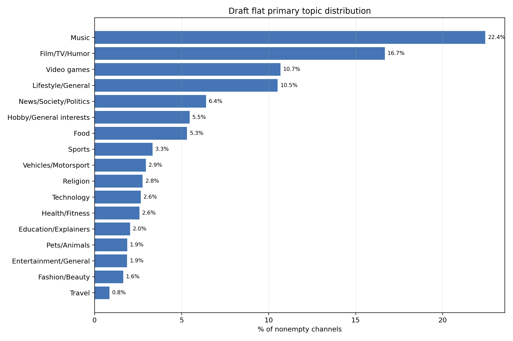
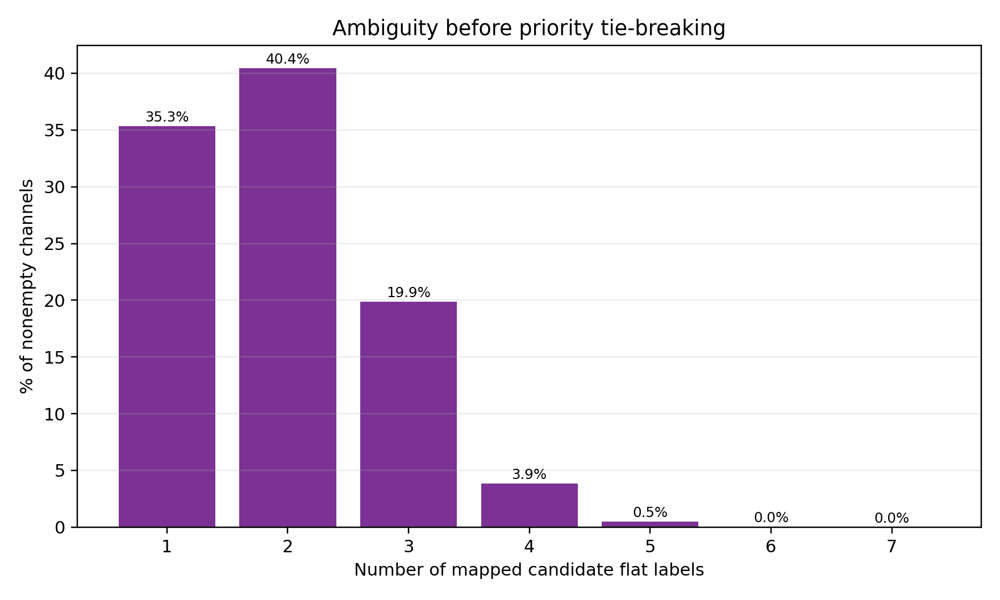
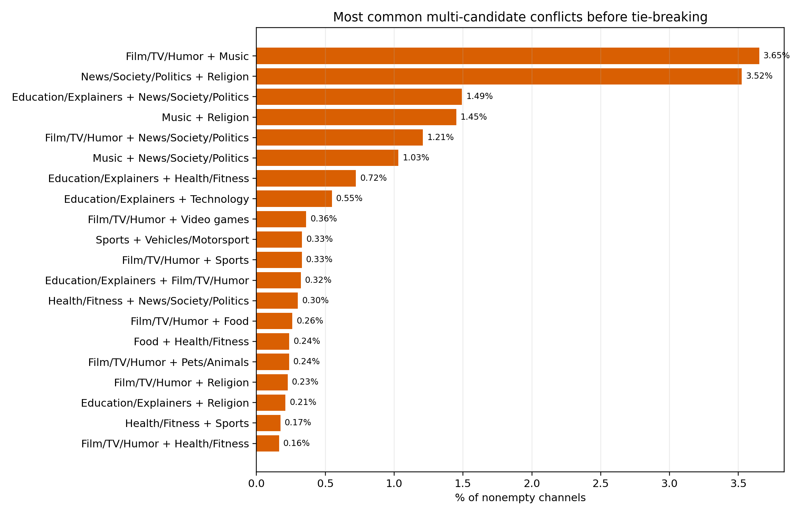
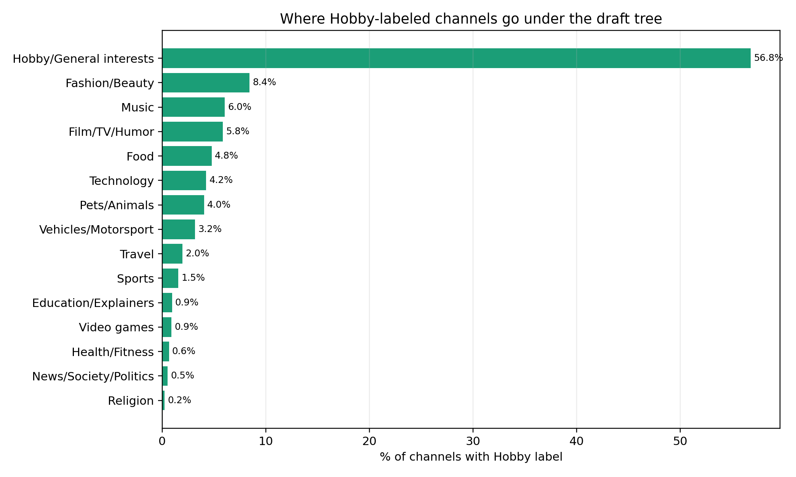

# Draft Flat Primary Topic Classifier

Date: 2026-06-15

Output table:

```text
dev_sean.matt.yt_channel_topic_flat_primary_draft_20260615
```

Goal: derive a single flat one-level label from the existing YouTube topic-category arrays using an explicit decision tree.

Rows in source table: 202,985
Nonempty category arrays: 197,664

## Requested Lumps and Splits

- `Film`, `Television_program`, and `Humour` are lumped into `Film/TV/Humor`.
- `Health` and `Physical_fitness` are lumped into `Health/Fitness`.
- `Hobby` is treated as a fallback. If a channel has `Hobby` plus any more specific mapped topic, it is assigned to the more specific topic. It is assigned to `Hobby/General interests` only when Hobby is standalone or only broad parent labels remain.
- All music labels are lumped into `Music`.
- Specific video game genre labels are lumped into early `Video games`; broad `Video_game_culture` is treated as a fallback after more concrete topics.
- Music is primary whenever it is present.
- `Vehicle` and `Motorsport` are lumped into `Vehicles/Motorsport`, which outranks Sports.
- `Performing_arts` is folded into `Film/TV/Humor`.
- `Politics`, `Military`, `Business`, and `Society` are lumped into `News/Society/Politics`.
- `Knowledge` maps to `Education/Explainers`.

## Draft Decision Tree

For a channel with nonempty YouTube topic labels, assign the first matching rule:

1. Any music label -> `Music`
2. Any specific video game genre label except broad `Video_game_culture` -> `Video games`
3. `Vehicle` or `Motorsport` -> `Vehicles/Motorsport`
4. Any non-motorsport sport label, including `Professional_wrestling` -> `Sports`
5. `Religion` -> `Religion`
6. `Politics`, `Military`, `Business`, or `Society` -> `News/Society/Politics`
7. `Food` -> `Food`
8. `Health` or `Physical_fitness` -> `Health/Fitness`
9. `Technology` -> `Technology`
10. `Pet` -> `Pets/Animals`
11. `Fashion` or `Physical_attractiveness` -> `Fashion/Beauty`
12. `Tourism` -> `Travel`
13. `Film`, `Television_program`, `Humour`, or `Performing_arts` -> `Film/TV/Humor`
14. `Knowledge` -> `Education/Explainers`
15. `Hobby`, only when no specific topic matched -> `Hobby/General interests`
16. Broad-only `Lifestyle_(sociology)` -> `Lifestyle/General`
17. Broad `Video_game_culture`, only when no more concrete topic matched -> `Video games`
18. Broad-only `Entertainment` -> `Entertainment/General`
19. Missing/empty/unmapped labels -> `Uncategorized`

## Primary Label Distribution

| Primary label | Channels | % nonempty |
|---|---:|---:|
| Music | 44,371 | 22.45% |
| Film/TV/Humor | 32,961 | 16.68% |
| Video games | 21,104 | 10.68% |
| Lifestyle/General | 20,790 | 10.52% |
| News/Society/Politics | 12,658 | 6.40% |
| Hobby/General interests | 10,786 | 5.46% |
| Food | 10,493 | 5.31% |
| Sports | 6,570 | 3.32% |
| Vehicles/Motorsport | 5,815 | 2.94% |
| Religion | 5,458 | 2.76% |
| Technology | 5,238 | 2.65% |
| Health/Fitness | 5,082 | 2.57% |
| Education/Explainers | 4,031 | 2.04% |
| Pets/Animals | 3,701 | 1.87% |
| Entertainment/General | 3,682 | 1.86% |
| Fashion/Beauty | 3,246 | 1.64% |
| Travel | 1,678 | 0.85% |



## Candidate Coverage

All mapped candidate counts include broad fallbacks such as `Lifestyle/General`, `Entertainment/General`, `Hobby/General interests`, and broad `Video_game_culture`.

| Mapped candidates | Channels | % nonempty |
|---|---:|---:|
| 1 | 69,860 | 35.34% |
| 2 | 79,921 | 40.43% |
| 3 | 39,250 | 19.86% |
| 4 | 7,617 | 3.85% |
| 5 | 979 | 0.50% |
| 6 | 34 | 0.02% |
| 7 | 3 | 0.00% |

The all-candidate exact-set table below should be used to detect truly unmapped rows. The old `[none]` value came from the specific-only diagnostic and was not an unclassified primary-label rate.

## Specific-Candidate Diagnostic

Specific candidate counts exclude broad fallback labels such as `Lifestyle/General`, `Entertainment/General`, and `Hobby/General interests`.

| Specific candidates | Channels | % nonempty |
|---|---:|---:|
| 0 | 36,732 | 18.58% |
| 1 | 129,854 | 65.69% |
| 2 | 27,346 | 13.83% |
| 3 | 3,583 | 1.81% |
| 4 | 147 | 0.07% |
| 5 | 2 | 0.00% |



Most common multi-candidate conflicts:

| Candidate A | Candidate B | Channels | % nonempty |
|---|---:|---:|---:|
| Film/TV/Humor | Music | 7,217 | 3.65% |
| News/Society/Politics | Religion | 6,967 | 3.52% |
| Education/Explainers | News/Society/Politics | 2,950 | 1.49% |
| Music | Religion | 2,867 | 1.45% |
| Film/TV/Humor | News/Society/Politics | 2,388 | 1.21% |
| Music | News/Society/Politics | 2,038 | 1.03% |
| Education/Explainers | Health/Fitness | 1,428 | 0.72% |
| Education/Explainers | Technology | 1,083 | 0.55% |
| Film/TV/Humor | Video games | 713 | 0.36% |
| Sports | Vehicles/Motorsport | 653 | 0.33% |
| Film/TV/Humor | Sports | 650 | 0.33% |
| Education/Explainers | Film/TV/Humor | 637 | 0.32% |
| Health/Fitness | News/Society/Politics | 594 | 0.30% |
| Film/TV/Humor | Food | 514 | 0.26% |
| Food | Health/Fitness | 469 | 0.24% |



Most common exact candidate sets, using all mapped candidates including broad fallbacks:

| Candidate set | Channels | % nonempty |
|---|---:|---:|
| Music | 24,640 | 12.47% |
| Entertainment/General + Film/TV/Humor | 21,776 | 11.02% |
| Video games | 18,514 | 9.37% |
| Lifestyle/General | 12,432 | 6.29% |
| Hobby/General interests + Lifestyle/General | 8,716 | 4.41% |
| Entertainment/General + Film/TV/Humor + Lifestyle/General | 8,508 | 4.30% |
| Entertainment/General + Lifestyle/General | 7,985 | 4.04% |
| Food + Lifestyle/General | 7,271 | 3.68% |
| News/Society/Politics | 6,023 | 3.05% |
| Entertainment/General + Film/TV/Humor + Music | 4,302 | 2.18% |
| Entertainment/General | 3,682 | 1.86% |
| Lifestyle/General + Vehicles/Motorsport | 3,590 | 1.82% |
| Lifestyle/General + Music | 3,526 | 1.78% |
| News/Society/Politics + Religion | 3,352 | 1.70% |
| Health/Fitness + Lifestyle/General | 3,235 | 1.64% |

## Hobby Handling

Channels with the raw `Hobby` label: 18,992
Assigned to `Hobby/General interests`: 10,786
Reassigned from Hobby to a more specific primary label: 8,206

| Assigned primary label | Hobby channels | % Hobby |
|---|---:|---:|
| Hobby/General interests | 10,786 | 56.79% |
| Fashion/Beauty | 1,600 | 8.42% |
| Music | 1,148 | 6.04% |
| Film/TV/Humor | 1,108 | 5.83% |
| Food | 906 | 4.77% |
| Technology | 806 | 4.24% |
| Pets/Animals | 767 | 4.04% |
| Vehicles/Motorsport | 601 | 3.16% |
| Travel | 371 | 1.95% |
| Sports | 291 | 1.53% |
| Education/Explainers | 178 | 0.94% |
| Video games | 167 | 0.88% |
| Health/Fitness | 123 | 0.65% |
| News/Society/Politics | 99 | 0.52% |
| Religion | 41 | 0.22% |



## Fallback and Broad Assignments

| Primary label | Channels | % nonempty |
|---|---:|---:|
| Lifestyle/General | 20,790 | 10.52% |
| Hobby/General interests | 10,786 | 5.46% |
| Entertainment/General | 3,682 | 1.86% |
| Video games | 1,474 | 0.75% |

## Other Lump/Split Candidates

- `Professional_wrestling`: currently assigned to `Sports` for intuitive topic grouping, even though YouTube often treats it as entertainment. This is a high-priority validation item.
- `Technology`: currently split out from Lifestyle because it is an intuitive main topic. Validate whether YouTube-labeled Technology channels are truly technology-centered or often general hobby/DIY.
- `Education/Explainers`: `Knowledge` remains broad even after renaming, so this bucket should be audited for explainers vs. formal education vs. generic fact channels.
- `Hobby/General interests`: any large residual here means the existing labels do not expose the underlying topic. This bucket should be audited for possible hand-built subrules.

## Statistical Validation Plan

1. Freeze this draft tree and materialized table as version `flat_primary_draft_20260615`.
2. Draw a stratified validation sample by assigned primary label, oversampling rare labels and all fallback/broad labels.
3. Add an ambiguity stratum: sample separately from channels with 0, 1, 2, and 3+ specific candidate labels.
4. Blind-code each sampled channel from channel/video evidence into the proposed flat label set. The coder must not see the YouTube labels or tree output.
5. Use at least two independent coders, or one coder plus an LLM adjudication pass, for high-impact ambiguous strata.
6. Estimate overall accuracy, macro-F1, per-label precision/recall, and confusion matrices against the blinded flat-label judgments.
7. Report Wilson or bootstrap confidence intervals for every label with enough sample size.
8. Specifically audit priority-conflict pairs such as `Film/TV/Humor` vs. `Music`, `Film/TV/Humor` vs. `Sports`, `Vehicles/Motorsport` vs. `Sports`, and `Hobby` reassignments.
9. Revise the decision tree only after reviewing statistically meaningful confusions, then rerun the same validation design on a fresh heldout sample.
