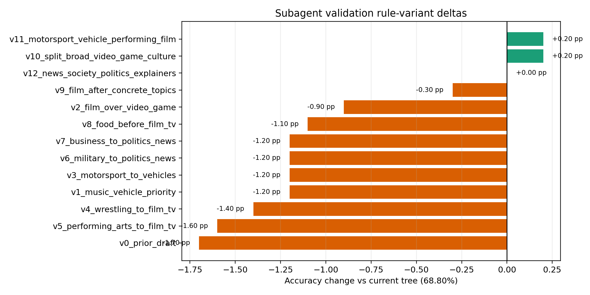
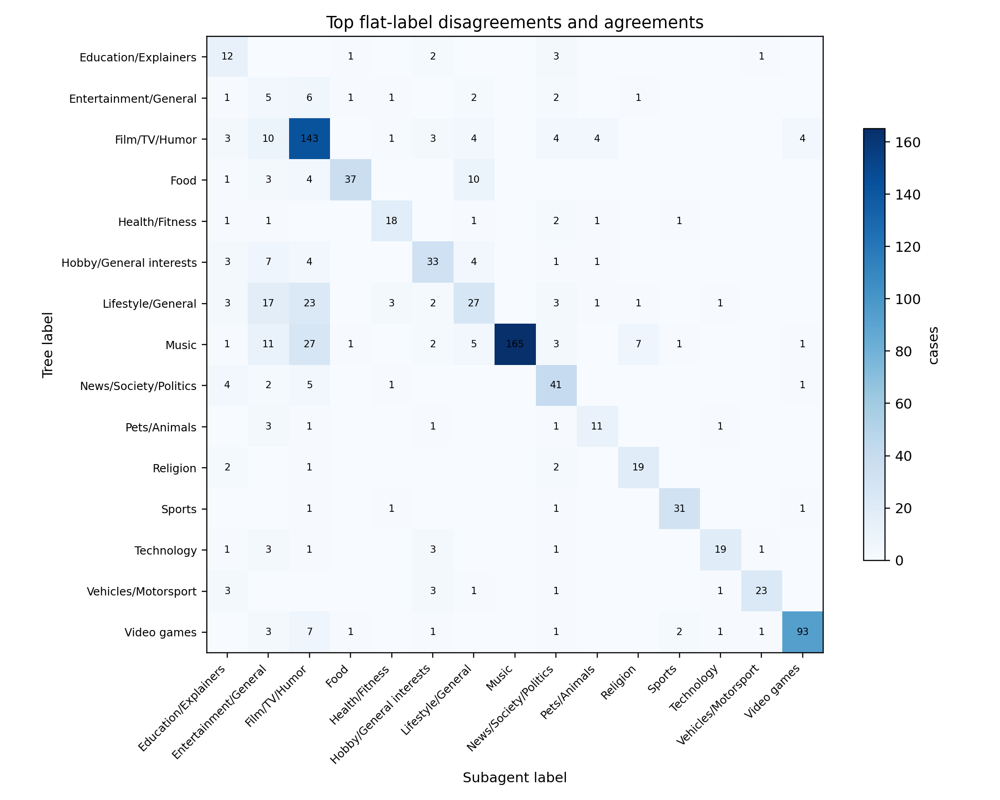

# Flat Primary Subagent Validation

Date: 2026-06-15

Sample size: 1,000 channels with nonempty YouTube topic-category arrays.

The subagents received only blind channel evidence: channel id, channel name, language code, rough record count, and recent video title/description snippets. They did not receive the YouTube topic-category arrays, the deterministic tree output, or the rule definitions.

## Agreement Summary

Current tree variant: `v12_news_society_politics_explainers`

- Current agreement with subagent labels: 68.80% (688/1,000)
- Best tested variant: `v10_split_broad_video_game_culture` at 69.00%
- Best gain over current tree: 0.20 percentage points
- Improvement over original `v1_music_vehicle_priority`: 1.20 percentage points
- Iteration status with a 0.5 percentage-point threshold: `stop`

The current tree incorporates these data- and taxonomy-supported changes from the original v1 tree:

1. `Film/TV/Humor` is evaluated after the concrete topical labels through `Travel`, so broad media/humor tags no longer override labels such as politics, food, health, technology, pets, fashion, or travel.
2. `Video_game_culture` is treated as a broad fallback. Specific game-genre tags still trigger `Video games` early, but the broad culture tag yields to more concrete non-game topics.
3. `Motorsport` is assigned to `Vehicles/Motorsport`, and `Sports` excludes motorsport.
4. `Performing arts` is folded into `Film/TV/Humor`.
5. `Politics/News`, `Military`, `Business`, and `Society/General` are folded into `News/Society/Politics`.
6. The raw `Knowledge` topic now maps to `Education/Explainers`, acknowledging that Knowledge is too weak as a flat end-user category.

## Rule Variant Accuracy

| Rule variant | Cases | Correct | Accuracy | Delta vs current pp |
|---|---:|---:|---:|---:|
| v10_split_broad_video_game_culture | 1,000 | 690 | 69.00% | 0.20 |
| v11_motorsport_vehicle_performing_film | 1,000 | 690 | 69.00% | 0.20 |
| v12_news_society_politics_explainers | 1,000 | 688 | 68.80% | 0.00 |
| v9_film_after_concrete_topics | 1,000 | 685 | 68.50% | -0.30 |
| v2_film_over_video_game | 1,000 | 679 | 67.90% | -0.90 |
| v8_food_before_film_tv | 1,000 | 677 | 67.70% | -1.10 |
| v1_music_vehicle_priority | 1,000 | 676 | 67.60% | -1.20 |
| v3_motorsport_to_vehicles | 1,000 | 676 | 67.60% | -1.20 |
| v6_military_to_politics_news | 1,000 | 676 | 67.60% | -1.20 |
| v7_business_to_politics_news | 1,000 | 676 | 67.60% | -1.20 |
| v4_wrestling_to_film_tv | 1,000 | 674 | 67.40% | -1.40 |
| v5_performing_arts_to_film_tv | 1,000 | 672 | 67.20% | -1.60 |
| v0_prior_draft | 1,000 | 671 | 67.10% | -1.70 |



## Subagent Confidence

| Confidence | Cases | % cases |
|---|---:|---:|
| high | 713 | 71.30% |
| medium | 256 | 25.60% |
| low | 31 | 3.10% |

## Top Error Pairs

| Tree label | Subagent label | Cases |
|---|---:|---:|
| Music | Film/TV/Humor | 27 |
| Lifestyle/General | Film/TV/Humor | 23 |
| Lifestyle/General | Entertainment/General | 17 |
| Music | Entertainment/General | 11 |
| Food | Lifestyle/General | 10 |
| Film/TV/Humor | Entertainment/General | 10 |
| Lifestyle/General | Fashion/Beauty | 10 |
| Video games | Film/TV/Humor | 7 |
| Hobby/General interests | Entertainment/General | 7 |
| Music | Religion | 7 |
| Entertainment/General | Film/TV/Humor | 6 |
| News/Society/Politics | Film/TV/Humor | 5 |
| Music | Lifestyle/General | 5 |
| Food | Film/TV/Humor | 4 |
| Hobby/General interests | Lifestyle/General | 4 |
| Hobby/General interests | Film/TV/Humor | 4 |
| Film/TV/Humor | Lifestyle/General | 4 |
| Film/TV/Humor | News/Society/Politics | 4 |
| News/Society/Politics | Education/Explainers | 4 |
| Film/TV/Humor | Video games | 4 |



## Diagnostic Pair Merges

This table estimates the apparent validation gain from collapsing two current flat labels into one label. It is a diagnostic only: the largest gains mostly come from broad, qualitatively costly collapses rather than clean taxonomy fixes.

| Label A | Label B | Merged accuracy | Gain pp |
|---|---:|---:|---:|
| Film/TV/Humor | Lifestyle/General | 71.50% | 2.70 |
| Film/TV/Humor | Music | 71.50% | 2.70 |
| Entertainment/General | Lifestyle/General | 70.70% | 1.90 |
| Entertainment/General | Film/TV/Humor | 70.40% | 1.60 |
| Fashion/Beauty | Lifestyle/General | 70.00% | 1.20 |
| Entertainment/General | Music | 69.90% | 1.10 |
| Film/TV/Humor | Video games | 69.90% | 1.10 |
| Food | Lifestyle/General | 69.80% | 1.00 |
| Film/TV/Humor | News/Society/Politics | 69.70% | 0.90 |
| Education/Explainers | News/Society/Politics | 69.50% | 0.70 |
| Entertainment/General | Hobby/General interests | 69.50% | 0.70 |
| Film/TV/Humor | Hobby/General interests | 69.50% | 0.70 |
| Music | Religion | 69.50% | 0.70 |
| Fashion/Beauty | Hobby/General interests | 69.40% | 0.60 |
| Hobby/General interests | Lifestyle/General | 69.40% | 0.60 |

## Tree Labels With Most Errors

| Tree label | Cases | Errors | Error rate |
|---|---:|---:|---:|
| Lifestyle/General | 94 | 67 | 71.28% |
| Music | 225 | 60 | 26.67% |
| Film/TV/Humor | 179 | 36 | 20.11% |
| Hobby/General interests | 57 | 24 | 42.11% |
| Food | 57 | 20 | 35.09% |
| Video games | 110 | 17 | 15.45% |
| Entertainment/General | 19 | 14 | 73.68% |
| News/Society/Politics | 54 | 13 | 24.07% |
| Technology | 29 | 10 | 34.48% |
| Vehicles/Motorsport | 33 | 10 | 30.30% |
| Health/Fitness | 27 | 9 | 33.33% |
| Pets/Animals | 18 | 7 | 38.89% |
| Education/Explainers | 19 | 7 | 36.84% |
| Fashion/Beauty | 15 | 6 | 40.00% |
| Religion | 24 | 5 | 20.83% |
| Sports | 35 | 4 | 11.43% |
| Travel | 5 | 3 | 60.00% |

## Matched Topic Labels In Residual Errors

| Rule key | Matched topic labels | Tree label | Cases |
|---|---:|---:|---:|
| literal_list | Lifestyle_(sociology) | Lifestyle/General | 67 |
| film_tv_humor_performing_arts | Film | Film/TV/Humor | 30 |
| music | Music; Music_of_Asia | Music | 26 |
| literal_list | Hobby | Hobby/General interests | 24 |
| literal_list | Food | Food | 20 |
| music | Music | Music | 18 |
| literal_list | Entertainment | Entertainment/General | 14 |
| news_society_politics | Society | News/Society/Politics | 11 |
| literal_list | Technology | Technology | 10 |
| vehicles_motorsport | Vehicle | Vehicles/Motorsport | 10 |
| literal_list | Knowledge | Education/Explainers | 7 |
| literal_list | Pet | Pets/Animals | 7 |
| fashion_beauty | Fashion | Fashion/Beauty | 6 |
| music | Music; Music_of_Asia; Pop_music | Music | 6 |
| health_fitness | Health | Health/Fitness | 6 |
| literal_list | Religion | Religion | 5 |
| specific_video_game | Action-adventure_game; Action_game; Role-playing_video_game | Video games | 4 |
| literal_list | Tourism | Travel | 3 |
| specific_video_game | Action_game | Video games | 3 |
| music | Music_of_Asia | Music | 3 |


## Changed Cases vs Original v1

- Changed assignments: 44
- Improved cases: 25
- Regressed cases: 13
- Still wrong with a different tree label: 6

Changed row-level cases are in:

```text
flat_primary_subagent_current_changed_cases.csv
```

## Error Case File

Detailed row-level errors are in:

```text
flat_primary_subagent_validation_errors.csv
```

The error audit with matched tree-rule details is in:

```text
flat_primary_subagent_error_audit.csv
```
