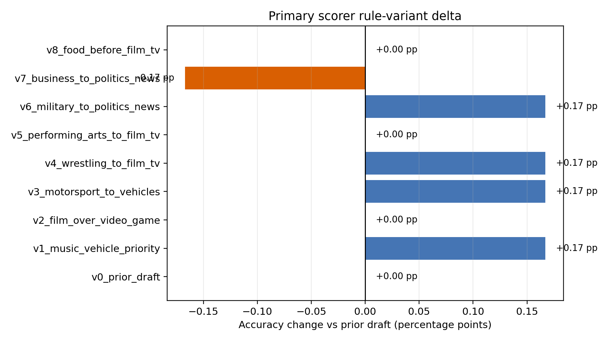
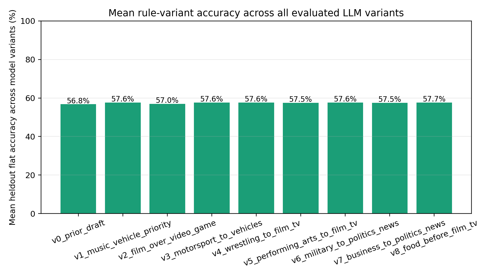
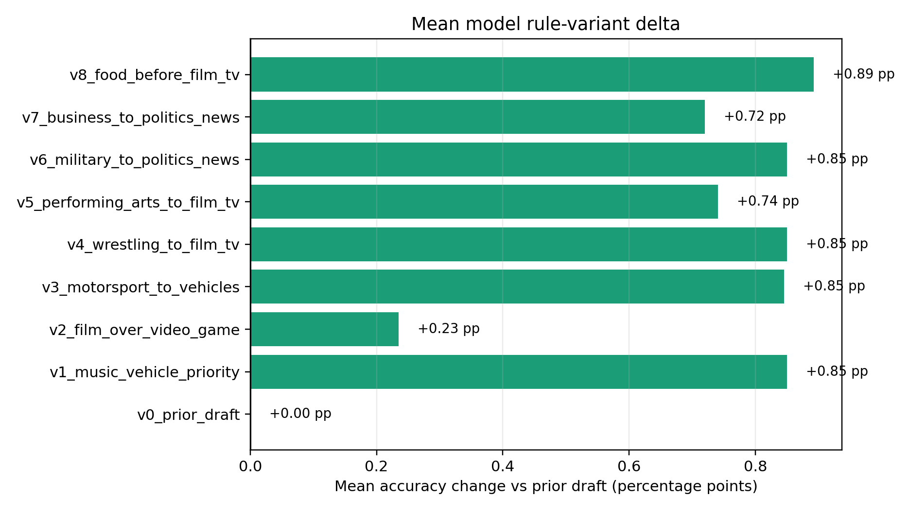

# Flat Primary Topic Validation Iteration

Date: 2026-06-15

Validation table:

```text
dev_sean.matt.yt_channel_topic_flat_validation_iteration_20260615
```

Primary scorer:

```text
gemini / gemini-3.5-flash / prob_label_threshold_closure_postprocessed
```

## Rule Variants

- `v0_prior_draft`: original draft tree, where Video games outranks Music and Sports outranks Vehicles.
- `v1_music_vehicle_priority`: Music outranks every other topic when present; Vehicles outranks Sports.
- `v2_film_over_video_game`: same as `v1`, but Film/TV/Humor outranks Video games.
- `v3_motorsport_to_vehicles`: same as `v1`, but Motorsport maps to Vehicles.
- `v4_wrestling_to_film_tv`: same as `v1`, but Professional_wrestling maps to Film/TV/Humor.
- `v5_performing_arts_to_film_tv`: same as `v1`, but Performing_arts maps to Film/TV/Humor.
- `v6_military_to_politics_news`: same as `v1`, but Military maps to Politics/News.
- `v7_business_to_politics_news`: same as `v1`, but Business maps to Politics/News.
- `v8_food_before_film_tv`: same as `v1`, but Food outranks Film/TV/Humor.

## Heldout Flat Accuracy

| Rule variant | Channels | Flat accuracy | Correct | Film+game collisions | Collision accuracy |
|---|---:|---:|---:|---:|---:|
| v0_prior_draft | 599 | 63.77% | 382 | 11 | 63.64% |
| v1_music_vehicle_priority | 599 | 63.94% | 383 | 11 | 63.64% |
| v2_film_over_video_game | 599 | 63.77% | 382 | 11 | 54.55% |
| v3_motorsport_to_vehicles | 599 | 63.94% | 383 | 11 | 63.64% |
| v4_wrestling_to_film_tv | 599 | 63.94% | 383 | 11 | 63.64% |
| v5_performing_arts_to_film_tv | 599 | 63.77% | 382 | 11 | 63.64% |
| v6_military_to_politics_news | 599 | 63.94% | 383 | 11 | 63.64% |
| v7_business_to_politics_news | 599 | 63.61% | 381 | 11 | 63.64% |
| v8_food_before_film_tv | 599 | 63.77% | 382 | 11 | 63.64% |




Mean across all heldout model/prediction-variant combinations:

| Rule variant | Model variants | Mean accuracy | Median accuracy | Max accuracy |
|---|---:|---:|---:|---:|
| v0_prior_draft | 32 | 56.77% | 59.93% | 64.61% |
| v1_music_vehicle_priority | 32 | 57.62% | 59.77% | 64.44% |
| v2_film_over_video_game | 32 | 57.01% | 59.60% | 64.11% |
| v3_motorsport_to_vehicles | 32 | 57.62% | 59.77% | 64.44% |
| v4_wrestling_to_film_tv | 32 | 57.62% | 59.77% | 64.44% |
| v5_performing_arts_to_film_tv | 32 | 57.51% | 59.93% | 64.27% |
| v6_military_to_politics_news | 32 | 57.62% | 59.77% | 64.44% |
| v7_business_to_politics_news | 32 | 57.49% | 59.93% | 64.27% |
| v8_food_before_film_tv | 32 | 57.66% | 59.93% | 64.44% |





## Iteration Decision

- Music + Vehicle priority gain over prior draft: 0.17 percentage points.
- Film-over-game gain after Music + Vehicle priority: -0.17 percentage points.
- Best tested variant after the requested Music/Vehicle change: `v1_music_vehicle_priority` at 63.94% heldout flat accuracy.
- Best additional gain over the requested Music/Vehicle tree: 0.00 percentage points.
- Collision decision: Video games stays above Film/TV/Humor.
- Iteration status under the 1 percentage point rule: `stop`.

## Film/TV/Humor + Video-games Evidence Sample

The 100-case sample was drawn from the full `youtube_too` channel universe among channels whose observed YouTube labels include both a Film/TV/Humor label and a video-game label. The assessment below is a keyword-assisted inspection of channel names and recent video titles/descriptions; it is not treated as final human gold-standard coding.

| Assessment | Cases | % cases |
|---|---:|---:|
| insufficient_keyword_evidence | 31 | 31.00% |
| mostly_film_tv_humor_or_adaptation | 27 | 27.00% |
| mostly_video_game_play_or_discussion | 26 | 26.00% |
| mixed_or_ambiguous | 16 | 16.00% |

Top sampled examples:

| Channel | Assessment | Game score | Media score | Game hits | Media hits |
|---|---:|---:|---:|---:|---:|
| IceToon | mixed_or_ambiguous | 2 | 2 | minecraft, among us | animation, cartoon |
| Thorne Frame | insufficient_keyword_evidence | 0 | 0 |  |  |
| Kpop Duck Hunter | mostly_video_game_play_or_discussion | 4 | 1 | minecraft, roblox, fortnite, gta | animation |
| NovoxGamer | insufficient_keyword_evidence | 0 | 0 |  |  |
| Bubble Planet | mostly_video_game_play_or_discussion | 2 | 1 | mods?, minecraft | anime |
| ThaNix229 | mostly_video_game_play_or_discussion | 1 | 0 | clash royale |  |
| Dazzling Divine Cinema | insufficient_keyword_evidence | 0 | 0 |  |  |
| The Tomee Bear | mostly_video_game_play_or_discussion | 2 | 1 | gaming, quest | animation |
| Talking Tom & Friends Español | insufficient_keyword_evidence | 0 | 0 |  |  |
| $UPERHERO HUNTER | mostly_film_tv_humor_or_adaptation | 2 | 3 | minecraft, mario | movie, animation, animated |
| Andrew Packer | insufficient_keyword_evidence | 0 | 0 |  |  |
| TeufeurS | insufficient_keyword_evidence | 0 | 0 |  |  |
| Orseofkorse  | insufficient_keyword_evidence | 0 | 0 |  |  |
| Wubzzy | mostly_film_tv_humor_or_adaptation | 0 | 2 |  | episode, reaction |
| MeowCuk | mostly_film_tv_humor_or_adaptation | 0 | 1 |  | cartoon |
| Kitty Pop | mostly_video_game_play_or_discussion | 2 | 1 | stream, mods? | animation |
| NCHProductions | mostly_video_game_play_or_discussion | 2 | 1 | pokemon, pok[eé]mon | animation |
| Fun Ling | mixed_or_ambiguous | 1 | 1 | uild | tv |
| CD-Call | mostly_film_tv_humor_or_adaptation | 1 | 2 | stream | tv, season |
| Cute Pazu | mixed_or_ambiguous | 1 | 1 | roblox | animation |

## Validation Plan Update

The flat-label validation plan should treat Film/TV/Humor + Video-games as an explicit ambiguity stratum. In each validation wave:

1. Score the deterministic tree on the heldout LLM validation set after collapsing model-predicted and reference label sets.
2. Separately report channels with both Film/TV/Humor and Video-game labels.
3. Blind-inspect a supplemental sample of that collision using channel/video evidence.
4. Move the Film/TV/Humor vs Video-games priority only if it improves heldout flat accuracy by more than 1 percentage point and the evidence inspection supports the semantic move.
5. Stop iterating when the next candidate change improves heldout flat accuracy by no more than 1 percentage point.
