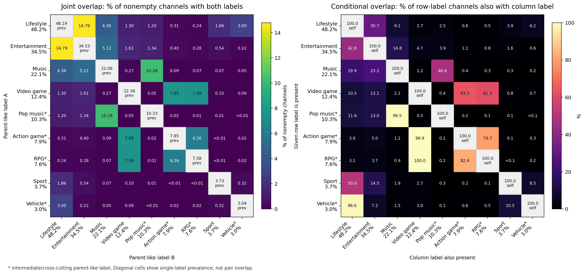
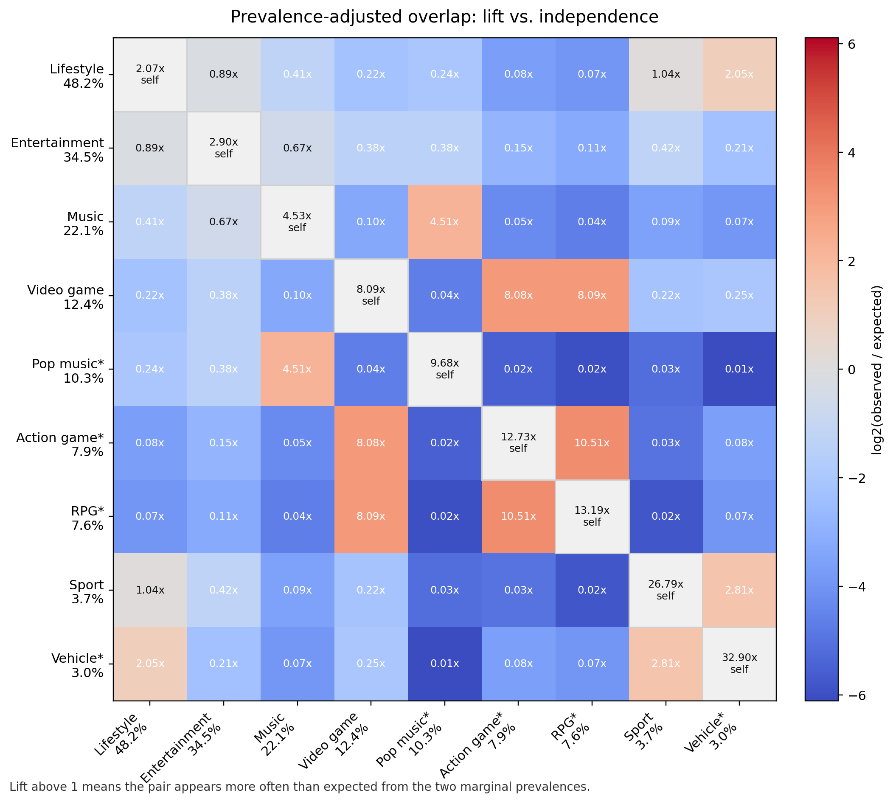
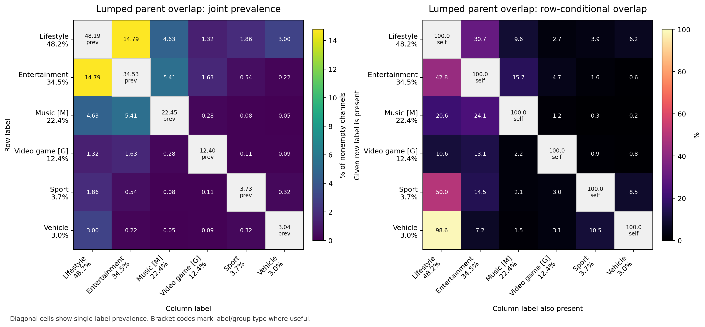
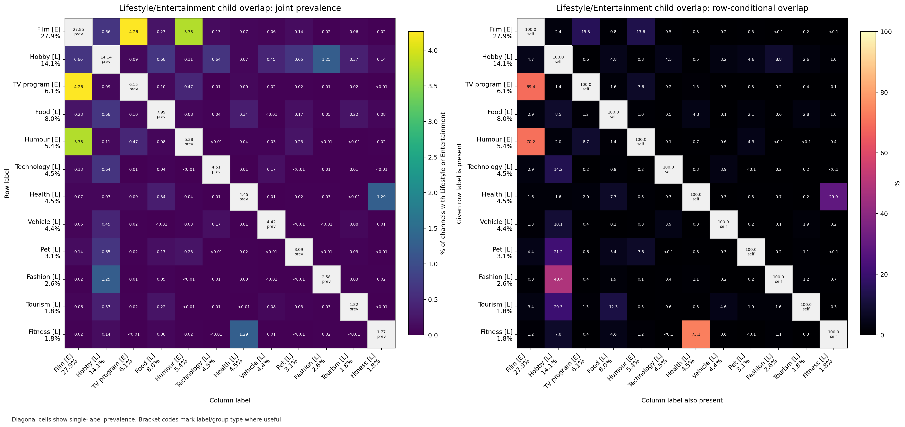
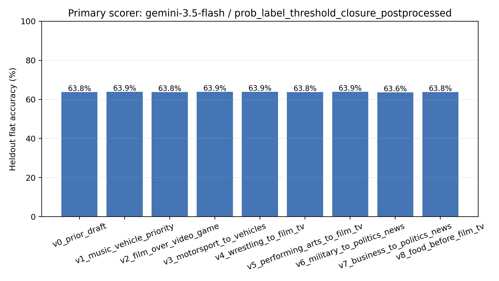

# YouTube Channel Topic Category Taxonomy: Methods and Findings

Date: 2026-06-12

## Purpose

This memo documents the investigation into the structure of `dev_sean.default.channel_category.topic_categories`, the category array populated from the YouTube Data API channel topic fields.

The immediate problem was that the topic classification validation workflow was treating the category information too much like a single-label ground truth. The table returns an array, and most channels have multiple topic categories. This raised several questions:

- Are the categories nested or hierarchical?
- Does a specific label such as `Music_of_Asia` imply a broader label such as `Music`?
- Is the first array element the primary or best-fit category?
- Should the LLM validation task be framed as one best category, or as a set of yes/no category decisions?

The short answer is: this field should be treated as a multi-label set. There is strong empirical evidence for parent-like closure rules, but the array order is not reliable enough to interpret as primary, secondary, tertiary, and the observed co-tagging structure is not a clean tree.

## Source Documentation

The relevant YouTube API field is `channels.topicDetails.topicCategories[]`. The official docs define this as a list of Wikipedia URLs that describe channel content:

- YouTube Data API channel resource docs: https://developers.google.com/youtube/v3/docs/channels

The same docs describe the older `topicIds[]` field as deprecated, but they still show the curated topic structure behind the topic categories. That older structure includes broad topic groups such as:

- Music
- Gaming
- Sports
- Entertainment
- Lifestyle
- Society

with supported child topics underneath each group.

For empirical estimation, I treated each channel's topic category array as a transaction and each topic label as a binary item. This is the standard setup for association-rule estimation. The relevant measures are support, confidence, lift, and directional asymmetry. I used association-rule logic consistent with the standard literature on support/confidence/lift:

- Hahsler, Buchta, Gruen, Hornik, "arules: Mining Association Rules and Frequent Itemsets", Journal of Statistical Software / arXiv: https://arxiv.org/abs/0803.0954
- Hahsler, "A Probabilistic Comparison of Commonly Used Interest Measures for Association Rules", arXiv: https://arxiv.org/abs/0803.0966

## Data Scope

The empirical analysis used:

- Channel universe: `prod_tads.youtube_too.yt_sl_channels`
- Category source: `dev_sean.default.channel_category`
- Join key: `yt_sl_channels.channel_id = channel_category.canonical_id`
- Category field: `topic_categories`

For each channel, I used the latest available category row by `collected_at` and `collected_date`.

The category array was normalized as follows:

1. Drop null and empty category values.
2. Deduplicate category URLs within channel using `array_distinct`.
3. Convert Wikipedia URLs to category slugs by taking the part after `/wiki/`.
4. Preserve the original array order only for order diagnostics, not as a ground-truth rank.

Example:

```text
https://en.wikipedia.org/wiki/Music_of_Asia -> Music_of_Asia
```

## Initial Category Frequency Findings

The full `youtube_too` channel universe contained:

- Total channels: 202,985
- Channels with nonempty topic category arrays: 197,664
- Distinct exploded topic labels: 62

The exact 1,000-channel validation sample contained 57 of those 62 labels.

The most common full-universe labels were:

| Category | Channels | Percent of all channels |
|---|---:|---:|
| Lifestyle_(sociology) | 95,264 | 46.93 |
| Entertainment | 68,261 | 33.63 |
| Music | 43,599 | 21.48 |
| Film | 37,520 | 18.48 |
| Video_game_culture | 24,436 | 12.04 |
| Pop_music | 20,419 | 10.06 |
| Society | 19,915 | 9.81 |
| Hobby | 18,992 | 9.36 |
| Action_game | 15,525 | 7.65 |
| Music_of_Asia | 15,372 | 7.57 |
| Role-playing_video_game | 14,984 | 7.38 |
| Action-adventure_game | 13,399 | 6.60 |

Most channels have multiple labels:

| Category count per channel | Channels | Percent |
|---:|---:|---:|
| 0 | 5,321 | 2.62 |
| 1 | 21,951 | 10.81 |
| 2 | 76,289 | 37.58 |
| 3 | 56,188 | 27.68 |
| 4 | 29,258 | 14.41 |
| 5 | 10,305 | 5.08 |
| 6 | 2,803 | 1.38 |
| 7+ | 870 | 0.43 |

Because labels are multi-label, category percentages sum to more than 100 percent.

## Array Order Findings

I tested whether the first array element behaves like a primary category.

It does not.

Only about 50.7 percent of nonempty category arrays have a broad documented parent topic first. Many specific child-like topics appear in the first position:

- `Film` is first in 43.96 percent of channels where it appears.
- `Food` is first in 46.60 percent of channels where it appears.
- `Hobby` is first in 44.29 percent of channels where it appears.
- `Politics` is first in 44.98 percent of channels where it appears.
- `Association_football` is first in 43.66 percent of channels where it appears.

I also checked parent-child pairs where both labels are present. If the array were ordered broad-to-specific, the parent should almost always appear before the child. Instead, parent-before-child rates are usually near 50 percent:

| Child | Parent | Parent before child when both present |
|---|---|---:|
| Film | Entertainment | 47.45 |
| Music_of_Asia | Music | 46.91 |
| Food | Lifestyle_(sociology) | 50.03 |
| Action_game | Video_game_culture | 49.48 |
| Pop_music | Music | 51.78 |
| Politics | Society | 51.21 |

Conclusion: array position should not be used as primary or secondary category evidence.

## Empirical Estimation Method

I used an 80/20 deterministic holdout split by hashing `channel_id`.

Split sizes:

| Split | Channels | Nonempty category arrays | Avg label cardinality |
|---|---:|---:|---:|
| Train | 162,321 | 158,084 | 2.6342 |
| Heldout | 40,664 | 39,580 | 2.6352 |

For each ordered pair of labels `A -> B`, I estimated:

- `n_antecedent`: number of train channels with `A`
- `n_consequent`: number of train channels with `B`
- `n_cooccurring`: number of train channels with both `A` and `B`
- `confidence`: `P(B | A)`
- `reverse_confidence`: `P(A | B)`
- `lift`: `P(A, B) / (P(A) * P(B))`
- `confidence_asymmetry`: `P(B | A) - P(A | B)`
- `confidence_wilson_lower_95`: Wilson lower bound for `P(B | A)`
- `pct_consequent_before_antecedent`: array-order diagnostic

I then inferred candidate parent-like edges from train data only.

Candidate filters:

- Child support at least 50 train channels.
- Candidate parent label is more frequent than candidate child label.
- Directional confidence is higher than reverse confidence.
- Lift is at least 1.10.
- Train confidence is at least 0.75.

Strong empirical parent edge:

- Child support at least 100 train channels.
- Train confidence at least 0.95.
- Wilson lower bound at least 0.90.
- Lift at least 1.25.

Moderate empirical parent edge:

- Child support at least 100 train channels.
- Train confidence at least 0.85.
- Wilson lower bound at least 0.80.
- Lift at least 1.15.

These thresholds intentionally favor stable, high-confidence closure patterns over weak correlations.

## Databricks Tables Created

The implementation materialized the following tables in `dev_sean.matt`:

| Table | Description |
|---|---|
| `yt_channel_topic_taxonomy_channel_labels_20260612` | Normalized latest topic-label arrays by channel, with train/heldout split |
| `yt_channel_topic_taxonomy_label_stats_20260612` | Per-label frequency, first-position rate, and average position by split |
| `yt_channel_topic_taxonomy_pairwise_estimates_20260612` | Pairwise association-rule estimates for all ordered label pairs by split |
| `yt_channel_topic_taxonomy_inferred_edges_20260612` | Train-learned parent-like edges with heldout metrics attached |
| `yt_channel_topic_taxonomy_label_roles_20260612` | Empirical role classification for each label |
| `yt_channel_topic_taxonomy_heldout_edge_predictions_20260612` | Heldout channel-level predicted parent labels and whether they are present |

Local SQL payloads are in:

```text
.codex_databricks/sql_taxonomy_channel_labels_create_20260612.json
.codex_databricks/sql_taxonomy_label_stats_create_20260612.json
.codex_databricks/sql_taxonomy_pairwise_create_20260612.json
.codex_databricks/sql_taxonomy_inferred_edges_create_20260612.json
.codex_databricks/sql_taxonomy_label_roles_create_20260612.json
.codex_databricks/sql_taxonomy_heldout_predictions_create_20260612.json
```

## Split-Half Reliability Results

The learned rules were tested by applying train-estimated edges to heldout channels from the same snapshot.

This should be interpreted as an internal split-half reliability check for co-label statistics, not as validation of a content-based classifier. No channel text or video evidence is used in this test. For each heldout channel, if an observed antecedent label had a learned high-confidence consequent edge, I checked whether the consequent label was actually present in that heldout channel's category array.

| Edge strength | Edges | Weighted train confidence | Weighted heldout confidence | Avg absolute confidence delta |
|---|---:|---:|---:|---:|
| Strong empirical parent | 47 | 0.9921 | 0.9921 | 0.0035 |
| Moderate empirical parent | 10 | 0.8992 | 0.8986 | 0.0143 |
| Weak or sparse association | 16 | 0.8186 | 0.8202 | 0.0290 |

Heldout parent-prediction precision:

| Edge strength | Heldout predictions | Precision |
|---|---:|---:|
| Strong empirical parent | 50,026 | 0.9921 |
| Moderate empirical parent | 9,077 | 0.8986 |

This indicates that the strongest co-label rules are estimated very reliably within this snapshot. It does not establish that an LLM or other content-based model can predict those labels from channel evidence.

## Calibration Check

I also compared train confidence bins against heldout confidence for all directed rules with enough support.

| Train confidence bin | Rules | Avg train confidence | Avg heldout confidence | Avg absolute delta |
|---|---:|---:|---:|---:|
| <0.50 | 1,524 | 0.0386 | 0.0394 | 0.0055 |
| 0.50-0.60 | 15 | 0.5472 | 0.5528 | 0.0274 |
| 0.60-0.70 | 11 | 0.6550 | 0.6654 | 0.0207 |
| 0.70-0.80 | 15 | 0.7534 | 0.7488 | 0.0378 |
| 0.80-0.90 | 8 | 0.8402 | 0.8250 | 0.0224 |
| 0.90-0.95 | 7 | 0.9260 | 0.9180 | 0.0110 |
| 0.95-1.00 | 47 | 0.9901 | 0.9884 | 0.0035 |

The calibration is good. High train-confidence rules remain high on heldout data.

## Learned Empirical Roles

The role classifier used strong plus moderate learned edges.

| Empirical role | Number of labels |
|---|---:|
| Empirical parent | 5 |
| Intermediate or cross-cutting parent | 4 |
| Empirical child | 42 |
| Standalone or sparse | 11 |

Empirical parent labels:

| Label | Learned children | Strong children | Moderate children |
|---|---:|---:|---:|
| Music | 14 | 14 | 0 |
| Lifestyle_(sociology) | 12 | 12 | 0 |
| Video_game_culture | 9 | 9 | 0 |
| Sport | 7 | 6 | 1 |
| Entertainment | 4 | 2 | 2 |

Intermediate or cross-cutting labels:

| Label | Learned children | Learned parents | Interpretation |
|---|---:|---:|---|
| Pop_music | 3 | 1 | Child of Music, parent-like for several music genres |
| Action_game | 2 | 1 | Child of Video_game_culture, parent-like for some game subgenres |
| Role-playing_video_game | 2 | 1 | Child of Video_game_culture, parent-like for some game subgenres |
| Vehicle | 1 | 1 | Child of Lifestyle, parent-like for Motorsport |

## Parent Category Overlap Among Common Parent-Like Labels

I also estimated overlap among parent-like labels with empirical role `empirical_parent` or `intermediate_or_crosscutting_parent` and prevalence above 2 percent of nonempty channel-label arrays. This produced 9 labels over 197,664 nonempty channels.

The direct overlap matrix is the percent of all nonempty channels that have both labels. Because the parent prevalences vary sharply, from 48.19 percent for `Lifestyle_(sociology)` to 3.04 percent for `Vehicle`, the companion conditional and lift matrices are necessary for interpretation.

Full outputs:

- `parent_overlap_20260613/parent_overlap_summary.md`
- `parent_overlap_20260613/parent_overlap_joint_prevalence_matrix_pct.csv`
- `parent_overlap_20260613/parent_overlap_conditional_matrix_pct.csv`
- `parent_overlap_20260613/parent_overlap_lift_matrix.csv`





Main patterns:

- Highest absolute joint overlap is `Lifestyle_(sociology)` + `Entertainment`: 14.79 percent of nonempty channels.
- The strongest near-nesting patterns are `Pop_music` -> `Music` at 99.53 percent, `Action_game` -> `Video_game_culture` at 99.92 percent, `Role-playing_video_game` -> `Video_game_culture` at 99.97 percent, and `Vehicle` -> `Lifestyle_(sociology)` at 98.64 percent.
- `Action_game` and `Role-playing_video_game` are tightly co-labeled: 6.26 percent of all nonempty channels have both, with lift 10.51x relative to independence.
- Many broad cross-domain pairs are below independence despite nontrivial absolute counts. For example, `Lifestyle_(sociology)` + `Music` covers 4.38 percent of channels but has lift 0.41x because both labels are common.

### Lumped Music and Video Game Parent View

The previous matrix intentionally exposed intermediate parent-like labels, but that can overstate parent overlap because `Pop_music`, `Action_game`, and `Role-playing_video_game` are mostly nested inside `Music` or `Video_game_culture`. I therefore reran the parent overlap after collapsing:

- all music labels into `Music_combined`
- all video game labels into `Video_game_combined`

Full outputs:

- `lumped_parent_overlap_20260613/lumped_parent_overlap_summary.md`
- `lumped_parent_overlap_20260613/joint_prevalence_matrix_pct.csv`
- `lumped_parent_overlap_20260613/conditional_matrix_pct.csv`
- `lumped_parent_overlap_20260613/lift_matrix.csv`



After lumping, the major absolute overlap remains `Lifestyle_(sociology)` + `Entertainment` at 14.79 percent. `Entertainment` + `Music_combined` is 5.41 percent, and `Lifestyle_(sociology)` + `Music_combined` is 4.63 percent. Most other cross-parent overlaps are small in absolute terms. In prevalence-adjusted terms, `Sport` + `Vehicle` has lift 2.81x and `Lifestyle_(sociology)` + `Vehicle` has lift 2.05x, reflecting a specific cross-cutting vehicle/lifestyle pattern rather than broad parent overlap.

### Lifestyle and Entertainment Child Overlap

I then focused only on children with strong or moderate empirical parent edges to `Lifestyle_(sociology)` or `Entertainment`. I included children that appear in more than 1 percent of Lifestyle cases or more than 1 percent of Entertainment cases.

Full outputs:

- `lifestyle_entertainment_child_overlap_20260613/lifestyle_entertainment_child_overlap_summary.md`
- `lifestyle_entertainment_child_overlap_20260613/joint_prevalence_matrix_pct.csv`
- `lifestyle_entertainment_child_overlap_20260613/conditional_matrix_pct.csv`
- `lifestyle_entertainment_child_overlap_20260613/lift_matrix.csv`



The largest child overlaps are within Entertainment: `Film` + `Television_program` covers 4.26 percent of the Lifestyle/Entertainment union, and `Film` + `Humour` covers 3.78 percent. The strongest Lifestyle child associations are more specific: `Health` + `Physical_fitness` has lift 16.41x, and `Hobby` + `Fashion` has lift 3.42x. These child-level matrices show why broad Lifestyle/Entertainment overlap is hard to interpret without splitting into children.

## Draft Flat One-Level Classifier

The raw YouTube topic field is multi-label, but the project now needs a single flat one-level categorization system where every channel receives exactly one intuitive main-topic label. I treat this as a deterministic projection from the observed YouTube label set to a project-defined primary label. This projection is not a claim that the source data are single-label; it is a documented decision tree for reducing the existing label array into one flat category.

The draft materialized table is:

```text
dev_sean.matt.yt_channel_topic_flat_primary_draft_20260615
```

The local implementation and report are:

```text
.codex_databricks/sql_flat_primary_draft_create_20260615.sql
.codex_databricks/render_flat_primary_draft_analysis_20260615.py
flat_primary_draft_20260615/flat_primary_draft_report.md
```

Requested rules applied in this draft:

- `Film`, `Television_program`, and `Humour` are lumped into `Film/TV/Humor`.
- `Health` and `Physical_fitness` are lumped into `Health/Fitness`.
- All music labels are lumped into `Music`.
- All video game labels are lumped into `Video games`.
- `Hobby` is treated as a fallback. If a channel has `Hobby` plus any more specific mapped topic, the channel is assigned to the more specific topic. `Hobby/General interests` is used only when Hobby is standalone or only broad parent labels remain.
- Music is primary whenever it is present.
- Vehicles outrank Sports when both vehicle and sport labels are present.
- Video games remain above Film/TV/Humor when both are present.

Draft decision tree, applied in order:

1. Any music label -> `Music`
2. Any video game label -> `Video games`
3. `Film`, `Television_program`, or `Humour` -> `Film/TV/Humor`
4. `Vehicle` -> `Vehicles`
5. Any sport label, including `Motorsport` and `Professional_wrestling` -> `Sports`
6. `Religion` -> `Religion`
7. `Politics` -> `Politics/News`
8. `Food` -> `Food`
9. `Health` or `Physical_fitness` -> `Health/Fitness`
10. `Technology` -> `Technology`
11. `Pet` -> `Pets/Animals`
12. `Fashion` or `Physical_attractiveness` -> `Fashion/Beauty`
13. `Tourism` -> `Travel`
14. `Performing_arts` -> `Performing arts`
15. `Business` -> `Business`
16. `Military` -> `Military`
17. `Knowledge` -> `Education/Knowledge`
18. `Hobby`, only when no specific topic matched -> `Hobby/General interests`
19. Broad-only `Society` -> `Society/General`
20. Broad-only `Lifestyle_(sociology)` -> `Lifestyle/General`
21. Broad-only `Entertainment` -> `Entertainment/General`
22. Missing, empty, or unmapped labels -> `Uncategorized`

The resulting primary-label distribution over 197,664 nonempty category arrays is:

| Primary label | Channels | Percent |
|---|---:|---:|
| Music | 44,371 | 22.45 |
| Film/TV/Humor | 35,410 | 17.91 |
| Video games | 23,957 | 12.12 |
| Lifestyle/General | 20,417 | 10.33 |
| Hobby/General interests | 10,440 | 5.28 |
| Food | 9,974 | 5.05 |
| Sports | 6,139 | 3.11 |
| Vehicles | 5,601 | 2.83 |
| Politics/News | 5,309 | 2.69 |
| Education/Knowledge | 5,287 | 2.67 |
| Health/Fitness | 5,255 | 2.66 |
| Religion | 5,113 | 2.59 |
| Technology | 4,790 | 2.42 |
| Entertainment/General | 3,682 | 1.86 |
| Pets/Animals | 3,249 | 1.64 |
| Fashion/Beauty | 3,203 | 1.62 |
| Society/General | 2,646 | 1.34 |
| Travel | 1,643 | 0.83 |
| Performing arts | 526 | 0.27 |
| Business | 347 | 0.18 |
| Military | 305 | 0.15 |


Before tie-breaking, 67.62 percent of nonempty channels have exactly one specific candidate primary label, 12.81 percent have two, 0.74 percent have three, and 0.02 percent have four. The remaining 18.81 percent have no specific candidate and are handled by broad or residual fallback rules.

The most important ambiguity pairs before tie-breaking are:

| Candidate pair | Channels | Percent |
|---|---:|---:|
| Film/TV/Humor + Music | 5,288 | 2.68 |
| Music + Religion | 2,867 | 1.45 |
| Music + Performing arts | 2,238 | 1.13 |
| Film/TV/Humor + Video games | 2,072 | 1.05 |
| Education/Knowledge + Health/Fitness | 1,428 | 0.72 |
| Education/Knowledge + Technology | 1,083 | 0.55 |
| Sports + Vehicles | 1,017 | 0.51 |


For `Hobby`, 18,992 channels have the raw Hobby label. The draft tree assigns 10,440 of them to `Hobby/General interests` and reassigns 8,552 to a more specific primary topic. The most common specific reassignments are `Fashion/Beauty`, `Music`, `Film/TV/Humor`, `Food`, `Technology`, `Pets/Animals`, `Video games`, `Sports`, `Vehicles`, and `Travel`.


### Heldout Rule-Variant Validation

I validated the priority changes by reusing the existing 1,000-channel multi-label LLM validation run. For each model's predicted label set and each reference YouTube label set, I applied competing flat decision trees and scored one-label agreement on the heldout-test split. The primary scorer was `gemini-3.5-flash` with the `prob_label_threshold_closure_postprocessed` prediction variant, which was the strongest model/variant in the earlier multi-label validation. I then ran an expanded sweep over the other plausible lump/split candidates: Motorsport to Vehicles, Professional_wrestling to Film/TV/Humor, Performing_arts to Film/TV/Humor, Military to Politics/News, Business to Politics/News, and Food before Film/TV/Humor.

Full outputs:

```text
flat_primary_validation_iteration_20260615/flat_primary_validation_iteration_report.md
flat_primary_validation_iteration_20260615/primary_scorer_rule_variant_metrics.csv
flat_primary_validation_iteration_20260615/film_tv_humor_video_game_collision_sample_100.csv
```

Heldout flat accuracy for the primary scorer:

| Rule variant | Channels | Flat accuracy | Correct | Film+game collisions | Collision accuracy |
|---|---:|---:|---:|---:|---:|
| Prior draft | 599 | 63.77 | 382 | 11 | 63.64 |
| Music primary, Vehicles over Sports | 599 | 63.94 | 383 | 11 | 63.64 |
| Film/TV/Humor over Video games | 599 | 63.77 | 382 | 11 | 54.55 |
| Motorsport to Vehicles | 599 | 63.94 | 383 | 11 | 63.64 |
| Professional_wrestling to Film/TV/Humor | 599 | 63.94 | 383 | 11 | 63.64 |
| Performing_arts to Film/TV/Humor | 599 | 63.77 | 382 | 11 | 63.64 |
| Military to Politics/News | 599 | 63.94 | 383 | 11 | 63.64 |
| Business to Politics/News | 599 | 63.61 | 381 | 11 | 63.64 |
| Food before Film/TV/Humor | 599 | 63.77 | 382 | 11 | 63.64 |

Mean heldout flat accuracy across all 32 model/prediction-variant combinations:

| Rule variant | Mean accuracy | Median accuracy | Max accuracy |
|---|---:|---:|---:|
| Prior draft | 56.77 | 59.93 | 64.61 |
| Music primary, Vehicles over Sports | 57.62 | 59.77 | 64.44 |
| Film/TV/Humor over Video games | 57.01 | 59.60 | 64.11 |
| Motorsport to Vehicles | 57.62 | 59.77 | 64.44 |
| Professional_wrestling to Film/TV/Humor | 57.62 | 59.77 | 64.44 |
| Performing_arts to Film/TV/Humor | 57.51 | 59.93 | 64.27 |
| Military to Politics/News | 57.62 | 59.77 | 64.44 |
| Business to Politics/News | 57.49 | 59.93 | 64.27 |
| Food before Film/TV/Humor | 57.66 | 59.93 | 64.44 |



The requested Music and Vehicle priority change improved the primary heldout scorer by 0.17 percentage points and improved the mean across all model variants by 0.85 percentage points. Moving Film/TV/Humor above Video games reduced the primary heldout scorer by 0.17 percentage points and reduced Film+game collision accuracy from 63.64 percent to 54.55 percent. In the expanded sweep, no candidate improved the primary scorer beyond the Music/Vehicle tree. The best mean-across-models candidate was Food before Film/TV/Humor, but its mean gain over the Music/Vehicle tree was only 0.04 percentage points and it did not improve the primary scorer. Under the stated one-percentage-point stopping rule, this iteration stops.

I also drew 100 full-universe channels with both Film/TV/Humor and Video-game labels and inspected channel names plus recent video titles/descriptions with a keyword-assisted pass. The sample was mixed rather than clearly film-dominant or game-dominant:

| Evidence assessment | Cases | Percent |
|---|---:|---:|
| Insufficient keyword evidence | 31 | 31.00 |
| Mostly film/TV/humor or adaptation | 27 | 27.00 |
| Mostly video-game play or discussion | 26 | 26.00 |
| Mixed or ambiguous | 16 | 16.00 |

Because the evidence sample is mixed and the heldout flat score worsens when Film/TV/Humor is moved above Video games, the current decision is to keep Video games above Film/TV/Humor and treat this collision as a mandatory validation stratum in future human/LLM review.

Other lump/split candidates for validation:

- `Motorsport` vs. direct `Vehicle`: direct `Vehicle` channels now map to `Vehicles` before `Sports`, but `Motorsport` without `Vehicle` still maps to `Sports`.
- `Professional_wrestling`: currently maps to `Sports`, but it may behave like entertainment in viewer intuition.
- `Performing_arts`: currently separate, but may need to fold into `Film/TV/Humor` or a broader `Arts/Performance` label.
- `Politics/News`, `Military`, `Business`, and `Society/General`: these may need a broader `News/Society/Politics` label if coders cannot reliably distinguish them.
- `Education/Knowledge`: `Knowledge` is broad and may need to be renamed `Education/Explainers` or merged after inspection.
- `Hobby/General interests`: this residual should be audited because it may hide topics that the YouTube label set does not expose directly.

Validation plan for the flat classifier:

1. Freeze `flat_primary_draft_20260615` as the first version of the deterministic projection.
2. Draw a stratified sample by assigned primary label, oversampling rare labels and all fallback labels.
3. Also stratify by ambiguity: 0, 1, 2, and 3+ specific candidate labels before tie-breaking.
4. Blind-code sampled channels from channel descriptions and recent video titles into the proposed flat label set without showing the YouTube labels or tree result.
5. Use two independent coders, or one coder plus an LLM adjudication pass, for high-impact ambiguous strata.
6. Estimate overall accuracy, macro-F1, per-label precision/recall, and a confusion matrix against the blinded flat-label judgments.
7. Report Wilson or bootstrap confidence intervals, especially for small labels.
8. Specifically audit `Film/TV/Humor` vs. `Music`, `Film/TV/Humor` vs. `Video games`, `Vehicles` vs. `Sports`, `Music` vs. `Religion`, and Hobby reassignments.
9. Revise the tree only after statistically meaningful confusion patterns are confirmed, then rerun on a fresh heldout sample.
10. For each candidate rule change, score the deterministic projection against heldout LLM predictions collapsed to the same flat label set; stop iterating when the next candidate change improves heldout flat accuracy by no more than 1 percentage point.

## Examples of Strong Learned Edges

| Child | Parent | Train confidence | Heldout confidence |
|---|---|---:|---:|
| Film | Entertainment | 0.9949 | 0.9966 |
| Humour | Entertainment | 0.9700 | 0.9735 |
| Hobby | Lifestyle_(sociology) | 0.9997 | 0.9997 |
| Food | Lifestyle_(sociology) | 0.9959 | 0.9963 |
| Health | Lifestyle_(sociology) | 0.9745 | 0.9662 |
| Pop_music | Music | 0.9952 | 0.9961 |
| Music_of_Asia | Music | 0.9657 | 0.9646 |
| Association_football | Sport | 0.9916 | 0.9896 |
| Action_game | Video_game_culture | 0.9993 | 0.9990 |
| Role-playing_video_game | Video_game_culture | 0.9997 | 1.0000 |

Some strong empirical edges are cross-cutting rather than clean official hierarchy:

| Child | Parent | Train confidence | Heldout confidence | Note |
|---|---|---:|---:|---|
| Health | Lifestyle_(sociology) | 0.9745 | 0.9662 | Official docs associate Health with Society, but observed data strongly co-tags Health with Lifestyle |
| Motorsport | Lifestyle_(sociology) | 0.9938 | 0.9889 | Cross-cutting Lifestyle signal |
| Motorsport | Vehicle | 0.9688 | 0.9500 | More semantically specific empirical parent |
| Boxing | Lifestyle_(sociology) | 0.9785 | 0.9783 | Cross-cutting Lifestyle signal |
| Mixed_martial_arts | Lifestyle_(sociology) | 0.9886 | 0.9775 | Cross-cutting Lifestyle signal |

These patterns are real in the table, but they should not be confused with a clean authoritative taxonomy.

## Interpretation

The category array is best understood as a multi-label set with strong directed co-labeling regularities.

It is not a single-label target.

It is not a reliably ordered list.

It is not a clean tree.

It behaves more like a co-labeling graph plus cross-cutting tags:

- Specific labels often imply broad labels in the observed YouTube output.
- Some labels are both children and parents.
- Some official parent-child expectations are weak or absent in the observed data.
- Some observed co-tags are not official hierarchy but are stable empirical closure rules.

For the LLM validation workflow, the key point is that a model should not be asked to select exactly one category from these labels. A single-label prompt and single-label accuracy metric are misaligned with the target.

The primary prediction target remains the raw observed YouTube label set. Co-label rules may be used as post-processing ablations or diagnostics, but they should not be used to rewrite the reference labels.

## Recommended LLM Prompting Changes

The LLM task should become multi-label classification.

Recommended prompt shape:

1. Provide the taxonomy labels.
2. Ask the model to mark each applicable label as yes/no.
3. Require confidence for each positive label.
4. Allow multiple labels.
5. Instruct the model not to infer a category merely because a broader parent is plausible unless direct channel evidence supports it.
6. Optionally ask in two stages:
   - Stage 1: broad topic groups.
   - Stage 2: specific child topics within positive broad groups.

The output should be structured JSON, for example:

```json
{
  "positive_labels": [
    {"label": "Music", "confidence": 0.94},
    {"label": "Pop_music", "confidence": 0.88}
  ],
  "negative_labels": [
    {"label": "Sport", "confidence": 0.91}
  ],
  "uncertain_labels": [
    {"label": "Entertainment", "confidence": 0.52}
  ]
}
```

## Recommended Evaluation Changes

Replace single-label agreement with multi-label evaluation.

Primary metrics:

- Micro precision
- Micro recall
- Micro F1
- Macro F1
- Jaccard similarity
- Exact set match rate

Additional diagnostics:

- Parent-level recall
- Child-level precision
- Calibration by model confidence
- False positive labels by category
- False negative labels by category
- Agreement after empirical closure expansion

Optional co-label post-processing means:

1. If the model predicts an antecedent label, optionally add learned strong consequent labels.
2. Score the expanded prediction set against the raw observed YouTube reference set.
3. Report this only as a post-processing ablation, not as the headline metric.

Do not use `topic_categories[0]` for accuracy.

Do not treat category arrays as ordered truth.

## Recommended Next Step

The next validation run should use the existing 1,000-channel sample, but the task should be reformatted as multi-label topic classification.

The analysis should produce:

- Raw model positive label sets.
- Confidence-calibrated positive label sets.
- Raw multi-label metrics against the heldout YouTube category set.
- Optional co-label post-processing diagnostics using `yt_channel_topic_taxonomy_inferred_edges_20260612`.
- Parent-only broad-category metrics.
- Label-specific precision/recall tables.

This will make the evaluation aligned with how the YouTube API topic category field actually behaves.
