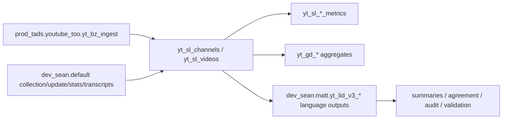

# Agent Data Context: Databricks YouTube Resources
This file is the concise agent-facing index for the Databricks YouTube resources used in this project. For complete machine-readable table and column metadata, load `src/databricks_youtube_resources.agent.json`. For the human-readable long-form map, load `src/README_data_resources.md`.
## Safety Contract
- The inventory was generated from metadata-only Unity Catalog calls. It intentionally omits row counts and value ranges.
- Do not run `count(*)`, broad `select *`, `distinct`, or unbounded scans just to understand structure. Start with metadata, narrow filters, and `LIMIT`.
- Treat descriptions as navigation hints. Verify semantics against code/docs before making publication-critical claims.
## Fast Entry Points
- `canonical_channel_metadata`: `prod_tads.youtube_too.yt_sl_channels`
- `canonical_video_metadata`: `prod_tads.youtube_too.yt_sl_videos`
- `channel_metrics`: `prod_tads.youtube_too.yt_sl_channels_metrics`
- `video_metrics`: `prod_tads.youtube_too.yt_sl_videos_metrics`
- `current_language_channel_labels`: `dev_sean.matt.yt_lid_v3_channels`
- `legacy_language_channel_labels`: `dev_sean.matt.yt_lid_openlid_v3_channels`
- `language_segments_input`: `dev_sean.matt.yt_lid_v3_segments_input`
- `older_collection_layer`: `dev_sean.default`
- `model_volume`: `dev_sean.matt.models`

## Schema Inventory
- `prod_tads.youtube_too`: 17 resources; production-style TOO ingest, curation, and aggregates
- `dev_sean.default`: 26 resources; legacy/development YouTube collection, update, transcript, and channel-stat tables
- `dev_sean.matt`: 22 resources; language-detection outputs and model-development tables
- `dev_sean.diagnostics`: 5 resources; TOO sampling/public-release diagnostics
- `dev_sean.validation`: 4 resources; validation and public-release cuts
- `dev_sean.threshold_yt_1k`: 4 resources; 1k subscriber-threshold collection
- `dev_sean.threshold_yt_5k`: 4 resources; 5k subscriber-threshold collection

## Core Mental Model
1. `prod_tads.youtube_too.yt_bz_ingest` is bronze/raw ingestion. Use it only for provenance/debugging.
2. `prod_tads.youtube_too.yt_sl_channels` and `yt_sl_videos` are the primary shaped channel/video surfaces.
3. `yt_sl_channels_metrics` and `yt_sl_videos_metrics` carry metrics; join back to the shaped entity tables on channel/video identifiers plus capture/ingest context when needed.
4. `yt_gd_*` resources are derived reporting/QA aggregates. They are useful for summaries, not row-level analysis.
5. `dev_sean.default` is the older/development collection layer: API calls, update queues, top lists, channel stats, discovery/backfill, transcripts.
6. `dev_sean.matt.yt_lid_v3_*` is the current dual-model language-detection family. Most tables are run-scoped by `run_id`, and many are partitioned by `channel_hash_bucket`.
7. `dev_sean.matt.yt_lid_openlid_v3_*` is the legacy/single-model OpenLID family.

## Relationship Sketch

## When Choosing A Table
- Need channel names, URLs, source language, capture/ingest metadata: use `prod_tads.youtube_too.yt_sl_channels`.
- Need video title/description/tags/labels/publication metadata: use `prod_tads.youtube_too.yt_sl_videos`.
- Need subscriber/view/video counts: use `prod_tads.youtube_too.yt_sl_channels_metrics`.
- Need video engagement counts: use `prod_tads.youtube_too.yt_sl_videos_metrics`.
- Need current channel language labels: use `dev_sean.matt.yt_lid_v3_channels`; filter by `run_id` when comparing runs.
- Need language pipeline internals: use `yt_lid_v3_segments_input`, compact prediction tables, and model comparison tables.
- Need historical collection provenance, update queues, top lists, transcripts: inspect `dev_sean.default` resources.

## File Contract
- `src/databricks_youtube_resources.agent.json`: canonical agent-readable manifest with schemas, resources, columns, relationships, and safety guidance.
- `src/README_data_resources.md`: long human-readable map with full column glossary.
- `src/AGENT_DATA_CONTEXT.md`: this concise orientation file.
