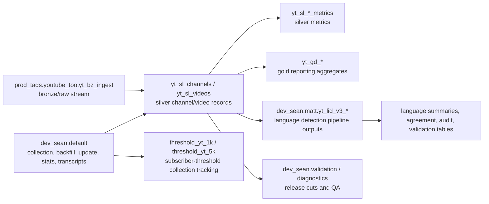

# YouTube Data Resource Map

_Generated from lightweight Unity Catalog REST metadata on 2026-05-28 22:08 UTC using Databricks profile `hindman.gmail.com@auth.researchaccelerator.org`._

> This inventory intentionally uses metadata-only calls. It does not run `count(*)`, `select`, `distinct`, date-range scans, `DESCRIBE DETAIL`, or any other table data reads.

Agent-facing companion files:

- `AGENT_DATA_CONTEXT.md` is the concise orientation file for Codex, Claude Code, and similar coding agents.
- `databricks_youtube_resources.agent.json` is the canonical structured manifest with schemas, resources, columns, relationships, and query-safety guidance.

## Scope

This map covers all user-visible resources in `prod_tads.youtube_too`; all tables in `dev_sean.default`; and YouTube-related resources in `dev_sean.matt`, `dev_sean.diagnostics`, `dev_sean.validation`, `dev_sean.threshold_yt_1k`, and `dev_sean.threshold_yt_5k`. It excludes non-YouTube-looking `dev_sean` schemas such as `llm_incitement`.

## High-Level Shape

- `prod_tads.youtube_too` is the production-style YouTube TOO pipeline area: bronze ingest, silver shaped channel/video tables, gold dashboard aggregates, and sampling/admin tables.

- `dev_sean.default` contains legacy/development YouTube collection tables, update queues, batch/progress logs, channel-stat snapshots, top-list tables, transcript tables, and discovery/backfill resources.

- `dev_sean.matt` contains Matt-facing language-detection work tables, including legacy OpenLID-v3 outputs and the newer dual-model `yt_lid_v3_*` family.

- `dev_sean.diagnostics`, `dev_sean.validation`, `dev_sean.threshold_yt_1k`, and `dev_sean.threshold_yt_5k` contain diagnostic, validation/public-release, and subscriber-threshold collection support tables.

## Schema Summary

| Schema | Included tables/views | Primary role |
|---|---:|---|
| `prod_tads.youtube_too` | 17 | production-style TOO ingest, curation, and aggregates |
| `dev_sean.default` | 26 | legacy/development YouTube collection, update, transcript, and channel-stat tables |
| `dev_sean.matt` | 22 | language-detection outputs and model-development tables |
| `dev_sean.diagnostics` | 5 | TOO sampling/public-release diagnostics |
| `dev_sean.validation` | 4 | validation and public-release cuts |
| `dev_sean.threshold_yt_1k` | 4 | 1k subscriber-threshold collection |
| `dev_sean.threshold_yt_5k` | 4 | 5k subscriber-threshold collection |

## Resource Map

### `prod_tads.youtube_too` - Production-Style YouTube TOO Resources

| Resource | Type | Layer | Columns | Keys / partitions | Updated | Description |
|---|---|---|---:|---|---|---|
| `prod_tads.youtube_too.sampling_history` | MANAGED | sampling/admin | 14 | `ingest_id` | 2026-05-20 | Sampling audit/history table for YouTube TOO subsampling runs. |
| `prod_tads.youtube_too.subsample_items` | MANAGED | sampling/admin | 31 | partitions: `partition_date` | 2026-05-05 | Item-level membership table for sampled/subsampled YouTube TOO objects. |
| `prod_tads.youtube_too.yt_bz_ingest` | STREAMING_TABLE | bronze ingest | 83 | `channel_id`, `ingest_id`, `channel_name`; partitions: `published_date` | 2026-05-20 | Bronze streaming ingest table: raw YouTube collection payloads/records before silver shaping. |
| `prod_tads.youtube_too.yt_bz_ingest_log` | MATERIALIZED_VIEW | bronze ingest | 11 | `ingest_id` | 2026-05-20 | Materialized ingest log for the bronze YouTube ingest stream. |
| `prod_tads.youtube_too.yt_gd_ad_vs_organic_by_channel` | MANAGED | gold aggregate | 7 | `channel_id`, `channel_name` | 2026-04-17 | Gold aggregate comparing apparent ad/paid-vs-organic video patterns by channel. |
| `prod_tads.youtube_too.yt_gd_channel_leaderboard` | MANAGED | gold aggregate | 9 | `channel_id`, `channel_name` | 2026-05-15 | Gold channel leaderboard for ranked channel summaries. |
| `prod_tads.youtube_too.yt_gd_collection_summary` | MANAGED | gold aggregate | 10 |  | 2026-05-15 | Gold collection-level summary across the YouTube TOO corpus. |
| `prod_tads.youtube_too.yt_gd_freshness_distribution` | MANAGED | gold aggregate | 5 |  | 2026-05-15 | Gold freshness distribution by ingest/capture/publication timing. |
| `prod_tads.youtube_too.yt_gd_ingestion_by_minute` | MANAGED | gold aggregate | 3 |  | 2026-05-15 | Gold ingestion throughput/time-series summary by minute. |
| `prod_tads.youtube_too.yt_gd_language_distribution` | MANAGED | gold aggregate | 3 |  | 2026-05-15 | Gold language distribution summary from source/detected language fields. |
| `prod_tads.youtube_too.yt_gd_publication_timeline` | MANAGED | gold aggregate | 3 |  | 2026-05-15 | Gold publication-date timeline summary for collected videos. |
| `prod_tads.youtube_too.yt_gd_video_length_distribution` | MANAGED | gold aggregate | 5 |  | 2026-05-15 | Gold distribution of video durations. |
| `prod_tads.youtube_too.yt_gd_videos_per_channel_histogram` | MANAGED | gold aggregate | 6 |  | 2026-05-15 | Gold histogram of videos collected per channel. |
| `prod_tads.youtube_too.yt_sl_channels` | MATERIALIZED_VIEW | silver shaped | 14 | `channel_id`, `ingest_id`, `channel_url`, `channel_name`; partitions: `capture_date` | 2026-05-20 | Silver channel dimension: shaped channel records with IDs, URLs, source language, ingest/capture timestamps, and optional detected language. |
| `prod_tads.youtube_too.yt_sl_channels_metrics` | MATERIALIZED_VIEW | silver shaped | 11 | `channel_id`, `ingest_id`, `channel_name`; partitions: `capture_date` | 2026-05-20 | Silver channel metrics: subscriber, view, video-count, and related channel statistics. |
| `prod_tads.youtube_too.yt_sl_videos` | MATERIALIZED_VIEW | silver shaped | 53 | `channel_id`, `video_id`, `ingest_id` | 2026-05-20 | Silver video dimension/content table: shaped video metadata, text fields, labels, publication/capture dates, and channel linkage. |
| `prod_tads.youtube_too.yt_sl_videos_metrics` | MATERIALIZED_VIEW | silver shaped | 8 | `channel_id`, `video_id`, `ingest_id`; partitions: `capture_date` | 2026-05-20 | Silver video metrics: video-level engagement/count metrics and metric freshness. |

### `dev_sean.default` - Legacy/Development YouTube Collection Resources

| Resource | Type | Layer | Columns | Keys / partitions | Updated | Description |
|---|---|---|---:|---|---|---|
| `dev_sean.default.all_channels` | MANAGED | channel stats/list | 1 |  | 2026-02-20 | Development collection table for the known YouTube channel universe in dev_sean.default. |
| `dev_sean.default.api_calls` | MANAGED | legacy collection | 9 |  | 2026-03-21 | Development API-call audit/log table for YouTube collection/update jobs. |
| `dev_sean.default.backfill_channels` | MANAGED | channel stats/list | 8 |  | 2026-05-28 | Development queue/table of channels targeted for backfill. |
| `dev_sean.default.batch_log` | MANAGED | collection operations | 11 |  | 2026-03-21 | Development batch execution log for YouTube collection/update runs. |
| `dev_sean.default.channels` | MANAGED | channel stats/list | 10 | `channel_id` | 2026-03-01 | Development channel metadata table. |
| `dev_sean.default.discoveries` | MANAGED | legacy collection | 5 | `channel_id` | 2026-03-21 | Development discovery table for newly found channels/items. |
| `dev_sean.default.fulcrum_sessions` | MANAGED | legacy collection | 2 |  | 2026-05-06 | Development support table for collection/review sessions. |
| `dev_sean.default.junkipedia_transcripts_2025` | MANAGED | transcripts | 4 | `video_id` | 2026-02-05 | Transcript table for 2025 Junkipedia/YouTube-linked records. |
| `dev_sean.default.junkipedia_transcripts_allyears` | MANAGED | transcripts | 4 | `video_id` | 2026-02-04 | Transcript table for all-year Junkipedia/YouTube-linked records. |
| `dev_sean.default.method_summary` | MANAGED | legacy collection | 9 |  | 2026-02-19 | Development summary table describing collection methods/sources. |
| `dev_sean.default.new_channels` | MANAGED | channel stats/list | 9 |  | 2026-05-28 | Development table of newly discovered channels. |
| `dev_sean.default.new_threshold_channels` | MANAGED | channel stats/list | 9 |  | 2026-05-28 | Development table of channels newly crossing a subscriber threshold. |
| `dev_sean.default.new_yt_top_list` | MANAGED | channel stats/list | 1 |  | 2026-02-17 | Development table for a refreshed/top YouTube channel list. |
| `dev_sean.default.pub_subs_batches` | MANAGED | collection operations | 5 |  | 2026-04-29 | Public-subscriber collection batch registry. |
| `dev_sean.default.pub_subs_full_pass_batches` | MANAGED | collection operations | 7 |  | 2026-03-11 | Full-pass public-subscriber collection batch registry. |
| `dev_sean.default.pub_subs_full_pass_progress` | MANAGED | collection operations | 2 |  | 2026-04-14 | Full-pass public-subscriber collection progress table. |
| `dev_sean.default.pub_subs_progress` | MANAGED | collection operations | 2 |  | 2026-05-20 | Public-subscriber collection progress table. |
| `dev_sean.default.qualified_channels` | MANAGED | channel stats/list | 10 | `channel_id` | 2026-03-21 | Development table of channels qualifying for downstream collection/release criteria. |
| `dev_sean.default.top_227k_yt` | MANAGED | channel stats/list | 4 |  | 2026-02-17 | Development snapshot/list of roughly top 227k YouTube channels. |
| `dev_sean.default.trending_batches` | MANAGED | collection operations | 8 |  | 2026-05-28 | Development batch registry for trending YouTube collection. |
| `dev_sean.default.updated_sb_top50k` | MANAGED | legacy collection | 16 |  | 2026-02-17 | Development updated SocialBlade/top-50k-style channel list. |
| `dev_sean.default.yt_channel_stats` | MANAGED | channel stats/list | 5 | `channel_name` | 2026-05-25 | Development YouTube channel statistics table. |
| `dev_sean.default.yt_channel_stats_full` | MANAGED | channel stats/list | 6 | `channel_name`; partitions: `collected_date` | 2026-05-28 | Development full YouTube channel statistics table. |
| `dev_sean.default.yt_update_map` | MANAGED | channel stats/list | 4 | `run_id`, `batch_id`; partitions: `run_id`, `chunk_id` | 2026-05-28 | Development mapping table for YouTube update jobs. |
| `dev_sean.default.yt_update_not_found` | MANAGED | channel stats/list | 3 | `run_id`; partitions: `run_id` | 2026-05-28 | Development table of YouTube update targets not found by the API/source. |
| `dev_sean.default.yt_update_queue` | MANAGED | collection operations | 3 | `run_id`; partitions: `run_id` | 2026-05-28 | Development queue table for YouTube update jobs. |

### `dev_sean.matt` - Language Detection Development

| Resource | Type | Layer | Columns | Keys / partitions | Updated | Description |
|---|---|---|---:|---|---|---|
| `dev_sean.matt.yt_lid_openlid_v3_channel_votes` | MANAGED | language detection development | 13 | `channel_id` | 2026-05-27 | Legacy OpenLID-v3 channel-language vote totals. |
| `dev_sean.matt.yt_lid_openlid_v3_channels` | MANAGED | language detection development | 21 | `channel_id` | 2026-05-28 | Legacy OpenLID-v3 final channel-level language classification table. |
| `dev_sean.matt.yt_lid_openlid_v3_segments` | MANAGED | language detection development | 22 | `channel_id`, `video_id`, `segment_id` | 2026-05-26 | Legacy OpenLID-v3 segment-level language predictions. |
| `dev_sean.matt.yt_lid_v3_channel_model_aggregation` | MANAGED | language detection development | 38 | `channel_id`, `run_id`; partitions: `run_id`, `channel_hash_bucket` | 2026-05-22 | Per-model channel-level language aggregation intermediate. |
| `dev_sean.matt.yt_lid_v3_channel_model_comparison` | MANAGED | language detection development | 40 | `channel_id`, `run_id`; partitions: `run_id`, `channel_hash_bucket` | 2026-05-23 | Channel-level model comparison and consensus inputs. |
| `dev_sean.matt.yt_lid_v3_channel_text_features` | MANAGED | language detection development | 17 | `channel_id`, `run_id`; partitions: `run_id`, `channel_hash_bucket` | 2026-05-22 | Per-channel script, keyword, text-validity, and sample-text features reused by language diagnostics. |
| `dev_sean.matt.yt_lid_v3_channel_votes` | MANAGED | language detection development | 22 | `channel_id`, `run_id`; partitions: `run_id`, `channel_hash_bucket` | 2026-05-22 | Per-(channel, language, model) weighted vote table. |
| `dev_sean.matt.yt_lid_v3_channels` | MANAGED | language detection development | 65 | `channel_id`, `run_id`; partitions: `run_id`, `channel_hash_bucket` | 2026-05-22 | Final dual-model v3 channel-level language classification output, including consensus fields. |
| `dev_sean.matt.yt_lid_v3_dedupe_qa` | MANAGED | language detection development | 14 | `run_id`; partitions: `run_id` | 2026-05-22 | Deduplication QA and pipeline row-count diagnostics. |
| `dev_sean.matt.yt_lid_v3_glotlid_predictions_compact` | MANAGED | language detection development | 39 | `channel_id`, `video_id`, `segment_id`, `run_id`; partitions: `run_id`, `channel_hash_bucket` | 2026-05-22 | Compact GlotLID top-k predictions, one row per valid segment. |
| `dev_sean.matt.yt_lid_v3_high_risk_redirect_diagnostic` | MANAGED | language detection development | 19 | `run_id`; partitions: `run_id` | 2026-05-22 | Diagnostics for high-risk tail-label redirects. |
| `dev_sean.matt.yt_lid_v3_hindi_indic_audit_candidates` | MANAGED | language detection development | 31 | `channel_id`, `run_id`; partitions: `run_id`, `channel_hash_bucket` | 2026-05-22 | Hindi/Indic recall audit candidates. |
| `dev_sean.matt.yt_lid_v3_language_summary_full` | MANAGED | language detection development | 13 | `run_id`; partitions: `run_id` | 2026-05-22 | Exact-label language summary with confidence and risk diagnostics. |
| `dev_sean.matt.yt_lid_v3_language_summary_rollup` | MANAGED | language detection development | 10 | `run_id`; partitions: `run_id` | 2026-05-22 | Rollup language summary by consensus status/language cluster. |
| `dev_sean.matt.yt_lid_v3_mixed_language_candidates` | MANAGED | language detection development | 20 | `channel_id`, `run_id`; partitions: `run_id`, `channel_hash_bucket` | 2026-05-22 | Screened/credible mixed-language candidates and rejection reasons. |
| `dev_sean.matt.yt_lid_v3_model_agreement_summary` | MANAGED | language detection development | 15 | `run_id`; partitions: `run_id` | 2026-05-22 | OpenLID/GlotLID agreement rates by exact label, ISO, cluster, and script. |
| `dev_sean.matt.yt_lid_v3_openlid_predictions_compact` | MANAGED | language detection development | 39 | `channel_id`, `video_id`, `segment_id`, `run_id`; partitions: `run_id`, `channel_hash_bucket` | 2026-05-22 | Compact OpenLID top-k predictions, one row per valid segment. |
| `dev_sean.matt.yt_lid_v3_segment_model_comparison` | MANAGED | language detection development | 23 | `channel_id`, `segment_id`, `run_id`; partitions: `run_id`, `channel_hash_bucket` | 2026-05-22 | Segment-level OpenLID-vs-GlotLID comparison and agreement fields. |
| `dev_sean.matt.yt_lid_v3_segments_input` | MANAGED | language detection development | 31 | `channel_id`, `video_id`, `segment_id`, `run_id`; partitions: `run_id`, `channel_hash_bucket` | 2026-05-22 | Canonical text segments + script metrics + validity + run/bucket metadata; shared input universe for OpenLID and GlotLID. |
| `dev_sean.matt.yt_lid_v3_source_language_confusion` | MANAGED | language detection development | 10 | `run_id`; partitions: `run_id` | 2026-05-22 | Source-language-vs-model disagreement patterns. |
| `dev_sean.matt.yt_lid_v3_suspect_tail_audit_sample` | MANAGED | language detection development | 13 | `channel_id`, `run_id`; partitions: `run_id`, `channel_hash_bucket` | 2026-05-22 | Audit sample of channels assigned high-risk tail labels. |
| `dev_sean.matt.yt_lid_v3_unclassified_audit` | MANAGED | language detection development | 11 | `channel_id`, `run_id`; partitions: `run_id`, `channel_hash_bucket` | 2026-05-22 | Audit table for text-sparse or invalid-text channels. |

### `dev_sean.diagnostics` - TOO Diagnostics

| Resource | Type | Layer | Columns | Keys / partitions | Updated | Description |
|---|---|---|---:|---|---|---|
| `dev_sean.diagnostics.too_breakdowns` | MANAGED | TOO diagnostics | 6 | `run_id` | 2026-05-04 | Development diagnostics: TOO sample/release breakdowns. |
| `dev_sean.diagnostics.too_rank_comparison` | MANAGED | TOO diagnostics | 9 | `channel_id`, `run_id` | 2026-05-07 | Development diagnostics: rank comparisons for TOO sample/release logic. |
| `dev_sean.diagnostics.too_run_summary` | MANAGED | TOO diagnostics | 9 | `run_id` | 2026-05-04 | Development diagnostics: run-level summary for TOO sample/release logic. |
| `dev_sean.diagnostics.too_subfloor_excluded` | MANAGED | TOO diagnostics | 39 | `channel_id`, `run_id`, `channel_url`, `channel_name` | 2026-05-13 | Development diagnostics: channels/items excluded below a subscriber or ranking floor. |
| `dev_sean.diagnostics.too_suspicion_flags` | MANAGED | TOO diagnostics | 59 | `channel_id`, `run_id`, `channel_url`, `channel_name` | 2026-05-25 | Development diagnostics: suspicion/QA flags for TOO sample/release logic. |

### `dev_sean.validation` - Validation/Public Release

| Resource | Type | Layer | Columns | Keys / partitions | Updated | Description |
|---|---|---|---:|---|---|---|
| `dev_sean.validation.all_channels_public_release` | MANAGED | validation/public release | 3 |  | 2026-05-26 | Validation/public-release candidate table for all channels. |
| `dev_sean.validation.yt_random_logs` | MANAGED | validation/public release | 15 |  | 2026-05-18 | Validation logs for random YouTube sampling. |
| `dev_sean.validation.yt_too_public` | MANAGED | validation/public release | 3 |  | 2026-05-28 | Validation/public-release table for YouTube TOO channels/items. |
| `dev_sean.validation.yt_too_sample_cut` | MANAGED | validation/public release | 5 |  | 2026-05-28 | Validation sample cut of YouTube TOO channels/items. |

### `dev_sean.threshold_yt_1k` - 1k Subscriber Threshold Collection

| Resource | Type | Layer | Columns | Keys / partitions | Updated | Description |
|---|---|---|---:|---|---|---|
| `dev_sean.threshold_yt_1k.new_channels` | MANAGED | subscriber-threshold collection | 8 |  | 2026-04-30 | Development table of newly discovered channels. |
| `dev_sean.threshold_yt_1k.new_threshold_channels` | MANAGED | subscriber-threshold collection | 8 |  | 2026-04-14 | Development table of channels newly crossing a subscriber threshold. |
| `dev_sean.threshold_yt_1k.pub_subs_1k_batches` | MANAGED | subscriber-threshold collection | 4 |  | 2026-05-28 | 1k-subscriber public-subscription collection batch registry. |
| `dev_sean.threshold_yt_1k.pub_subs_1k_progress` | MANAGED | subscriber-threshold collection | 3 |  | 2026-04-30 | 1k-subscriber public-subscription collection progress table. |

### `dev_sean.threshold_yt_5k` - 5k Subscriber Threshold Collection

| Resource | Type | Layer | Columns | Keys / partitions | Updated | Description |
|---|---|---|---:|---|---|---|
| `dev_sean.threshold_yt_5k.new_channels` | MANAGED | subscriber-threshold collection | 8 |  | 2026-04-14 | Development table of newly discovered channels. |
| `dev_sean.threshold_yt_5k.new_threshold_channels` | MANAGED | subscriber-threshold collection | 8 |  | 2026-04-14 | Development table of channels newly crossing a subscriber threshold. |
| `dev_sean.threshold_yt_5k.pub_subs_5k_batches` | MANAGED | subscriber-threshold collection | 4 |  | 2026-05-28 | 5k-subscriber public-subscription collection batch registry. |
| `dev_sean.threshold_yt_5k.pub_subs_5k_progress` | MANAGED | subscriber-threshold collection | 2 |  | 2026-04-14 | 5k-subscriber public-subscription collection progress table. |

## Volumes

| Volume | Type | Owner | Purpose |
|---|---|---|---|
| `dev_sean.matt.models` | MANAGED | sean.norton@researchaccelerator.org | Model/artifact volume used by language-detection workflows. |

## How The Pieces Relate

## Practical Use Notes

- Use `prod_tads.youtube_too.yt_sl_channels` and `prod_tads.youtube_too.yt_sl_videos` as the canonical shaped source tables for channel/video metadata in this workspace.

- Use `prod_tads.youtube_too.yt_sl_channels_metrics` and `prod_tads.youtube_too.yt_sl_videos_metrics` for metric fields; do not assume all metrics live in the channel/video dimension tables.

- Treat `yt_gd_*` as derived reporting/QA aggregates, not row-level analytical sources.

- Treat `dev_sean.default` as the older/development collection layer: useful for provenance, update queues, top lists, API logs, and channel-stat snapshots, but not necessarily the cleanest analytical surface.

- Treat `dev_sean.matt.yt_lid_v3_channels` as the current channel-level language output family for Matt's dual-model language-detection work; `yt_lid_openlid_v3_*` tables are legacy/single-model outputs kept for comparison and backward compatibility.

- Use `dev_sean.matt.models` for model binaries. The inventory found no volumes in `prod_tads.youtube_too`.

- This is a point-in-time metadata map. Re-run the metadata inventory after pipeline refreshes or schema migrations.

## Column Glossary By Table

### `dev_sean.default.all_channels`

- Type: MANAGED
- Layer: channel stats/list
- Column count: 1
- Important columns: `canonical_id`

| # | Column | Type | Nullable | Partition | Comment |
|---:|---|---|---|---|---|
| 0 | `canonical_id` | `string` | True |  |  |

### `dev_sean.default.api_calls`

- Type: MANAGED
- Layer: legacy collection
- Column count: 9
- Important columns: `http_status`; ... 8 more

| # | Column | Type | Nullable | Partition | Comment |
|---:|---|---|---|---|---|
| 0 | `id` | `bigint` | True |  |  |
| 1 | `called_at` | `string` | True |  |  |
| 2 | `strategy` | `string` | True |  |  |
| 3 | `endpoint` | `string` | True |  |  |
| 4 | `params_json` | `string` | True |  |  |
| 5 | `quota_cost` | `int` | True |  |  |
| 6 | `http_status` | `int` | True |  |  |
| 7 | `error_reason` | `string` | True |  |  |
| 8 | `error_message` | `string` | True |  |  |

### `dev_sean.default.backfill_channels`

- Type: MANAGED
- Layer: channel stats/list
- Column count: 8
- Important columns: `snippet_default_language`; `branding_default_language`; `status`; ... 5 more

| # | Column | Type | Nullable | Partition | Comment |
|---:|---|---|---|---|---|
| 0 | `canonical_id` | `string` | False |  |  |
| 1 | `topic_categories` | `array<string>` | True |  |  |
| 2 | `branding_default_tab` | `string` | True |  |  |
| 3 | `snippet_default_language` | `string` | True |  |  |
| 4 | `branding_default_language` | `string` | True |  |  |
| 5 | `status` | `string` | False |  |  |
| 6 | `retry_count` | `int` | False |  |  |
| 7 | `backfilled_at` | `timestamp` | True |  |  |

### `dev_sean.default.batch_log`

- Type: MANAGED
- Layer: collection operations
- Column count: 11
- Important columns: `batch`; `quota_batch`; ... 9 more

| # | Column | Type | Nullable | Partition | Comment |
|---:|---|---|---|---|---|
| 0 | `batch` | `int` | True |  |  |
| 1 | `method` | `string` | True |  |  |
| 2 | `quota_batch` | `int` | True |  |  |
| 3 | `quota_total` | `int` | True |  |  |
| 4 | `quota_remaining` | `int` | True |  |  |
| 5 | `candidates_found` | `int` | True |  |  |
| 6 | `candidates_new` | `int` | True |  |  |
| 7 | `qualified_new` | `int` | True |  |  |
| 8 | `qualified_total` | `int` | True |  |  |
| 9 | `ema_yield` | `double` | True |  |  |
| 10 | `timestamp` | `string` | True |  |  |

### `dev_sean.default.channels`

- Type: MANAGED
- Layer: channel stats/list
- Column count: 10
- Key/link columns: `channel_id`
- Important columns: `channel_id`; `title`; `subscriber_count`; `view_count`; `video_count`; `hidden_subscriber_count`; ... 4 more

| # | Column | Type | Nullable | Partition | Comment |
|---:|---|---|---|---|---|
| 0 | `channel_id` | `string` | False |  |  |
| 1 | `fetched_at` | `string` | True |  |  |
| 2 | `title` | `string` | True |  |  |
| 3 | `subscriber_count` | `bigint` | True |  |  |
| 4 | `view_count` | `bigint` | True |  |  |
| 5 | `video_count` | `bigint` | True |  |  |
| 6 | `hidden_subscriber_count` | `boolean` | True |  |  |
| 7 | `uploads_playlist_id` | `string` | True |  |  |
| 8 | `country` | `string` | True |  |  |
| 9 | `raw_json` | `string` | True |  |  |

### `dev_sean.default.discoveries`

- Type: MANAGED
- Layer: legacy collection
- Column count: 5
- Key/link columns: `channel_id`
- Important columns: `channel_id`; ... 4 more

| # | Column | Type | Nullable | Partition | Comment |
|---:|---|---|---|---|---|
| 0 | `id` | `bigint` | True |  |  |
| 1 | `discovered_at` | `string` | True |  |  |
| 2 | `channel_id` | `string` | True |  |  |
| 3 | `strategy` | `string` | True |  |  |
| 4 | `source_id` | `string` | True |  |  |

### `dev_sean.default.fulcrum_sessions`

- Type: MANAGED
- Layer: legacy collection
- Column count: 2
- Important columns: `channel`; ... 1 more

| # | Column | Type | Nullable | Partition | Comment |
|---:|---|---|---|---|---|
| 0 | `channel` | `string` | True |  |  |
| 1 | `property` | `string` | True |  |  |

### `dev_sean.default.junkipedia_transcripts_2025`

- Type: MANAGED
- Layer: transcripts
- Column count: 4
- Key/link columns: `video_id`
- Important columns: `video_id`; `video_link`; `has_transcripts`; ... 1 more

| # | Column | Type | Nullable | Partition | Comment |
|---:|---|---|---|---|---|
| 0 | `video_id` | `string` | True |  |  |
| 1 | `video_link` | `string` | True |  |  |
| 2 | `has_transcripts` | `string` | True |  |  |
| 3 | `error` | `string` | True |  |  |

### `dev_sean.default.junkipedia_transcripts_allyears`

- Type: MANAGED
- Layer: transcripts
- Column count: 4
- Key/link columns: `video_id`
- Important columns: `video_id`; `video_link`; `has_transcripts`; ... 1 more

| # | Column | Type | Nullable | Partition | Comment |
|---:|---|---|---|---|---|
| 0 | `video_id` | `string` | True |  |  |
| 1 | `video_link` | `string` | True |  |  |
| 2 | `has_transcripts` | `string` | True |  |  |
| 3 | `error` | `string` | True |  |  |

### `dev_sean.default.method_summary`

- Type: MANAGED
- Layer: legacy collection
- Column count: 9
- Important columns: `batches`; ... 8 more

| # | Column | Type | Nullable | Partition | Comment |
|---:|---|---|---|---|---|
| 0 | `method` | `string` | True |  |  |
| 1 | `batches` | `int` | True |  |  |
| 2 | `quota_used` | `int` | True |  |  |
| 3 | `candidates_total` | `int` | True |  |  |
| 4 | `candidates_new` | `int` | True |  |  |
| 5 | `qualified_new` | `int` | True |  |  |
| 6 | `cost_per_qualified` | `double` | True |  |  |
| 7 | `cost_per_new_unique` | `double` | True |  |  |
| 8 | `ema_yield` | `double` | True |  |  |

### `dev_sean.default.new_channels`

- Type: MANAGED
- Layer: channel stats/list
- Column count: 9
- Important columns: `title`; `subscriber_count`; `view_count`; `video_count`; `hidden_subscriber_count`; `batch_number`; `batch_source`; ... 2 more

| # | Column | Type | Nullable | Partition | Comment |
|---:|---|---|---|---|---|
| 0 | `canonical_id` | `string` | True |  |  |
| 1 | `title` | `string` | True |  |  |
| 2 | `country` | `string` | True |  |  |
| 3 | `subscriber_count` | `bigint` | True |  |  |
| 4 | `view_count` | `bigint` | True |  |  |
| 5 | `video_count` | `bigint` | True |  |  |
| 6 | `hidden_subscriber_count` | `boolean` | True |  |  |
| 7 | `batch_number` | `int` | True |  |  |
| 8 | `batch_source` | `string` | True |  |  |

### `dev_sean.default.new_threshold_channels`

- Type: MANAGED
- Layer: channel stats/list
- Column count: 9
- Important columns: `title`; `subscriber_count`; `view_count`; `video_count`; `hidden_subscriber_count`; `batch_number`; `batch_source`; ... 2 more

| # | Column | Type | Nullable | Partition | Comment |
|---:|---|---|---|---|---|
| 0 | `canonical_id` | `string` | True |  |  |
| 1 | `title` | `string` | True |  |  |
| 2 | `country` | `string` | True |  |  |
| 3 | `subscriber_count` | `bigint` | True |  |  |
| 4 | `view_count` | `bigint` | True |  |  |
| 5 | `video_count` | `bigint` | True |  |  |
| 6 | `hidden_subscriber_count` | `boolean` | True |  |  |
| 7 | `batch_number` | `int` | True |  |  |
| 8 | `batch_source` | `string` | True |  |  |

### `dev_sean.default.new_yt_top_list`

- Type: MANAGED
- Layer: channel stats/list
- Column count: 1
- Important columns: `canonical_id`

| # | Column | Type | Nullable | Partition | Comment |
|---:|---|---|---|---|---|
| 0 | `canonical_id` | `string` | True |  |  |

### `dev_sean.default.pub_subs_batches`

- Type: MANAGED
- Layer: collection operations
- Column count: 5
- Important columns: `batch_number`; `new_channels_count`; `seed_batch`; ... 2 more

| # | Column | Type | Nullable | Partition | Comment |
|---:|---|---|---|---|---|
| 0 | `batch_number` | `int` | True |  |  |
| 1 | `new_channels_count` | `int` | True |  |  |
| 2 | `run_date` | `string` | True |  |  |
| 3 | `seed_batch` | `int` | True |  |  |
| 4 | `notes` | `string` | True |  |  |

### `dev_sean.default.pub_subs_full_pass_batches`

- Type: MANAGED
- Layer: collection operations
- Column count: 7
- Important columns: `batch_number`; `new_channels_count`; ... 5 more

| # | Column | Type | Nullable | Partition | Comment |
|---:|---|---|---|---|---|
| 0 | `batch_number` | `int` | True |  |  |
| 1 | `new_channels_count` | `int` | True |  |  |
| 2 | `new_threshold_count` | `int` | True |  |  |
| 3 | `run_date` | `string` | True |  |  |
| 4 | `seeds_top_count` | `int` | True |  |  |
| 5 | `seeds_thresh_count` | `int` | True |  |  |
| 6 | `seeds_total` | `int` | True |  |  |

### `dev_sean.default.pub_subs_full_pass_progress`

- Type: MANAGED
- Layer: collection operations
- Column count: 2
- Important columns: `batch_number`; `seed_channel_id`

| # | Column | Type | Nullable | Partition | Comment |
|---:|---|---|---|---|---|
| 0 | `batch_number` | `int` | True |  |  |
| 1 | `seed_channel_id` | `string` | True |  |  |

### `dev_sean.default.pub_subs_progress`

- Type: MANAGED
- Layer: collection operations
- Column count: 2
- Important columns: `batch_number`; `seed_channel_id`

| # | Column | Type | Nullable | Partition | Comment |
|---:|---|---|---|---|---|
| 0 | `batch_number` | `int` | True |  |  |
| 1 | `seed_channel_id` | `string` | True |  |  |

### `dev_sean.default.qualified_channels`

- Type: MANAGED
- Layer: channel stats/list
- Column count: 10
- Key/link columns: `channel_id`
- Important columns: `channel_id`; `title`; `subscriberCount`; `viewCount`; `videoCount`; ... 5 more

| # | Column | Type | Nullable | Partition | Comment |
|---:|---|---|---|---|---|
| 0 | `channel_id` | `string` | True |  |  |
| 1 | `title` | `string` | True |  |  |
| 2 | `subscriberCount` | `bigint` | True |  |  |
| 3 | `viewCount` | `bigint` | True |  |  |
| 4 | `videoCount` | `bigint` | True |  |  |
| 5 | `country` | `string` | True |  |  |
| 6 | `uploadsPlaylistId` | `string` | True |  |  |
| 7 | `discoveredBy` | `string` | True |  |  |
| 8 | `source` | `string` | True |  |  |
| 9 | `discoveredAt` | `string` | True |  |  |

### `dev_sean.default.top_227k_yt`

- Type: MANAGED
- Layer: channel stats/list
- Column count: 4
- Important columns: `subscribers`; ... 3 more

| # | Column | Type | Nullable | Partition | Comment |
|---:|---|---|---|---|---|
| 0 | `user_id` | `string` | True |  |  |
| 1 | `canonical_id_url` | `string` | True |  |  |
| 2 | `subscribers` | `double` | True |  |  |
| 3 | `canonical_id` | `string` | True |  |  |

### `dev_sean.default.trending_batches`

- Type: MANAGED
- Layer: collection operations
- Column count: 8
- Important columns: `batch_number`; `new_channels_count`; ... 6 more

| # | Column | Type | Nullable | Partition | Comment |
|---:|---|---|---|---|---|
| 0 | `batch_number` | `int` | True |  |  |
| 1 | `new_channels_count` | `int` | True |  |  |
| 2 | `run_date` | `string` | True |  |  |
| 3 | `regions_count` | `int` | True |  |  |
| 4 | `categories_count` | `int` | True |  |  |
| 5 | `combos_count` | `int` | True |  |  |
| 6 | `new_threshold_count` | `int` | True |  |  |
| 7 | `overall_combos_count` | `int` | True |  |  |

### `dev_sean.default.updated_sb_top50k`

- Type: MANAGED
- Layer: legacy collection
- Column count: 16
- Important columns: `general.channel_type`; `statistics.total.subscribers`; `statistics.total.views`; `ranks.subscribers`; `ranks.views`; `ranks.channel_type`; ... 10 more

| # | Column | Type | Nullable | Partition | Comment |
|---:|---|---|---|---|---|
| 0 | `id.id` | `string` | True |  |  |
| 1 | `id.username` | `string` | True |  |  |
| 2 | `id.display_name` | `string` | True |  |  |
| 3 | `id.handle` | `string` | True |  |  |
| 4 | `general.created_at` | `timestamp` | True |  |  |
| 5 | `general.channel_type` | `string` | True |  |  |
| 6 | `general.geo.country_code` | `string` | True |  |  |
| 7 | `general.geo.country` | `string` | True |  |  |
| 8 | `statistics.total.uploads` | `bigint` | True |  |  |
| 9 | `statistics.total.subscribers` | `bigint` | True |  |  |
| 10 | `statistics.total.views` | `bigint` | True |  |  |
| 11 | `ranks.sbrank` | `string` | True |  |  |
| 12 | `ranks.subscribers` | `string` | True |  |  |
| 13 | `ranks.views` | `string` | True |  |  |
| 14 | `ranks.country` | `string` | True |  |  |
| 15 | `ranks.channel_type` | `string` | True |  |  |

### `dev_sean.default.yt_channel_stats`

- Type: MANAGED
- Layer: channel stats/list
- Column count: 5
- Key/link columns: `channel_name`
- Important columns: `channel_name`; `subscriber_count`; `total_view_count`; ... 2 more

| # | Column | Type | Nullable | Partition | Comment |
|---:|---|---|---|---|---|
| 0 | `canonical_id` | `string` | True |  |  |
| 1 | `channel_name` | `string` | True |  |  |
| 2 | `subscriber_count` | `bigint` | True |  |  |
| 3 | `total_view_count` | `bigint` | True |  |  |
| 4 | `collected_at` | `timestamp` | True |  |  |

### `dev_sean.default.yt_channel_stats_full`

- Type: MANAGED
- Layer: channel stats/list
- Column count: 6
- Key/link columns: `channel_name`
- Partition columns: `collected_date`
- Important columns: `channel_name`; `subscriber_count`; `total_view_count`; ... 3 more

| # | Column | Type | Nullable | Partition | Comment |
|---:|---|---|---|---|---|
| 0 | `canonical_id` | `string` | True |  |  |
| 1 | `channel_name` | `string` | True |  |  |
| 2 | `subscriber_count` | `bigint` | True |  |  |
| 3 | `total_view_count` | `bigint` | True |  |  |
| 4 | `collected_at` | `timestamp` | True |  |  |
| 5 | `collected_date` | `date` | True | 0 |  |

### `dev_sean.default.yt_update_map`

- Type: MANAGED
- Layer: channel stats/list
- Column count: 4
- Key/link columns: `run_id`, `batch_id`
- Partition columns: `run_id`, `chunk_id`
- Important columns: `batch_id`; ... 3 more

| # | Column | Type | Nullable | Partition | Comment |
|---:|---|---|---|---|---|
| 0 | `canonical_id` | `string` | True |  |  |
| 1 | `batch_id` | `bigint` | True |  |  |
| 2 | `run_id` | `string` | True | 0 |  |
| 3 | `chunk_id` | `bigint` | True | 1 |  |

### `dev_sean.default.yt_update_not_found`

- Type: MANAGED
- Layer: channel stats/list
- Column count: 3
- Key/link columns: `run_id`
- Partition columns: `run_id`
- Important columns: `run_id`; `canonical_id`; `collected_at`

| # | Column | Type | Nullable | Partition | Comment |
|---:|---|---|---|---|---|
| 0 | `run_id` | `string` | True | 0 |  |
| 1 | `canonical_id` | `string` | True |  |  |
| 2 | `collected_at` | `timestamp` | True |  |  |

### `dev_sean.default.yt_update_queue`

- Type: MANAGED
- Layer: collection operations
- Column count: 3
- Key/link columns: `run_id`
- Partition columns: `run_id`
- Important columns: `run_id`; `chunk_id`; `completed_at`

| # | Column | Type | Nullable | Partition | Comment |
|---:|---|---|---|---|---|
| 0 | `run_id` | `string` | True | 0 |  |
| 1 | `chunk_id` | `bigint` | True |  |  |
| 2 | `completed_at` | `timestamp` | True |  |  |

### `dev_sean.diagnostics.too_breakdowns`

- Type: MANAGED
- Layer: TOO diagnostics
- Column count: 6
- Key/link columns: `run_id`
- Important columns: `n_channels`; `view_share_or_count_share`; ... 4 more

| # | Column | Type | Nullable | Partition | Comment |
|---:|---|---|---|---|---|
| 0 | `dimension` | `string` | True |  |  |
| 1 | `bucket` | `string` | True |  |  |
| 2 | `scope` | `string` | True |  |  |
| 3 | `n_channels` | `bigint` | True |  |  |
| 4 | `view_share_or_count_share` | `double` | True |  |  |
| 5 | `run_id` | `string` | True |  |  |

### `dev_sean.diagnostics.too_rank_comparison`

- Type: MANAGED
- Layer: TOO diagnostics
- Column count: 9
- Key/link columns: `channel_id`, `run_id`
- Important columns: `channel_id`; `recency_status`; `views_past_year`; ... 6 more

| # | Column | Type | Nullable | Partition | Comment |
|---:|---|---|---|---|---|
| 0 | `channel_id` | `string` | True |  |  |
| 1 | `rank_overall_lifetime` | `bigint` | True |  |  |
| 2 | `recency_status` | `string` | True |  |  |
| 3 | `rank_within_cut_lifetime` | `int` | True |  |  |
| 4 | `views_past_year` | `bigint` | True |  |  |
| 5 | `no_pastyear_activity` | `boolean` | True |  |  |
| 6 | `rank_within_pastyear` | `bigint` | True |  |  |
| 7 | `rank_delta` | `bigint` | True |  |  |
| 8 | `run_id` | `string` | True |  |  |

### `dev_sean.diagnostics.too_run_summary`

- Type: MANAGED
- Layer: TOO diagnostics
- Column count: 9
- Key/link columns: `run_id`
- Important columns: `cut_n_channels`; `n_channels_with_flags`; `channel_metrics_panel_size`; `view_count_threshold`; ... 5 more

| # | Column | Type | Nullable | Partition | Comment |
|---:|---|---|---|---|---|
| 0 | `run_id` | `string` | True |  |  |
| 1 | `run_ts` | `timestamp` | True |  |  |
| 2 | `cut_n_channels` | `bigint` | True |  |  |
| 3 | `n_channels_with_flags` | `bigint` | True |  |  |
| 4 | `n_excluded_subfloor` | `bigint` | True |  |  |
| 5 | `n_no_pastyear_activity` | `bigint` | True |  |  |
| 6 | `channel_metrics_panel_size` | `int` | True |  |  |
| 7 | `view_count_threshold` | `bigint` | True |  |  |
| 8 | `spearman_rho` | `double` | True |  |  |

### `dev_sean.diagnostics.too_subfloor_excluded`

- Type: MANAGED
- Layer: TOO diagnostics
- Column count: 39
- Key/link columns: `channel_id`, `run_id`, `channel_url`, `channel_name`
- Important columns: `channel_id`; `view_count_lifetime`; `subscriber_count_universe`; `channel_name`; `channel_url`; `language_code`; `detected_language`; `first_capture_timestamp`; `last_ingestion_timestamp`; `channel_like_count`; `channel_comment_count`; `channel_share_count`; `views_count_channel`; `py_video_count`; `py_view_sum`; `py_view_median`; `py_short_video_count`; `py_oldest_video_at`; ... 21 more

| # | Column | Type | Nullable | Partition | Comment |
|---:|---|---|---|---|---|
| 0 | `channel_id` | `string` | True |  |  |
| 1 | `view_count_lifetime` | `bigint` | True |  |  |
| 2 | `subscriber_count_universe` | `bigint` | True |  |  |
| 3 | `country` | `string` | True |  |  |
| 4 | `channel_name` | `string` | True |  |  |
| 5 | `channel_url` | `string` | True |  |  |
| 6 | `language_code` | `string` | True |  |  |
| 7 | `detected_language` | `string` | True |  |  |
| 8 | `first_capture_timestamp` | `timestamp` | True |  |  |
| 9 | `last_ingestion_timestamp` | `timestamp` | True |  |  |
| 10 | `follower_count` | `bigint` | True |  |  |
| 11 | `following_count` | `bigint` | True |  |  |
| 12 | `channel_like_count` | `bigint` | True |  |  |
| 13 | `channel_comment_count` | `bigint` | True |  |  |
| 14 | `channel_share_count` | `bigint` | True |  |  |
| 15 | `post_count` | `bigint` | True |  |  |
| 16 | `views_count_channel` | `bigint` | True |  |  |
| 17 | `py_video_count` | `bigint` | True |  |  |
| 18 | `py_view_sum` | `bigint` | True |  |  |
| 19 | `py_view_median` | `bigint` | True |  |  |
| 20 | `py_ad_count` | `bigint` | True |  |  |
| 21 | `py_reply_count` | `bigint` | True |  |  |
| 22 | `py_round_minute_count` | `bigint` | True |  |  |
| 23 | `py_empty_text_count` | `bigint` | True |  |  |
| 24 | `py_short_video_count` | `bigint` | True |  |  |
| 25 | `py_zero_eng_count` | `bigint` | True |  |  |
| 26 | `py_oldest_video_at` | `timestamp` | True |  |  |
| 27 | `py_newest_video_at` | `timestamp` | True |  |  |
| 28 | `py_video_length_median` | `double` | True |  |  |
| 29 | `top3_view_share` | `double` | True |  |  |
| 30 | `max_window_count` | `bigint` | True |  |  |
| 31 | `shorts_share` | `double` | True |  |  |
| 32 | `duplicate_title_groups` | `bigint` | True |  |  |
| 33 | `is_top_decile_sus` | `boolean` | True |  |  |
| 34 | `is_hidden_or_zero_subs` | `boolean` | True |  |  |
| 35 | `narrow_share` | `double` | True |  |  |
| 36 | `primary_archetype` | `string` | True |  |  |
| 37 | `_secondary_archetypes` | `array<string>` | True |  |  |
| 38 | `run_id` | `string` | True |  |  |

### `dev_sean.diagnostics.too_suspicion_flags`

- Type: MANAGED
- Layer: TOO diagnostics
- Column count: 59
- Key/link columns: `channel_id`, `run_id`, `channel_url`, `channel_name`
- Important columns: `channel_id`; `recency_status`; `channel_name`; `channel_url`; `language_code`; `detected_language`; `first_capture_timestamp`; `last_ingestion_timestamp`; `channel_like_count`; `channel_comment_count`; `channel_share_count`; `views_count_channel`; `py_video_count`; `py_view_sum`; `py_view_median`; `py_short_video_count`; `py_oldest_video_at`; `py_newest_video_at`; ... 41 more

| # | Column | Type | Nullable | Partition | Comment |
|---:|---|---|---|---|---|
| 0 | `channel_id` | `string` | True |  |  |
| 1 | `rank_overall_lifetime` | `bigint` | True |  |  |
| 2 | `recency_status` | `string` | True |  |  |
| 3 | `channel_name` | `string` | True |  |  |
| 4 | `channel_url` | `string` | True |  |  |
| 5 | `language_code` | `string` | True |  |  |
| 6 | `detected_language` | `string` | True |  |  |
| 7 | `first_capture_timestamp` | `timestamp` | True |  |  |
| 8 | `last_ingestion_timestamp` | `timestamp` | True |  |  |
| 9 | `follower_count` | `bigint` | True |  |  |
| 10 | `following_count` | `bigint` | True |  |  |
| 11 | `channel_like_count` | `bigint` | True |  |  |
| 12 | `channel_comment_count` | `bigint` | True |  |  |
| 13 | `channel_share_count` | `bigint` | True |  |  |
| 14 | `post_count` | `bigint` | True |  |  |
| 15 | `views_count_channel` | `bigint` | True |  |  |
| 16 | `py_video_count` | `bigint` | True |  |  |
| 17 | `py_view_sum` | `bigint` | True |  |  |
| 18 | `py_view_median` | `bigint` | True |  |  |
| 19 | `py_ad_count` | `bigint` | True |  |  |
| 20 | `py_reply_count` | `bigint` | True |  |  |
| 21 | `py_round_minute_count` | `bigint` | True |  |  |
| 22 | `py_empty_text_count` | `bigint` | True |  |  |
| 23 | `py_short_video_count` | `bigint` | True |  |  |
| 24 | `py_zero_eng_count` | `bigint` | True |  |  |
| 25 | `py_oldest_video_at` | `timestamp` | True |  |  |
| 26 | `py_newest_video_at` | `timestamp` | True |  |  |
| 27 | `py_video_length_median` | `double` | True |  |  |
| 28 | `top3_view_share` | `double` | True |  |  |
| 29 | `interval_stddev_sec` | `double` | True |  |  |
| 30 | `interval_mean_sec` | `double` | True |  |  |
| 31 | `interval_n` | `bigint` | True |  |  |
| 32 | `interval_cv` | `double` | True |  |  |
| 33 | `max_24h_uploads` | `bigint` | True |  |  |
| 34 | `max_day_uploads` | `bigint` | True |  |  |
| 35 | `max_zero_eng_run` | `bigint` | True |  |  |
| 36 | `duplicate_title_groups` | `bigint` | True |  |  |
| 37 | `log_view_to_follower` | `double` | True |  |  |
| 38 | `log_ratio_median` | `double` | True |  |  |
| 39 | `log_ratio_abs_dev` | `double` | True |  |  |
| 40 | `log_ratio_mad` | `double` | True |  |  |
| 41 | `flag_sub_view_outlier` | `boolean` | True |  |  |
| 42 | `flag_high_post_low_view` | `boolean` | True |  |  |
| 43 | `flag_uniform_upload_cadence` | `boolean` | True |  |  |
| 44 | `flag_round_clock_uploads` | `boolean` | True |  |  |
| 45 | `flag_burst_uploads` | `boolean` | True |  |  |
| 46 | `flag_zero_engagement_runs` | `boolean` | True |  |  |
| 47 | `flag_view_count_spike_implausible` | `boolean` | True |  |  |
| 48 | `flag_duplicate_titles` | `boolean` | True |  |  |
| 49 | `flag_ad_dominant` | `boolean` | True |  |  |
| 50 | `flag_reply_dominant` | `boolean` | True |  |  |
| 51 | `flag_low_text_dominant` | `boolean` | True |  |  |
| 52 | `n_flags_fired` | `int` | True |  |  |
| 53 | `n_flags_evaluable` | `int` | True |  |  |
| 54 | `composite_score` | `double` | True |  |  |
| 55 | `composite_score_norm` | `double` | True |  |  |
| 56 | `primary_archetype` | `string` | True |  |  |
| 57 | `_secondary_archetypes` | `array<string>` | True |  |  |
| 58 | `run_id` | `string` | True |  |  |

### `dev_sean.matt.yt_lid_openlid_v3_channel_votes`

- Type: MANAGED
- Layer: language detection development
- Column count: 13
- Key/link columns: `channel_id`
- Important columns: `channel_id`; `label_1`; `weighted_score`; `segment_count`; `mean_segment_score`; `max_segment_score`; `segment_types`; `language_rank`; ... 5 more

| # | Column | Type | Nullable | Partition | Comment |
|---:|---|---|---|---|---|
| 0 | `channel_id` | `string` | True |  |  |
| 1 | `label_1` | `string` | True |  |  |
| 2 | `iso639_3_1` | `string` | True |  |  |
| 3 | `script_1` | `string` | True |  |  |
| 4 | `weighted_score` | `double` | True |  |  |
| 5 | `segment_count` | `bigint` | True |  |  |
| 6 | `vote_count` | `bigint` | True |  |  |
| 7 | `mean_segment_score` | `double` | True |  |  |
| 8 | `max_segment_score` | `double` | True |  |  |
| 9 | `mean_rank_weight` | `double` | True |  |  |
| 10 | `mean_length_weight` | `double` | True |  |  |
| 11 | `segment_types` | `array<string>` | True |  |  |
| 12 | `language_rank` | `int` | True |  |  |

### `dev_sean.matt.yt_lid_openlid_v3_channels`

- Type: MANAGED
- Layer: language detection development
- Column count: 21
- Key/link columns: `channel_id`
- Important columns: `channel_id`; `primary_language_label`; `primary_language_iso639_3`; `primary_language_script`; `primary_language_score`; `primary_language_segment_count`; `secondary_language_label`; `secondary_language_iso639_3`; `secondary_language_score`; `secondary_language_segment_count`; `language_votes_json`; `total_language_score`; `valid_language_segment_count`; `primary_language_confidence`; `secondary_to_primary_score_ratio`; `is_mixed_language_candidate`; `language_status`; `source_language_code`; ... 3 more

| # | Column | Type | Nullable | Partition | Comment |
|---:|---|---|---|---|---|
| 0 | `channel_id` | `string` | True |  |  |
| 1 | `primary_language_label` | `string` | True |  |  |
| 2 | `primary_language_iso639_3` | `string` | True |  |  |
| 3 | `primary_language_script` | `string` | True |  |  |
| 4 | `primary_language_score` | `double` | True |  |  |
| 5 | `primary_language_segment_count` | `bigint` | True |  |  |
| 6 | `secondary_language_label` | `string` | True |  |  |
| 7 | `secondary_language_iso639_3` | `string` | True |  |  |
| 8 | `secondary_language_score` | `double` | True |  |  |
| 9 | `secondary_language_segment_count` | `bigint` | True |  |  |
| 10 | `language_votes_json` | `string` | True |  |  |
| 11 | `total_language_score` | `double` | True |  |  |
| 12 | `valid_language_segment_count` | `bigint` | True |  |  |
| 13 | `primary_language_confidence` | `double` | True |  |  |
| 14 | `secondary_to_primary_score_ratio` | `double` | True |  |  |
| 15 | `is_mixed_language_candidate` | `boolean` | True |  |  |
| 16 | `language_status` | `string` | True |  |  |
| 17 | `lid_model` | `string` | True |  |  |
| 18 | `prediction_timestamp` | `timestamp` | True |  |  |
| 19 | `source_language_code` | `string` | True |  |  |
| 20 | `source_detected_language` | `string` | True |  |  |

### `dev_sean.matt.yt_lid_openlid_v3_segments`

- Type: MANAGED
- Layer: language detection development
- Column count: 22
- Key/link columns: `channel_id`, `video_id`, `segment_id`
- Important columns: `channel_id`; `video_id`; `segment_id`; `segment_type`; `label_1`; `score_1`; `label_2`; `score_2`; `label_3`; `score_3`; ... 12 more

| # | Column | Type | Nullable | Partition | Comment |
|---:|---|---|---|---|---|
| 0 | `channel_id` | `string` | True |  |  |
| 1 | `video_id` | `string` | True |  |  |
| 2 | `segment_id` | `string` | True |  |  |
| 3 | `segment_type` | `string` | True |  |  |
| 4 | `text` | `string` | True |  |  |
| 5 | `lid_model` | `string` | True |  |  |
| 6 | `label_1` | `string` | True |  |  |
| 7 | `score_1` | `double` | True |  |  |
| 8 | `label_2` | `string` | True |  |  |
| 9 | `score_2` | `double` | True |  |  |
| 10 | `label_3` | `string` | True |  |  |
| 11 | `score_3` | `double` | True |  |  |
| 12 | `clean_text_len` | `int` | True |  |  |
| 13 | `is_valid_text` | `boolean` | True |  |  |
| 14 | `lid_error` | `string` | True |  |  |
| 15 | `iso639_3_1` | `string` | True |  |  |
| 16 | `script_1` | `string` | True |  |  |
| 17 | `iso639_3_2` | `string` | True |  |  |
| 18 | `script_2` | `string` | True |  |  |
| 19 | `iso639_3_3` | `string` | True |  |  |
| 20 | `script_3` | `string` | True |  |  |
| 21 | `prediction_timestamp` | `timestamp` | True |  |  |

### `dev_sean.matt.yt_lid_v3_channel_model_aggregation`

- Type: MANAGED
- Layer: language detection development
- Column count: 38
- Key/link columns: `channel_id`, `run_id`
- Partition columns: `run_id`, `channel_hash_bucket`
- Important columns: `channel_id`; `channel_hash_bucket`; `valid_language_segment_count`; `valid_language_segment_type_count`; `primary_language_label`; `primary_language_iso639_3`; `primary_language_script`; `primary_language_score`; `primary_language_top1_weighted_score`; `primary_language_top1_score`; `mean_segment_score_primary`; `max_segment_score_primary`; `primary_language_top1_segment_count`; `primary_language_top2_segment_count`; `secondary_language_label`; `secondary_language_iso639_3`; `secondary_language_script`; `secondary_language_score`; ... 20 more

| # | Column | Type | Nullable | Partition | Comment |
|---:|---|---|---|---|---|
| 0 | `channel_id` | `string` | True |  |  |
| 1 | `channel_hash_bucket` | `int` | True | 1 |  |
| 2 | `valid_language_segment_count` | `bigint` | True |  |  |
| 3 | `valid_language_segment_type_count` | `bigint` | True |  |  |
| 4 | `total_clean_letter_count` | `bigint` | True |  |  |
| 5 | `primary_language_label` | `string` | True |  |  |
| 6 | `primary_language_iso639_3` | `string` | True |  |  |
| 7 | `primary_language_script` | `string` | True |  |  |
| 8 | `primary_language_score` | `double` | True |  |  |
| 9 | `primary_language_top1_weighted_score` | `double` | True |  |  |
| 10 | `primary_language_top1_score` | `double` | True |  |  |
| 11 | `mean_segment_score_primary` | `double` | True |  |  |
| 12 | `max_segment_score_primary` | `double` | True |  |  |
| 13 | `primary_language_top1_segment_count` | `bigint` | True |  |  |
| 14 | `primary_language_top2_segment_count` | `bigint` | True |  |  |
| 15 | `secondary_language_label` | `string` | True |  |  |
| 16 | `secondary_language_iso639_3` | `string` | True |  |  |
| 17 | `secondary_language_script` | `string` | True |  |  |
| 18 | `secondary_language_score` | `double` | True |  |  |
| 19 | `secondary_language_segment_count` | `bigint` | True |  |  |
| 20 | `secondary_language_top1_segment_count` | `bigint` | True |  |  |
| 21 | `secondary_language_segment_type_count` | `int` | True |  |  |
| 22 | `secondary_mean_segment_score` | `double` | True |  |  |
| 23 | `secondary_max_segment_score` | `double` | True |  |  |
| 24 | `rank2_language_score` | `double` | True |  |  |
| 25 | `rank3_language_score` | `double` | True |  |  |
| 26 | `language_votes_json` | `string` | True |  |  |
| 27 | `total_weighted_score` | `double` | True |  |  |
| 28 | `total_top1_weighted_score` | `double` | True |  |  |
| 29 | `lid_model` | `string` | True |  |  |
| 30 | `primary_language_vote_share_with_top2` | `double` | True |  |  |
| 31 | `primary_language_top1_vote_share` | `double` | True |  |  |
| 32 | `secondary_to_primary_score_ratio` | `double` | True |  |  |
| 33 | `rank2_rank3_margin` | `double` | True |  |  |
| 34 | `rank2_rank3_margin_ratio` | `double` | True |  |  |
| 35 | `run_id` | `string` | True | 0 |  |
| 36 | `inference_hash_buckets` | `int` | True |  |  |
| 37 | `prediction_timestamp` | `timestamp` | True |  |  |

### `dev_sean.matt.yt_lid_v3_channel_model_comparison`

- Type: MANAGED
- Layer: language detection development
- Column count: 40
- Key/link columns: `channel_id`, `run_id`
- Partition columns: `run_id`, `channel_hash_bucket`
- Important columns: `channel_id`; `openlid_primary_language_label`; `openlid_primary_language_iso639_3`; `openlid_primary_language_script`; `openlid_primary_language_score`; `openlid_primary_language_vote_share_with_top2`; `openlid_secondary_language_label`; `openlid_secondary_language_iso639_3`; `openlid_secondary_to_primary_score_ratio`; `glotlid_primary_language_label`; `glotlid_primary_language_iso639_3`; `glotlid_primary_language_script`; `glotlid_primary_language_score`; `glotlid_primary_language_vote_share_with_top2`; `glotlid_secondary_language_label`; `glotlid_secondary_language_iso639_3`; `glotlid_secondary_to_primary_score_ratio`; `channel_hash_bucket`; ... 22 more

| # | Column | Type | Nullable | Partition | Comment |
|---:|---|---|---|---|---|
| 0 | `channel_id` | `string` | True |  |  |
| 1 | `openlid_primary_language_label` | `string` | True |  |  |
| 2 | `openlid_primary_language_iso639_3` | `string` | True |  |  |
| 3 | `openlid_primary_language_script` | `string` | True |  |  |
| 4 | `openlid_primary_language_score` | `double` | True |  |  |
| 5 | `openlid_primary_language_vote_share_with_top2` | `double` | True |  |  |
| 6 | `openlid_secondary_language_label` | `string` | True |  |  |
| 7 | `openlid_secondary_language_iso639_3` | `string` | True |  |  |
| 8 | `openlid_secondary_to_primary_score_ratio` | `double` | True |  |  |
| 9 | `glotlid_primary_language_label` | `string` | True |  |  |
| 10 | `glotlid_primary_language_iso639_3` | `string` | True |  |  |
| 11 | `glotlid_primary_language_script` | `string` | True |  |  |
| 12 | `glotlid_primary_language_score` | `double` | True |  |  |
| 13 | `glotlid_primary_language_vote_share_with_top2` | `double` | True |  |  |
| 14 | `glotlid_secondary_language_label` | `string` | True |  |  |
| 15 | `glotlid_secondary_language_iso639_3` | `string` | True |  |  |
| 16 | `glotlid_secondary_to_primary_score_ratio` | `double` | True |  |  |
| 17 | `channel_hash_bucket` | `int` | True | 1 |  |
| 18 | `openlid_primary_cluster` | `string` | True |  |  |
| 19 | `glotlid_primary_cluster` | `string` | True |  |  |
| 20 | `openlid_secondary_cluster` | `string` | True |  |  |
| 21 | `glotlid_secondary_cluster` | `string` | True |  |  |
| 22 | `openlid_primary_is_high_risk` | `boolean` | True |  |  |
| 23 | `glotlid_primary_is_high_risk` | `boolean` | True |  |  |
| 24 | `glotlid_present` | `boolean` | True |  |  |
| 25 | `models_agree_exact_primary` | `boolean` | True |  |  |
| 26 | `models_agree_iso_primary` | `boolean` | True |  |  |
| 27 | `models_agree_analysis_cluster_primary` | `boolean` | True |  |  |
| 28 | `models_agree_exact_secondary` | `boolean` | True |  |  |
| 29 | `models_agree_analysis_cluster_secondary` | `boolean` | True |  |  |
| 30 | `consensus_status` | `string` | True |  |  |
| 31 | `consensus_language_label` | `string` | True |  |  |
| 32 | `consensus_language_iso639_3` | `string` | True |  |  |
| 33 | `consensus_language_script` | `string` | True |  |  |
| 34 | `consensus_analysis_language_cluster` | `string` | True |  |  |
| 35 | `consensus_for_rollup_label` | `string` | True |  |  |
| 36 | `requires_manual_adjudication` | `boolean` | True |  |  |
| 37 | `run_id` | `string` | True | 0 |  |
| 38 | `inference_hash_buckets` | `int` | True |  |  |
| 39 | `prediction_timestamp` | `timestamp` | True |  |  |

### `dev_sean.matt.yt_lid_v3_channel_text_features`

- Type: MANAGED
- Layer: language detection development
- Column count: 17
- Key/link columns: `channel_id`, `run_id`
- Partition columns: `run_id`, `channel_hash_bucket`
- Important columns: `channel_id`; `channel_hash_bucket`; `n_segments`; `n_valid_segments`; `devanagari_segment_count`; ... 12 more

| # | Column | Type | Nullable | Partition | Comment |
|---:|---|---|---|---|---|
| 0 | `channel_id` | `string` | True |  |  |
| 1 | `channel_hash_bucket` | `int` | True | 1 |  |
| 2 | `n_segments` | `bigint` | True |  |  |
| 3 | `n_valid_segments` | `bigint` | True |  |  |
| 4 | `total_clean_letter_count` | `bigint` | True |  |  |
| 5 | `short_text_reasons` | `array<string>` | True |  |  |
| 6 | `non_latin_any_int` | `int` | True |  |  |
| 7 | `devanagari_char_count_total` | `bigint` | True |  |  |
| 8 | `devanagari_segment_count` | `bigint` | True |  |  |
| 9 | `romanized_hindi_keyword_count` | `bigint` | True |  |  |
| 10 | `romanized_indic_keyword_count` | `bigint` | True |  |  |
| 11 | `romanized_indic_keyword_examples` | `array<string>` | True |  |  |
| 12 | `contains_devanagari_metadata` | `boolean` | True |  |  |
| 13 | `sample_text` | `string` | True |  |  |
| 14 | `run_id` | `string` | True | 0 |  |
| 15 | `inference_hash_buckets` | `int` | True |  |  |
| 16 | `prediction_timestamp` | `timestamp` | True |  |  |

### `dev_sean.matt.yt_lid_v3_channel_votes`

- Type: MANAGED
- Layer: language detection development
- Column count: 22
- Key/link columns: `channel_id`, `run_id`
- Partition columns: `run_id`, `channel_hash_bucket`
- Important columns: `channel_id`; `channel_hash_bucket`; `label`; `weighted_score`; `top1_weighted_score`; `segment_count`; `top1_segment_count`; `top2_segment_count`; `mean_segment_score`; `max_segment_score`; `top1_mean_score`; `top1_max_score`; `segment_types`; `segment_type_count`; `language_rank`; ... 7 more

| # | Column | Type | Nullable | Partition | Comment |
|---:|---|---|---|---|---|
| 0 | `channel_id` | `string` | True |  |  |
| 1 | `channel_hash_bucket` | `int` | True | 1 |  |
| 2 | `label` | `string` | True |  |  |
| 3 | `iso639_3` | `string` | True |  |  |
| 4 | `script` | `string` | True |  |  |
| 5 | `weighted_score` | `double` | True |  |  |
| 6 | `top1_weighted_score` | `double` | True |  |  |
| 7 | `segment_count` | `bigint` | True |  |  |
| 8 | `top1_segment_count` | `bigint` | True |  |  |
| 9 | `top2_segment_count` | `bigint` | True |  |  |
| 10 | `vote_count` | `bigint` | True |  |  |
| 11 | `mean_segment_score` | `double` | True |  |  |
| 12 | `max_segment_score` | `double` | True |  |  |
| 13 | `top1_mean_score` | `double` | True |  |  |
| 14 | `top1_max_score` | `double` | True |  |  |
| 15 | `segment_types` | `array<string>` | True |  |  |
| 16 | `segment_type_count` | `int` | True |  |  |
| 17 | `language_rank` | `int` | True |  |  |
| 18 | `lid_model` | `string` | True |  |  |
| 19 | `run_id` | `string` | True | 0 |  |
| 20 | `inference_hash_buckets` | `int` | True |  |  |
| 21 | `prediction_timestamp` | `timestamp` | True |  |  |

### `dev_sean.matt.yt_lid_v3_channels`

- Type: MANAGED
- Layer: language detection development
- Column count: 65
- Key/link columns: `channel_id`, `run_id`
- Partition columns: `run_id`, `channel_hash_bucket`
- Important columns: `channel_id`; `channel_hash_bucket`; `primary_language_label`; `primary_language_iso639_3`; `primary_language_script`; `primary_language_score`; `primary_language_vote_share_with_top2`; `primary_language_top1_vote_share`; `secondary_language_label`; `secondary_language_iso639_3`; `secondary_language_script`; `secondary_language_score`; `secondary_to_primary_score_ratio`; `valid_language_segment_count`; `valid_language_segment_type_count`; `language_votes_json`; `primary_language_confidence`; `glotlid_language_votes_json`; ... 47 more

| # | Column | Type | Nullable | Partition | Comment |
|---:|---|---|---|---|---|
| 0 | `channel_id` | `string` | True |  |  |
| 1 | `channel_hash_bucket` | `int` | True | 1 |  |
| 2 | `primary_language_label` | `string` | True |  |  |
| 3 | `primary_language_iso639_3` | `string` | True |  |  |
| 4 | `primary_language_script` | `string` | True |  |  |
| 5 | `primary_language_score` | `double` | True |  |  |
| 6 | `primary_language_vote_share_with_top2` | `double` | True |  |  |
| 7 | `primary_language_top1_vote_share` | `double` | True |  |  |
| 8 | `secondary_language_label` | `string` | True |  |  |
| 9 | `secondary_language_iso639_3` | `string` | True |  |  |
| 10 | `secondary_language_script` | `string` | True |  |  |
| 11 | `secondary_language_score` | `double` | True |  |  |
| 12 | `secondary_to_primary_score_ratio` | `double` | True |  |  |
| 13 | `valid_language_segment_count` | `bigint` | True |  |  |
| 14 | `valid_language_segment_type_count` | `bigint` | True |  |  |
| 15 | `total_clean_letter_count` | `bigint` | True |  |  |
| 16 | `language_votes_json` | `string` | True |  |  |
| 17 | `primary_language_confidence` | `double` | True |  |  |
| 18 | `glotlid_language_votes_json` | `string` | True |  |  |
| 19 | `openlid_primary_language_label` | `string` | True |  |  |
| 20 | `openlid_primary_language_iso639_3` | `string` | True |  |  |
| 21 | `openlid_primary_language_script` | `string` | True |  |  |
| 22 | `openlid_primary_language_score` | `double` | True |  |  |
| 23 | `openlid_primary_language_vote_share_with_top2` | `double` | True |  |  |
| 24 | `openlid_secondary_language_label` | `string` | True |  |  |
| 25 | `openlid_secondary_to_primary_score_ratio` | `double` | True |  |  |
| 26 | `glotlid_primary_language_label` | `string` | True |  |  |
| 27 | `glotlid_primary_language_iso639_3` | `string` | True |  |  |
| 28 | `glotlid_primary_language_script` | `string` | True |  |  |
| 29 | `glotlid_primary_language_score` | `double` | True |  |  |
| 30 | `glotlid_primary_language_vote_share_with_top2` | `double` | True |  |  |
| 31 | `glotlid_secondary_language_label` | `string` | True |  |  |
| 32 | `glotlid_secondary_to_primary_score_ratio` | `double` | True |  |  |
| 33 | `openlid_primary_is_high_risk` | `boolean` | True |  |  |
| 34 | `glotlid_primary_is_high_risk` | `boolean` | True |  |  |
| 35 | `models_agree_exact_primary` | `boolean` | True |  |  |
| 36 | `models_agree_iso_primary` | `boolean` | True |  |  |
| 37 | `models_agree_analysis_cluster_primary` | `boolean` | True |  |  |
| 38 | `models_agree_exact_secondary` | `boolean` | True |  |  |
| 39 | `models_agree_analysis_cluster_secondary` | `boolean` | True |  |  |
| 40 | `consensus_status` | `string` | True |  |  |
| 41 | `consensus_language_label` | `string` | True |  |  |
| 42 | `consensus_language_iso639_3` | `string` | True |  |  |
| 43 | `consensus_language_script` | `string` | True |  |  |
| 44 | `consensus_analysis_language_cluster` | `string` | True |  |  |
| 45 | `consensus_for_rollup_label` | `string` | True |  |  |
| 46 | `requires_manual_adjudication` | `boolean` | True |  |  |
| 47 | `openlid_is_mixed_language_screen` | `boolean` | True |  |  |
| 48 | `openlid_is_credible_mixed_language_candidate` | `boolean` | True |  |  |
| 49 | `glotlid_is_mixed_language_screen` | `boolean` | True |  |  |
| 50 | `glotlid_is_credible_mixed_language_candidate` | `boolean` | True |  |  |
| 51 | `consensus_is_mixed_language_screen` | `boolean` | True |  |  |
| 52 | `consensus_is_credible_mixed_language_candidate` | `boolean` | True |  |  |
| 53 | `mixed_language_rejection_reason` | `string` | True |  |  |
| 54 | `hindi_indic_candidate_status` | `string` | True |  |  |
| 55 | `contains_devanagari_metadata` | `boolean` | True |  |  |
| 56 | `romanized_hindi_keyword_count` | `bigint` | True |  |  |
| 57 | `romanized_indic_keyword_count` | `bigint` | True |  |  |
| 58 | `source_language_value` | `string` | True |  |  |
| 59 | `is_mixed_language_candidate` | `boolean` | True |  |  |
| 60 | `language_status` | `string` | True |  |  |
| 61 | `pipeline_version` | `string` | True |  |  |
| 62 | `run_id` | `string` | True | 0 |  |
| 63 | `inference_hash_buckets` | `int` | True |  |  |
| 64 | `prediction_timestamp` | `timestamp` | True |  |  |

### `dev_sean.matt.yt_lid_v3_dedupe_qa`

- Type: MANAGED
- Layer: language detection development
- Column count: 14
- Key/link columns: `run_id`
- Partition columns: `run_id`
- Important columns: `limit_channels`; ... 13 more

| # | Column | Type | Nullable | Partition | Comment |
|---:|---|---|---|---|---|
| 0 | `entity` | `string` | True |  |  |
| 1 | `n_input_rows` | `bigint` | True |  |  |
| 2 | `n_output_rows` | `bigint` | True |  |  |
| 3 | `n_duplicate_rows_removed` | `bigint` | True |  |  |
| 4 | `n_duplicate_keys` | `bigint` | True |  |  |
| 5 | `chosen_timestamp_column` | `string` | True |  |  |
| 6 | `n_pipeline_rows_after_sampling` | `bigint` | True |  |  |
| 7 | `limit_channels` | `int` | True |  |  |
| 8 | `run_id` | `string` | True | 0 |  |
| 9 | `inference_hash_buckets` | `int` | True |  |  |
| 10 | `bucket_start` | `int` | True |  |  |
| 11 | `bucket_end` | `int` | True |  |  |
| 12 | `is_full_bucket_range` | `boolean` | True |  |  |
| 13 | `prediction_timestamp` | `timestamp` | True |  |  |

### `dev_sean.matt.yt_lid_v3_glotlid_predictions_compact`

- Type: MANAGED
- Layer: language detection development
- Column count: 39
- Key/link columns: `channel_id`, `video_id`, `segment_id`, `run_id`
- Partition columns: `run_id`, `channel_hash_bucket`
- Important columns: `channel_id`; `video_id`; `segment_id`; `segment_type`; `channel_hash_bucket`; `label_raw_1`; `label_1`; `score_1`; `label_raw_2`; `label_2`; `score_2`; `label_raw_3`; `label_3`; `score_3`; `label_raw_4`; `label_4`; `score_4`; `label_raw_5`; ... 21 more

| # | Column | Type | Nullable | Partition | Comment |
|---:|---|---|---|---|---|
| 0 | `channel_id` | `string` | True |  |  |
| 1 | `video_id` | `string` | True |  |  |
| 2 | `segment_id` | `string` | True |  |  |
| 3 | `segment_type` | `string` | True |  |  |
| 4 | `channel_hash_bucket` | `int` | True | 1 |  |
| 5 | `clean_letter_count` | `int` | True |  |  |
| 6 | `clean_text_len` | `int` | True |  |  |
| 7 | `dominant_script` | `string` | True |  |  |
| 8 | `is_valid_text_for_lid` | `boolean` | True |  |  |
| 9 | `lid_model` | `string` | True |  |  |
| 10 | `label_raw_1` | `string` | True |  |  |
| 11 | `label_1` | `string` | True |  |  |
| 12 | `iso639_3_1` | `string` | True |  |  |
| 13 | `script_1` | `string` | True |  |  |
| 14 | `score_1` | `double` | True |  |  |
| 15 | `label_raw_2` | `string` | True |  |  |
| 16 | `label_2` | `string` | True |  |  |
| 17 | `iso639_3_2` | `string` | True |  |  |
| 18 | `script_2` | `string` | True |  |  |
| 19 | `score_2` | `double` | True |  |  |
| 20 | `label_raw_3` | `string` | True |  |  |
| 21 | `label_3` | `string` | True |  |  |
| 22 | `iso639_3_3` | `string` | True |  |  |
| 23 | `script_3` | `string` | True |  |  |
| 24 | `score_3` | `double` | True |  |  |
| 25 | `label_raw_4` | `string` | True |  |  |
| 26 | `label_4` | `string` | True |  |  |
| 27 | `iso639_3_4` | `string` | True |  |  |
| 28 | `script_4` | `string` | True |  |  |
| 29 | `score_4` | `double` | True |  |  |
| 30 | `label_raw_5` | `string` | True |  |  |
| 31 | `label_5` | `string` | True |  |  |
| 32 | `iso639_3_5` | `string` | True |  |  |
| 33 | `script_5` | `string` | True |  |  |
| 34 | `score_5` | `double` | True |  |  |
| 35 | `lid_error` | `string` | True |  |  |
| 36 | `run_id` | `string` | True | 0 |  |
| 37 | `inference_hash_buckets` | `int` | True |  |  |
| 38 | `prediction_timestamp` | `timestamp` | True |  |  |

### `dev_sean.matt.yt_lid_v3_high_risk_redirect_diagnostic`

- Type: MANAGED
- Layer: language detection development
- Column count: 19
- Key/link columns: `run_id`
- Partition columns: `run_id`
- Important columns: `model_label_source`; `high_risk_label`; `n_channels`; `n_dominant_script_non_latin_any_segment`; `sample_channel_ids`; ... 14 more

| # | Column | Type | Nullable | Partition | Comment |
|---:|---|---|---|---|---|
| 0 | `model_label_source` | `string` | True |  |  |
| 1 | `high_risk_label` | `string` | True |  |  |
| 2 | `n_channels` | `bigint` | True |  |  |
| 3 | `n_with_devanagari_metadata` | `bigint` | True |  |  |
| 4 | `n_with_romanized_hindi_keywords` | `bigint` | True |  |  |
| 5 | `n_with_romanized_indic_keywords` | `bigint` | True |  |  |
| 6 | `n_with_any_indic_model_vote` | `bigint` | True |  |  |
| 7 | `n_with_source_indic_code` | `bigint` | True |  |  |
| 8 | `n_with_glotlid_non_romance_top1` | `bigint` | True |  |  |
| 9 | `n_with_openlid_non_romance_top1` | `bigint` | True |  |  |
| 10 | `n_dominant_script_non_latin_any_segment` | `bigint` | True |  |  |
| 11 | `share_with_any_indic_or_nonlatin_signal` | `double` | True |  |  |
| 12 | `sample_channel_ids` | `array<string>` | True |  |  |
| 13 | `run_id` | `string` | True | 0 |  |
| 14 | `inference_hash_buckets` | `int` | True |  |  |
| 15 | `bucket_start` | `int` | True |  |  |
| 16 | `bucket_end` | `int` | True |  |  |
| 17 | `is_full_bucket_range` | `boolean` | True |  |  |
| 18 | `prediction_timestamp` | `timestamp` | True |  |  |

### `dev_sean.matt.yt_lid_v3_hindi_indic_audit_candidates`

- Type: MANAGED
- Layer: language detection development
- Column count: 31
- Key/link columns: `channel_id`, `run_id`
- Partition columns: `run_id`, `channel_hash_bucket`
- Important columns: `channel_id`; `channel_hash_bucket`; `devanagari_segment_count`; `hindi_indic_candidate_status`; `source_language_value`; `consensus_status`; `consensus_language_label`; `consensus_analysis_language_cluster`; `openlid_primary_language_label`; `glotlid_primary_language_label`; ... 21 more

| # | Column | Type | Nullable | Partition | Comment |
|---:|---|---|---|---|---|
| 0 | `channel_id` | `string` | True |  |  |
| 1 | `channel_hash_bucket` | `int` | True | 1 |  |
| 2 | `contains_devanagari_metadata` | `boolean` | True |  |  |
| 3 | `devanagari_segment_count` | `bigint` | True |  |  |
| 4 | `devanagari_char_count_total` | `bigint` | True |  |  |
| 5 | `hindi_related_openlid_vote_present` | `boolean` | True |  |  |
| 6 | `hindi_related_glotlid_vote_present` | `boolean` | True |  |  |
| 7 | `hindi_related_any_model_vote_present` | `boolean` | True |  |  |
| 8 | `indic_openlid_vote_present` | `boolean` | True |  |  |
| 9 | `indic_glotlid_vote_present` | `boolean` | True |  |  |
| 10 | `indic_any_model_vote_present` | `boolean` | True |  |  |
| 11 | `hindi_related_primary_or_secondary` | `boolean` | True |  |  |
| 12 | `indic_primary_or_secondary` | `boolean` | True |  |  |
| 13 | `romanized_hindi_keyword_count` | `bigint` | True |  |  |
| 14 | `romanized_indic_keyword_count` | `bigint` | True |  |  |
| 15 | `romanized_indic_keyword_examples` | `array<string>` | True |  |  |
| 16 | `source_hi_disagreement` | `boolean` | True |  |  |
| 17 | `source_indic_disagreement` | `boolean` | True |  |  |
| 18 | `hindi_indic_candidate_status` | `string` | True |  |  |
| 19 | `sample_text` | `string` | True |  |  |
| 20 | `openlid_votes_json` | `string` | True |  |  |
| 21 | `glotlid_votes_json` | `string` | True |  |  |
| 22 | `source_language_value` | `string` | True |  |  |
| 23 | `consensus_status` | `string` | True |  |  |
| 24 | `consensus_language_label` | `string` | True |  |  |
| 25 | `consensus_analysis_language_cluster` | `string` | True |  |  |
| 26 | `openlid_primary_language_label` | `string` | True |  |  |
| 27 | `glotlid_primary_language_label` | `string` | True |  |  |
| 28 | `run_id` | `string` | True | 0 |  |
| 29 | `inference_hash_buckets` | `int` | True |  |  |
| 30 | `prediction_timestamp` | `timestamp` | True |  |  |

### `dev_sean.matt.yt_lid_v3_language_summary_full`

- Type: MANAGED
- Layer: language detection development
- Column count: 13
- Key/link columns: `run_id`
- Partition columns: `run_id`
- Important columns: `consensus_language_label`; `n_channels`; ... 11 more

| # | Column | Type | Nullable | Partition | Comment |
|---:|---|---|---|---|---|
| 0 | `consensus_language_label` | `string` | True |  |  |
| 1 | `n_channels` | `bigint` | True |  |  |
| 2 | `n_requires_manual_adjudication` | `bigint` | True |  |  |
| 3 | `n_high_risk_primary` | `bigint` | True |  |  |
| 4 | `n_hindi_indic_candidate` | `bigint` | True |  |  |
| 5 | `mean_openlid_vote_share` | `double` | True |  |  |
| 6 | `median_openlid_vote_share` | `double` | True |  |  |
| 7 | `run_id` | `string` | True | 0 |  |
| 8 | `inference_hash_buckets` | `int` | True |  |  |
| 9 | `bucket_start` | `int` | True |  |  |
| 10 | `bucket_end` | `int` | True |  |  |
| 11 | `is_full_bucket_range` | `boolean` | True |  |  |
| 12 | `prediction_timestamp` | `timestamp` | True |  |  |

### `dev_sean.matt.yt_lid_v3_language_summary_rollup`

- Type: MANAGED
- Layer: language detection development
- Column count: 10
- Key/link columns: `run_id`
- Partition columns: `run_id`
- Important columns: `consensus_for_rollup_label`; `consensus_status`; `language_status`; `n_channels`; ... 6 more

| # | Column | Type | Nullable | Partition | Comment |
|---:|---|---|---|---|---|
| 0 | `consensus_for_rollup_label` | `string` | True |  |  |
| 1 | `consensus_status` | `string` | True |  |  |
| 2 | `language_status` | `string` | True |  |  |
| 3 | `n_channels` | `bigint` | True |  |  |
| 4 | `run_id` | `string` | True | 0 |  |
| 5 | `inference_hash_buckets` | `int` | True |  |  |
| 6 | `bucket_start` | `int` | True |  |  |
| 7 | `bucket_end` | `int` | True |  |  |
| 8 | `is_full_bucket_range` | `boolean` | True |  |  |
| 9 | `prediction_timestamp` | `timestamp` | True |  |  |

### `dev_sean.matt.yt_lid_v3_mixed_language_candidates`

- Type: MANAGED
- Layer: language detection development
- Column count: 20
- Key/link columns: `channel_id`, `run_id`
- Partition columns: `run_id`, `channel_hash_bucket`
- Important columns: `channel_id`; `channel_hash_bucket`; `openlid_is_mixed_language_screen`; `openlid_is_credible_mixed_language_candidate`; `glotlid_is_mixed_language_screen`; `glotlid_is_credible_mixed_language_candidate`; `consensus_is_mixed_language_screen`; `consensus_is_credible_mixed_language_candidate`; `mixed_language_rejection_reason`; `openlid_primary_language_label`; `openlid_secondary_language_label`; `openlid_secondary_to_primary_score_ratio`; `glotlid_primary_language_label`; `glotlid_secondary_language_label`; `glotlid_secondary_to_primary_score_ratio`; ... 5 more

| # | Column | Type | Nullable | Partition | Comment |
|---:|---|---|---|---|---|
| 0 | `channel_id` | `string` | True |  |  |
| 1 | `channel_hash_bucket` | `int` | True | 1 |  |
| 2 | `openlid_is_mixed_language_screen` | `boolean` | True |  |  |
| 3 | `openlid_is_credible_mixed_language_candidate` | `boolean` | True |  |  |
| 4 | `glotlid_is_mixed_language_screen` | `boolean` | True |  |  |
| 5 | `glotlid_is_credible_mixed_language_candidate` | `boolean` | True |  |  |
| 6 | `consensus_is_mixed_language_screen` | `boolean` | True |  |  |
| 7 | `consensus_is_credible_mixed_language_candidate` | `boolean` | True |  |  |
| 8 | `mixed_language_rejection_reason` | `string` | True |  |  |
| 9 | `openlid_primary_language_label` | `string` | True |  |  |
| 10 | `openlid_secondary_language_label` | `string` | True |  |  |
| 11 | `openlid_secondary_to_primary_score_ratio` | `double` | True |  |  |
| 12 | `glotlid_primary_language_label` | `string` | True |  |  |
| 13 | `glotlid_secondary_language_label` | `string` | True |  |  |
| 14 | `glotlid_secondary_to_primary_score_ratio` | `double` | True |  |  |
| 15 | `models_agree_exact_secondary` | `boolean` | True |  |  |
| 16 | `models_agree_analysis_cluster_secondary` | `boolean` | True |  |  |
| 17 | `run_id` | `string` | True | 0 |  |
| 18 | `inference_hash_buckets` | `int` | True |  |  |
| 19 | `prediction_timestamp` | `timestamp` | True |  |  |

### `dev_sean.matt.yt_lid_v3_model_agreement_summary`

- Type: MANAGED
- Layer: language detection development
- Column count: 15
- Key/link columns: `run_id`
- Partition columns: `run_id`
- Important columns: `openlid_primary_language_iso639_3`; `openlid_primary_language_script`; `consensus_analysis_language_cluster`; `n_channels`; ... 11 more

| # | Column | Type | Nullable | Partition | Comment |
|---:|---|---|---|---|---|
| 0 | `openlid_primary_language_iso639_3` | `string` | True |  |  |
| 1 | `openlid_primary_language_script` | `string` | True |  |  |
| 2 | `openlid_primary_analysis_cluster` | `string` | True |  |  |
| 3 | `glotlid_primary_analysis_cluster` | `string` | True |  |  |
| 4 | `consensus_analysis_language_cluster` | `string` | True |  |  |
| 5 | `n_channels` | `bigint` | True |  |  |
| 6 | `exact_agreement_rate` | `double` | True |  |  |
| 7 | `iso_agreement_rate` | `double` | True |  |  |
| 8 | `cluster_agreement_rate` | `double` | True |  |  |
| 9 | `run_id` | `string` | True | 0 |  |
| 10 | `inference_hash_buckets` | `int` | True |  |  |
| 11 | `bucket_start` | `int` | True |  |  |
| 12 | `bucket_end` | `int` | True |  |  |
| 13 | `is_full_bucket_range` | `boolean` | True |  |  |
| 14 | `prediction_timestamp` | `timestamp` | True |  |  |

### `dev_sean.matt.yt_lid_v3_openlid_predictions_compact`

- Type: MANAGED
- Layer: language detection development
- Column count: 39
- Key/link columns: `channel_id`, `video_id`, `segment_id`, `run_id`
- Partition columns: `run_id`, `channel_hash_bucket`
- Important columns: `channel_id`; `video_id`; `segment_id`; `segment_type`; `channel_hash_bucket`; `label_raw_1`; `label_1`; `score_1`; `label_raw_2`; `label_2`; `score_2`; `label_raw_3`; `label_3`; `score_3`; `label_raw_4`; `label_4`; `score_4`; `label_raw_5`; ... 21 more

| # | Column | Type | Nullable | Partition | Comment |
|---:|---|---|---|---|---|
| 0 | `channel_id` | `string` | True |  |  |
| 1 | `video_id` | `string` | True |  |  |
| 2 | `segment_id` | `string` | True |  |  |
| 3 | `segment_type` | `string` | True |  |  |
| 4 | `channel_hash_bucket` | `int` | True | 1 |  |
| 5 | `clean_letter_count` | `int` | True |  |  |
| 6 | `clean_text_len` | `int` | True |  |  |
| 7 | `dominant_script` | `string` | True |  |  |
| 8 | `is_valid_text_for_lid` | `boolean` | True |  |  |
| 9 | `lid_model` | `string` | True |  |  |
| 10 | `label_raw_1` | `string` | True |  |  |
| 11 | `label_1` | `string` | True |  |  |
| 12 | `iso639_3_1` | `string` | True |  |  |
| 13 | `script_1` | `string` | True |  |  |
| 14 | `score_1` | `double` | True |  |  |
| 15 | `label_raw_2` | `string` | True |  |  |
| 16 | `label_2` | `string` | True |  |  |
| 17 | `iso639_3_2` | `string` | True |  |  |
| 18 | `script_2` | `string` | True |  |  |
| 19 | `score_2` | `double` | True |  |  |
| 20 | `label_raw_3` | `string` | True |  |  |
| 21 | `label_3` | `string` | True |  |  |
| 22 | `iso639_3_3` | `string` | True |  |  |
| 23 | `script_3` | `string` | True |  |  |
| 24 | `score_3` | `double` | True |  |  |
| 25 | `label_raw_4` | `string` | True |  |  |
| 26 | `label_4` | `string` | True |  |  |
| 27 | `iso639_3_4` | `string` | True |  |  |
| 28 | `script_4` | `string` | True |  |  |
| 29 | `score_4` | `double` | True |  |  |
| 30 | `label_raw_5` | `string` | True |  |  |
| 31 | `label_5` | `string` | True |  |  |
| 32 | `iso639_3_5` | `string` | True |  |  |
| 33 | `script_5` | `string` | True |  |  |
| 34 | `score_5` | `double` | True |  |  |
| 35 | `lid_error` | `string` | True |  |  |
| 36 | `run_id` | `string` | True | 0 |  |
| 37 | `inference_hash_buckets` | `int` | True |  |  |
| 38 | `prediction_timestamp` | `timestamp` | True |  |  |

### `dev_sean.matt.yt_lid_v3_segment_model_comparison`

- Type: MANAGED
- Layer: language detection development
- Column count: 23
- Key/link columns: `channel_id`, `segment_id`, `run_id`
- Partition columns: `run_id`, `channel_hash_bucket`
- Important columns: `channel_hash_bucket`; `segment_id`; `openlid_label`; `openlid_score`; `glotlid_label`; `glotlid_score`; `channel_id`; `segment_type`; `segment_agree_exact`; `segment_agree_iso`; `segment_agree_cluster`; ... 12 more

| # | Column | Type | Nullable | Partition | Comment |
|---:|---|---|---|---|---|
| 0 | `channel_hash_bucket` | `int` | True | 1 |  |
| 1 | `segment_id` | `string` | True |  |  |
| 2 | `openlid_label` | `string` | True |  |  |
| 3 | `openlid_iso639_3` | `string` | True |  |  |
| 4 | `openlid_script` | `string` | True |  |  |
| 5 | `openlid_score` | `double` | True |  |  |
| 6 | `openlid_lid_error` | `string` | True |  |  |
| 7 | `glotlid_label` | `string` | True |  |  |
| 8 | `glotlid_iso639_3` | `string` | True |  |  |
| 9 | `glotlid_script` | `string` | True |  |  |
| 10 | `glotlid_score` | `double` | True |  |  |
| 11 | `glotlid_lid_error` | `string` | True |  |  |
| 12 | `channel_id` | `string` | True |  |  |
| 13 | `segment_type` | `string` | True |  |  |
| 14 | `dominant_script` | `string` | True |  |  |
| 15 | `openlid_cluster` | `string` | True |  |  |
| 16 | `glotlid_cluster` | `string` | True |  |  |
| 17 | `segment_agree_exact` | `boolean` | True |  |  |
| 18 | `segment_agree_iso` | `boolean` | True |  |  |
| 19 | `segment_agree_cluster` | `boolean` | True |  |  |
| 20 | `run_id` | `string` | True | 0 |  |
| 21 | `inference_hash_buckets` | `int` | True |  |  |
| 22 | `prediction_timestamp` | `timestamp` | True |  |  |

### `dev_sean.matt.yt_lid_v3_segments_input`

- Type: MANAGED
- Layer: language detection development
- Column count: 31
- Key/link columns: `channel_id`, `video_id`, `segment_id`, `run_id`
- Partition columns: `run_id`, `channel_hash_bucket`
- Important columns: `channel_id`; `video_id`; `segment_id`; `segment_type`; `channel_hash_bucket`; ... 26 more

| # | Column | Type | Nullable | Partition | Comment |
|---:|---|---|---|---|---|
| 0 | `channel_id` | `string` | True |  |  |
| 1 | `video_id` | `string` | True |  |  |
| 2 | `segment_id` | `string` | True |  |  |
| 3 | `segment_type` | `string` | True |  |  |
| 4 | `channel_hash_bucket` | `int` | True | 1 |  |
| 5 | `text` | `string` | True |  |  |
| 6 | `clean_text` | `string` | True |  |  |
| 7 | `raw_text_len` | `int` | True |  |  |
| 8 | `clean_text_len` | `int` | True |  |  |
| 9 | `clean_letter_count` | `int` | True |  |  |
| 10 | `clean_token_count` | `int` | True |  |  |
| 11 | `dominant_script` | `string` | True |  |  |
| 12 | `dominant_script_share` | `double` | True |  |  |
| 13 | `latin_char_count` | `int` | True |  |  |
| 14 | `devanagari_char_count` | `int` | True |  |  |
| 15 | `arabic_char_count` | `int` | True |  |  |
| 16 | `cyrillic_char_count` | `int` | True |  |  |
| 17 | `han_char_count` | `int` | True |  |  |
| 18 | `kana_char_count` | `int` | True |  |  |
| 19 | `hangul_char_count` | `int` | True |  |  |
| 20 | `thai_char_count` | `int` | True |  |  |
| 21 | `has_url` | `boolean` | True |  |  |
| 22 | `has_hashtag` | `boolean` | True |  |  |
| 23 | `has_emoji_or_symbol` | `boolean` | True |  |  |
| 24 | `is_valid_text_latin_rule` | `boolean` | True |  |  |
| 25 | `is_valid_text_non_latin_rule` | `boolean` | True |  |  |
| 26 | `is_valid_text_for_lid` | `boolean` | True |  |  |
| 27 | `short_text_reason` | `string` | True |  |  |
| 28 | `run_id` | `string` | True | 0 |  |
| 29 | `inference_hash_buckets` | `int` | True |  |  |
| 30 | `prediction_timestamp` | `timestamp` | True |  |  |

### `dev_sean.matt.yt_lid_v3_source_language_confusion`

- Type: MANAGED
- Layer: language detection development
- Column count: 10
- Key/link columns: `run_id`
- Partition columns: `run_id`
- Important columns: `source_language_value`; `openlid_primary_language_iso639_3`; `consensus_language_iso639_3`; `n_channels`; ... 6 more

| # | Column | Type | Nullable | Partition | Comment |
|---:|---|---|---|---|---|
| 0 | `source_language_value` | `string` | True |  |  |
| 1 | `openlid_primary_language_iso639_3` | `string` | True |  |  |
| 2 | `consensus_language_iso639_3` | `string` | True |  |  |
| 3 | `n_channels` | `bigint` | True |  |  |
| 4 | `run_id` | `string` | True | 0 |  |
| 5 | `inference_hash_buckets` | `int` | True |  |  |
| 6 | `bucket_start` | `int` | True |  |  |
| 7 | `bucket_end` | `int` | True |  |  |
| 8 | `is_full_bucket_range` | `boolean` | True |  |  |
| 9 | `prediction_timestamp` | `timestamp` | True |  |  |

### `dev_sean.matt.yt_lid_v3_suspect_tail_audit_sample`

- Type: MANAGED
- Layer: language detection development
- Column count: 13
- Key/link columns: `channel_id`, `run_id`
- Partition columns: `run_id`, `channel_hash_bucket`
- Important columns: `channel_id`; `channel_hash_bucket`; `high_risk_label`; `openlid_primary_language_label`; `glotlid_primary_language_label`; `consensus_status`; `hindi_indic_candidate_status`; `source_language_value`; ... 5 more

| # | Column | Type | Nullable | Partition | Comment |
|---:|---|---|---|---|---|
| 0 | `channel_id` | `string` | True |  |  |
| 1 | `channel_hash_bucket` | `int` | True | 1 |  |
| 2 | `high_risk_label` | `string` | True |  |  |
| 3 | `openlid_primary_language_label` | `string` | True |  |  |
| 4 | `glotlid_primary_language_label` | `string` | True |  |  |
| 5 | `consensus_status` | `string` | True |  |  |
| 6 | `hindi_indic_candidate_status` | `string` | True |  |  |
| 7 | `contains_devanagari_metadata` | `boolean` | True |  |  |
| 8 | `romanized_indic_keyword_count` | `bigint` | True |  |  |
| 9 | `source_language_value` | `string` | True |  |  |
| 10 | `run_id` | `string` | True | 0 |  |
| 11 | `inference_hash_buckets` | `int` | True |  |  |
| 12 | `prediction_timestamp` | `timestamp` | True |  |  |

### `dev_sean.matt.yt_lid_v3_unclassified_audit`

- Type: MANAGED
- Layer: language detection development
- Column count: 11
- Key/link columns: `channel_id`, `run_id`
- Partition columns: `run_id`, `channel_hash_bucket`
- Important columns: `channel_id`; `channel_hash_bucket`; `n_segments`; `n_valid_segments`; `language_status`; `consensus_status`; ... 5 more

| # | Column | Type | Nullable | Partition | Comment |
|---:|---|---|---|---|---|
| 0 | `channel_id` | `string` | True |  |  |
| 1 | `channel_hash_bucket` | `int` | True | 1 |  |
| 2 | `n_segments` | `bigint` | True |  |  |
| 3 | `n_valid_segments` | `bigint` | True |  |  |
| 4 | `total_clean_letter_count` | `bigint` | True |  |  |
| 5 | `short_text_reasons` | `array<string>` | True |  |  |
| 6 | `language_status` | `string` | True |  |  |
| 7 | `consensus_status` | `string` | True |  |  |
| 8 | `run_id` | `string` | True | 0 |  |
| 9 | `inference_hash_buckets` | `int` | True |  |  |
| 10 | `prediction_timestamp` | `timestamp` | True |  |  |

### `dev_sean.threshold_yt_1k.new_channels`

- Type: MANAGED
- Layer: subscriber-threshold collection
- Column count: 8
- Important columns: `title`; `subscriber_count`; `view_count`; `video_count`; `hidden_subscriber_count`; `batch_number`; ... 2 more

| # | Column | Type | Nullable | Partition | Comment |
|---:|---|---|---|---|---|
| 0 | `canonical_id` | `string` | True |  |  |
| 1 | `title` | `string` | True |  |  |
| 2 | `country` | `string` | True |  |  |
| 3 | `subscriber_count` | `bigint` | True |  |  |
| 4 | `view_count` | `bigint` | True |  |  |
| 5 | `video_count` | `bigint` | True |  |  |
| 6 | `hidden_subscriber_count` | `boolean` | True |  |  |
| 7 | `batch_number` | `int` | True |  |  |

### `dev_sean.threshold_yt_1k.new_threshold_channels`

- Type: MANAGED
- Layer: subscriber-threshold collection
- Column count: 8
- Important columns: `title`; `subscriber_count`; `view_count`; `video_count`; `hidden_subscriber_count`; `batch_number`; ... 2 more

| # | Column | Type | Nullable | Partition | Comment |
|---:|---|---|---|---|---|
| 0 | `canonical_id` | `string` | True |  |  |
| 1 | `title` | `string` | True |  |  |
| 2 | `country` | `string` | True |  |  |
| 3 | `subscriber_count` | `bigint` | True |  |  |
| 4 | `view_count` | `bigint` | True |  |  |
| 5 | `video_count` | `bigint` | True |  |  |
| 6 | `hidden_subscriber_count` | `boolean` | True |  |  |
| 7 | `batch_number` | `int` | True |  |  |

### `dev_sean.threshold_yt_1k.pub_subs_1k_batches`

- Type: MANAGED
- Layer: subscriber-threshold collection
- Column count: 4
- Important columns: `batch_number`; `new_channels_count`; `seed_batch`; ... 1 more

| # | Column | Type | Nullable | Partition | Comment |
|---:|---|---|---|---|---|
| 0 | `batch_number` | `int` | True |  |  |
| 1 | `new_channels_count` | `int` | True |  |  |
| 2 | `run_date` | `string` | True |  |  |
| 3 | `seed_batch` | `int` | True |  |  |

### `dev_sean.threshold_yt_1k.pub_subs_1k_progress`

- Type: MANAGED
- Layer: subscriber-threshold collection
- Column count: 3
- Important columns: `batch_number`; ... 2 more

| # | Column | Type | Nullable | Partition | Comment |
|---:|---|---|---|---|---|
| 0 | `batch_number` | `int` | True |  |  |
| 1 | `last_seed_id` | `string` | True |  |  |
| 2 | `seeds_processed` | `int` | True |  |  |

### `dev_sean.threshold_yt_5k.new_channels`

- Type: MANAGED
- Layer: subscriber-threshold collection
- Column count: 8
- Important columns: `title`; `subscriber_count`; `view_count`; `video_count`; `hidden_subscriber_count`; `batch_number`; ... 2 more

| # | Column | Type | Nullable | Partition | Comment |
|---:|---|---|---|---|---|
| 0 | `canonical_id` | `string` | True |  |  |
| 1 | `title` | `string` | True |  |  |
| 2 | `country` | `string` | True |  |  |
| 3 | `subscriber_count` | `bigint` | True |  |  |
| 4 | `view_count` | `bigint` | True |  |  |
| 5 | `video_count` | `bigint` | True |  |  |
| 6 | `hidden_subscriber_count` | `boolean` | True |  |  |
| 7 | `batch_number` | `int` | True |  |  |

### `dev_sean.threshold_yt_5k.new_threshold_channels`

- Type: MANAGED
- Layer: subscriber-threshold collection
- Column count: 8
- Important columns: `title`; `subscriber_count`; `view_count`; `video_count`; `hidden_subscriber_count`; `batch_number`; ... 2 more

| # | Column | Type | Nullable | Partition | Comment |
|---:|---|---|---|---|---|
| 0 | `canonical_id` | `string` | True |  |  |
| 1 | `title` | `string` | True |  |  |
| 2 | `country` | `string` | True |  |  |
| 3 | `subscriber_count` | `bigint` | True |  |  |
| 4 | `view_count` | `bigint` | True |  |  |
| 5 | `video_count` | `bigint` | True |  |  |
| 6 | `hidden_subscriber_count` | `boolean` | True |  |  |
| 7 | `batch_number` | `int` | True |  |  |

### `dev_sean.threshold_yt_5k.pub_subs_5k_batches`

- Type: MANAGED
- Layer: subscriber-threshold collection
- Column count: 4
- Important columns: `batch_number`; `new_channels_count`; `seed_batch`; ... 1 more

| # | Column | Type | Nullable | Partition | Comment |
|---:|---|---|---|---|---|
| 0 | `batch_number` | `int` | True |  |  |
| 1 | `new_channels_count` | `int` | True |  |  |
| 2 | `run_date` | `string` | True |  |  |
| 3 | `seed_batch` | `int` | True |  |  |

### `dev_sean.threshold_yt_5k.pub_subs_5k_progress`

- Type: MANAGED
- Layer: subscriber-threshold collection
- Column count: 2
- Important columns: `batch_number`; `seed_channel_id`

| # | Column | Type | Nullable | Partition | Comment |
|---:|---|---|---|---|---|
| 0 | `batch_number` | `int` | True |  |  |
| 1 | `seed_channel_id` | `string` | True |  |  |

### `dev_sean.validation.all_channels_public_release`

- Type: MANAGED
- Layer: validation/public release
- Column count: 3
- Important columns: `view_share`; ... 2 more

| # | Column | Type | Nullable | Partition | Comment |
|---:|---|---|---|---|---|
| 0 | `canonical_id` | `string` | True |  |  |
| 1 | `rank` | `bigint` | True |  |  |
| 2 | `view_share` | `double` | True |  |  |

### `dev_sean.validation.yt_random_logs`

- Type: MANAGED
- Layer: validation/public release
- Column count: 15
- Important columns: `Date`; `Time`; `Line`; `tsNs`; `id`; `app`; `container`; `detected_level`; `filename`; `job`; `namespace`; `node_name`; `pod`; `service_name`; `stream`

| # | Column | Type | Nullable | Partition | Comment |
|---:|---|---|---|---|---|
| 0 | `Date` | `timestamp` | True |  |  |
| 1 | `Time` | `bigint` | True |  |  |
| 2 | `Line` | `string` | True |  |  |
| 3 | `tsNs` | `bigint` | True |  |  |
| 4 | `id` | `string` | True |  |  |
| 5 | `app` | `string` | True |  |  |
| 6 | `container` | `string` | True |  |  |
| 7 | `detected_level` | `string` | True |  |  |
| 8 | `filename` | `string` | True |  |  |
| 9 | `job` | `string` | True |  |  |
| 10 | `namespace` | `string` | True |  |  |
| 11 | `node_name` | `string` | True |  |  |
| 12 | `pod` | `string` | True |  |  |
| 13 | `service_name` | `string` | True |  |  |
| 14 | `stream` | `string` | True |  |  |

### `dev_sean.validation.yt_too_public`

- Type: MANAGED
- Layer: validation/public release
- Column count: 3
- Important columns: `view_share`; ... 2 more

| # | Column | Type | Nullable | Partition | Comment |
|---:|---|---|---|---|---|
| 0 | `canonical_id` | `string` | True |  |  |
| 1 | `rank` | `bigint` | True |  |  |
| 2 | `view_share` | `double` | True |  |  |

### `dev_sean.validation.yt_too_sample_cut`

- Type: MANAGED
- Layer: validation/public release
- Column count: 5
- Important columns: `recency_status`; `view_count`; `view_share`; ... 2 more

| # | Column | Type | Nullable | Partition | Comment |
|---:|---|---|---|---|---|
| 0 | `canonical_id` | `string` | True |  |  |
| 1 | `rank` | `bigint` | True |  |  |
| 2 | `recency_status` | `string` | True |  |  |
| 3 | `view_count` | `bigint` | True |  |  |
| 4 | `view_share` | `double` | True |  |  |

### `prod_tads.youtube_too.sampling_history`

- Type: MANAGED
- Layer: sampling/admin
- Column count: 14
- Key/link columns: `ingest_id`
- Important columns: `ingest_id`; `languages_json`; `sampled_languages_json`; `status`; ... 10 more

| # | Column | Type | Nullable | Partition | Comment |
|---:|---|---|---|---|---|
| 0 | `sampling_event_id` | `string` | True |  |  |
| 1 | `platform` | `string` | True |  |  |
| 2 | `ingest_id` | `string` | True |  |  |
| 3 | `method` | `string` | True |  |  |
| 4 | `sample_fraction` | `double` | True |  |  |
| 5 | `random_seed` | `int` | True |  |  |
| 6 | `input_row_count` | `bigint` | True |  |  |
| 7 | `sampled_row_count` | `bigint` | True |  |  |
| 8 | `languages_json` | `string` | True |  |  |
| 9 | `sampled_languages_json` | `string` | True |  |  |
| 10 | `started_at` | `timestamp` | True |  |  |
| 11 | `completed_at` | `timestamp` | True |  |  |
| 12 | `status` | `string` | True |  |  |
| 13 | `notes` | `string` | True |  |  |

### `prod_tads.youtube_too.subsample_items`

- Type: MANAGED
- Layer: sampling/admin
- Column count: 31
- Partition columns: `partition_date`
- Important columns: `source_channel_id`; `published_at`; `published_date`; `toxicity_score`; `sentiment_label`; `sentiment_score`; ... 25 more

| # | Column | Type | Nullable | Partition | Comment |
|---:|---|---|---|---|---|
| 0 | `subsample_id` | `string` | True |  |  |
| 1 | `sampling_event_id` | `string` | True |  |  |
| 2 | `platform` | `string` | True |  |  |
| 3 | `source_table` | `string` | True |  |  |
| 4 | `source_record_id` | `string` | True |  |  |
| 5 | `source_channel_id` | `string` | True |  |  |
| 6 | `source_url` | `string` | True |  |  |
| 7 | `published_at` | `timestamp` | True |  |  |
| 8 | `published_date` | `date` | True |  |  |
| 9 | `content_hash_sha256` | `string` | True |  |  |
| 10 | `content_lang_detected` | `string` | True |  |  |
| 11 | `content_length_chars` | `int` | True |  |  |
| 12 | `content_raw` | `string` | True |  |  |
| 13 | `translation_en_text` | `string` | True |  |  |
| 14 | `translated_at` | `timestamp` | True |  |  |
| 15 | `toxicity_score` | `double` | True |  |  |
| 16 | `sentiment_label` | `string` | True |  |  |
| 17 | `sentiment_score` | `double` | True |  |  |
| 18 | `topic_top_k_json` | `string` | True |  |  |
| 19 | `ngrams_json` | `string` | True |  |  |
| 20 | `enrichments_json` | `string` | True |  |  |
| 21 | `translator_run_id` | `string` | True |  |  |
| 22 | `enricher_run_id` | `string` | True |  |  |
| 23 | `translation_attempts` | `int` | True |  |  |
| 24 | `enrichment_attempts` | `int` | True |  |  |
| 25 | `last_error_code` | `string` | True |  |  |
| 26 | `last_error_message` | `string` | True |  |  |
| 27 | `last_error_stage` | `string` | True |  |  |
| 28 | `created_at` | `timestamp` | True |  |  |
| 29 | `updated_at` | `timestamp` | True |  |  |
| 30 | `partition_date` | `date` | True | 0 |  |

### `prod_tads.youtube_too.yt_bz_ingest`

- Type: STREAMING_TABLE
- Layer: bronze ingest
- Column count: 83
- Key/link columns: `channel_id`, `ingest_id`, `channel_name`
- Partition columns: `published_date`
- Important columns: `ai_label`; `all_labels`; `capture_time`; `channel_data`; `channel_id`; `channel_name`; `comment_count`; `comments`; `comments_count`; `description`; `label_data`; `label_ids`; `labeler_ids`; `labels_metadata`; `language_code`; `like_count`; `likes_count`; `performance_scores`; ... 65 more

| # | Column | Type | Nullable | Partition | Comment |
|---:|---|---|---|---|---|
| 0 | `ad_fields` | `string` | True |  |  |
| 1 | `agent_ids` | `string` | True |  |  |
| 2 | `ai_label` | `string` | True |  |  |
| 3 | `all_labels` | `string` | True |  |  |
| 4 | `all_text` | `string` | True |  |  |
| 5 | `capture_time` | `string` | True |  |  |
| 6 | `channel_data` | `struct<channel_id:string,channel_name:string,channel_profile_image:string,channel_engagement_data:struct<follower_count:bigint,following_count:bigint,like_count:bigint,post_count:bigint,views_count:bigint,comment_count:bigint,share_count:bigint>,channel_url_external:string,channel_url:string>` | True |  |  |
| 7 | `channel_id` | `string` | True |  |  |
| 8 | `channel_name` | `string` | True |  |  |
| 9 | `comment_count` | `string` | True |  |  |
| 10 | `comments` | `string` | True |  |  |
| 11 | `comments_count` | `string` | True |  |  |
| 12 | `contrast_agent_project_ids` | `string` | True |  |  |
| 13 | `created_at` | `string` | True |  |  |
| 14 | `description` | `string` | True |  |  |
| 15 | `engagement` | `string` | True |  |  |
| 16 | `engagement_steps_count` | `string` | True |  |  |
| 17 | `exercise_ids` | `string` | True |  |  |
| 18 | `handle` | `string` | True |  |  |
| 19 | `has_embed_media` | `string` | True |  |  |
| 20 | `image_text` | `string` | True |  |  |
| 21 | `is_ad` | `string` | True |  |  |
| 22 | `is_reply` | `string` | True |  |  |
| 23 | `is_verified` | `string` | True |  |  |
| 24 | `label_data` | `string` | True |  |  |
| 25 | `label_ids` | `string` | True |  |  |
| 26 | `labeler_ids` | `string` | True |  |  |
| 27 | `labels_metadata` | `string` | True |  |  |
| 28 | `language_code` | `string` | True |  |  |
| 29 | `like_count` | `string` | True |  |  |
| 30 | `likes_count` | `string` | True |  |  |
| 31 | `list_ids` | `string` | True |  |  |
| 32 | `media_data` | `struct<document_name:string>` | True |  |  |
| 33 | `media_url` | `string` | True |  |  |
| 34 | `ocr_data` | `array<struct<ocr_text:string,thumb_url:string>>` | True |  |  |
| 35 | `outlinks` | `array<string>` | True |  |  |
| 36 | `performance_scores` | `struct<likes:bigint,shares:bigint,comments:bigint,views:bigint>` | True |  |  |
| 37 | `platform_name` | `string` | True |  |  |
| 38 | `post_link` | `string` | True |  |  |
| 39 | `post_title` | `string` | True |  |  |
| 40 | `post_type` | `string` | True |  |  |
| 41 | `post_uid` | `string` | True |  |  |
| 42 | `project_ids` | `string` | True |  |  |
| 43 | `project_labeled_post_ids` | `string` | True |  |  |
| 44 | `published_at` | `string` | True |  |  |
| 45 | `quoted_id` | `string` | True |  |  |
| 46 | `reactions` | `struct<like:bigint>` | True |  |  |
| 47 | `replied_id` | `string` | True |  |  |
| 48 | `repost_channel_data` | `string` | True |  |  |
| 49 | `root_post_id` | `string` | True |  |  |
| 50 | `search_term_ids` | `string` | True |  |  |
| 51 | `search_terms` | `string` | True |  |  |
| 52 | `searchable_text` | `string` | True |  |  |
| 53 | `segment_ids` | `string` | True |  |  |
| 54 | `share_count` | `string` | True |  |  |
| 55 | `shared_id` | `string` | True |  |  |
| 56 | `shares_count` | `string` | True |  |  |
| 57 | `thumb_url` | `string` | True |  |  |
| 58 | `transcript_text` | `string` | True |  |  |
| 59 | `url` | `string` | True |  |  |
| 60 | `video_length` | `string` | True |  |  |
| 61 | `view_count` | `string` | True |  |  |
| 62 | `views_count` | `string` | True |  |  |
| 63 | `depth` | `string` | True |  |  |
| 64 | `error` | `string` | True |  |  |
| 65 | `id` | `string` | True |  |  |
| 66 | `messages` | `string` | True |  |  |
| 67 | `parentId` | `string` | True |  |  |
| 68 | `status` | `string` | True |  |  |
| 69 | `timestamp` | `string` | True |  |  |
| 70 | `_rescued_data` | `string` | True |  |  |
| 71 | `file_name` | `string` | True |  |  |
| 72 | `file_path` | `string` | True |  |  |
| 73 | `file_size` | `bigint` | True |  |  |
| 74 | `sourcing_system` | `string` | True |  |  |
| 75 | `sampling_method` | `string` | True |  |  |
| 76 | `platform` | `string` | True |  |  |
| 77 | `ingest_id` | `string` | True |  |  |
| 78 | `ingestion_timestamp` | `timestamp` | True |  |  |
| 79 | `scrape_timestamp` | `timestamp` | True |  |  |
| 80 | `sourcing_status` | `string` | True |  |  |
| 81 | `failure_reason` | `string` | True |  |  |
| 82 | `published_date` | `date` | True | 0 |  |

### `prod_tads.youtube_too.yt_bz_ingest_log`

- Type: MATERIALIZED_VIEW
- Layer: bronze ingest
- Column count: 11
- Key/link columns: `ingest_id`
- Important columns: `sourcing_status`; `ingest_id`; `ingestion_timestamp`; `capture_time`; `ingested_record_count`; ... 6 more

| # | Column | Type | Nullable | Partition | Comment |
|---:|---|---|---|---|---|
| 0 | `file_name` | `string` | True |  |  |
| 1 | `file_path` | `string` | True |  |  |
| 2 | `file_size` | `bigint` | True |  |  |
| 3 | `sourcing_system` | `string` | True |  |  |
| 4 | `platform` | `string` | True |  |  |
| 5 | `sourcing_status` | `string` | True |  |  |
| 6 | `failure_reason` | `string` | True |  |  |
| 7 | `ingest_id` | `string` | True |  |  |
| 8 | `ingestion_timestamp` | `timestamp` | True |  |  |
| 9 | `capture_time` | `string` | True |  |  |
| 10 | `ingested_record_count` | `bigint` | True |  |  |

### `prod_tads.youtube_too.yt_gd_ad_vs_organic_by_channel`

- Type: MANAGED
- Layer: gold aggregate
- Column count: 7
- Key/link columns: `channel_id`, `channel_name`
- Important columns: `channel_id`; `channel_name`; `videos_total`; `videos_ad`; `videos_organic`; `videos_unknown`; ... 1 more

| # | Column | Type | Nullable | Partition | Comment |
|---:|---|---|---|---|---|
| 0 | `channel_id` | `string` | True |  |  |
| 1 | `channel_name` | `string` | True |  |  |
| 2 | `videos_total` | `bigint` | True |  |  |
| 3 | `videos_ad` | `bigint` | True |  |  |
| 4 | `videos_organic` | `bigint` | True |  |  |
| 5 | `videos_unknown` | `bigint` | True |  |  |
| 6 | `ad_pct` | `decimal(38,14)` | True |  |  |

### `prod_tads.youtube_too.yt_gd_channel_leaderboard`

- Type: MANAGED
- Layer: gold aggregate
- Column count: 9
- Key/link columns: `channel_id`, `channel_name`
- Important columns: `channel_id`; `channel_name`; `video_count`; `first_published`; `last_published`; `primary_language`; `first_captured`; `last_captured`; ... 1 more

| # | Column | Type | Nullable | Partition | Comment |
|---:|---|---|---|---|---|
| 0 | `channel_id` | `string` | True |  |  |
| 1 | `channel_name` | `string` | True |  |  |
| 2 | `video_count` | `bigint` | True |  |  |
| 3 | `first_published` | `timestamp` | True |  |  |
| 4 | `last_published` | `timestamp` | True |  |  |
| 5 | `active_days` | `bigint` | True |  |  |
| 6 | `primary_language` | `string` | True |  |  |
| 7 | `first_captured` | `timestamp` | True |  |  |
| 8 | `last_captured` | `timestamp` | True |  |  |

### `prod_tads.youtube_too.yt_gd_collection_summary`

- Type: MANAGED
- Layer: gold aggregate
- Column count: 10
- Important columns: `total_videos`; `total_channels`; `earliest_capture`; `latest_capture`; `total_capture_span_hours`; `active_capture_minutes`; `peak_minute_videos`; `distinct_languages`; `earliest_published`; `latest_published`

| # | Column | Type | Nullable | Partition | Comment |
|---:|---|---|---|---|---|
| 0 | `total_videos` | `bigint` | True |  |  |
| 1 | `total_channels` | `bigint` | True |  |  |
| 2 | `earliest_capture` | `timestamp` | True |  |  |
| 3 | `latest_capture` | `timestamp` | True |  |  |
| 4 | `total_capture_span_hours` | `decimal(27,6)` | True |  |  |
| 5 | `active_capture_minutes` | `bigint` | True |  |  |
| 6 | `peak_minute_videos` | `bigint` | True |  |  |
| 7 | `distinct_languages` | `bigint` | True |  |  |
| 8 | `earliest_published` | `timestamp` | True |  |  |
| 9 | `latest_published` | `timestamp` | True |  |  |

### `prod_tads.youtube_too.yt_gd_freshness_distribution`

- Type: MANAGED
- Layer: gold aggregate
- Column count: 5
- Important columns: `video_count`; ... 4 more

| # | Column | Type | Nullable | Partition | Comment |
|---:|---|---|---|---|---|
| 0 | `freshness_bucket` | `string` | True |  |  |
| 1 | `bucket_order` | `int` | True |  |  |
| 2 | `video_count` | `bigint` | True |  |  |
| 3 | `pct_of_total` | `decimal(38,14)` | True |  |  |
| 4 | `avg_lag_hours` | `double` | True |  |  |

### `prod_tads.youtube_too.yt_gd_ingestion_by_minute`

- Type: MANAGED
- Layer: gold aggregate
- Column count: 3
- Important columns: `capture_minute`; `videos_captured`; `channels_first_seen`

| # | Column | Type | Nullable | Partition | Comment |
|---:|---|---|---|---|---|
| 0 | `capture_minute` | `timestamp` | True |  |  |
| 1 | `videos_captured` | `bigint` | True |  |  |
| 2 | `channels_first_seen` | `bigint` | True |  |  |

### `prod_tads.youtube_too.yt_gd_language_distribution`

- Type: MANAGED
- Layer: gold aggregate
- Column count: 3
- Important columns: `detected_language`; `video_count`; ... 1 more

| # | Column | Type | Nullable | Partition | Comment |
|---:|---|---|---|---|---|
| 0 | `detected_language` | `string` | True |  |  |
| 1 | `video_count` | `bigint` | True |  |  |
| 2 | `pct_of_total` | `decimal(38,14)` | True |  |  |

### `prod_tads.youtube_too.yt_gd_publication_timeline`

- Type: MANAGED
- Layer: gold aggregate
- Column count: 3
- Important columns: `published_month`; `video_count`; `distinct_channels`

| # | Column | Type | Nullable | Partition | Comment |
|---:|---|---|---|---|---|
| 0 | `published_month` | `date` | True |  |  |
| 1 | `video_count` | `bigint` | True |  |  |
| 2 | `distinct_channels` | `bigint` | True |  |  |

### `prod_tads.youtube_too.yt_gd_video_length_distribution`

- Type: MANAGED
- Layer: gold aggregate
- Column count: 5
- Important columns: `video_count`; ... 4 more

| # | Column | Type | Nullable | Partition | Comment |
|---:|---|---|---|---|---|
| 0 | `length_bucket` | `string` | True |  |  |
| 1 | `bucket_order` | `int` | True |  |  |
| 2 | `video_count` | `bigint` | True |  |  |
| 3 | `pct_of_total` | `decimal(38,14)` | True |  |  |
| 4 | `avg_seconds` | `double` | True |  |  |

### `prod_tads.youtube_too.yt_gd_videos_per_channel_histogram`

- Type: MANAGED
- Layer: gold aggregate
- Column count: 6
- Important columns: `channel_bucket`; `channel_count`; `video_count`; `pct_of_channels`; `pct_of_videos`; ... 1 more

| # | Column | Type | Nullable | Partition | Comment |
|---:|---|---|---|---|---|
| 0 | `channel_bucket` | `string` | True |  |  |
| 1 | `bucket_order` | `int` | True |  |  |
| 2 | `channel_count` | `bigint` | True |  |  |
| 3 | `video_count` | `bigint` | True |  |  |
| 4 | `pct_of_channels` | `decimal(38,14)` | True |  |  |
| 5 | `pct_of_videos` | `decimal(38,14)` | True |  |  |

### `prod_tads.youtube_too.yt_sl_channels`

- Type: MATERIALIZED_VIEW
- Layer: silver shaped
- Column count: 14
- Key/link columns: `channel_id`, `ingest_id`, `channel_url`, `channel_name`
- Partition columns: `capture_date`
- Important columns: `channel_name`; `channel_id`; `channel_profile_image`; `channel_url`; `channel_url_external`; `language_code`; `first_ingestion_timestamp`; `last_ingestion_timestamp`; `first_capture_timestamp`; `capture_date`; `first_ingest_id`; `ingest_id`; `detected_language`; ... 1 more

| # | Column | Type | Nullable | Partition | Comment |
|---:|---|---|---|---|---|
| 0 | `channel_name` | `string` | True |  |  |
| 1 | `channel_id` | `string` | True |  |  |
| 2 | `channel_profile_image` | `string` | True |  |  |
| 3 | `channel_url` | `string` | True |  |  |
| 4 | `channel_url_external` | `string` | True |  |  |
| 5 | `language_code` | `string` | True |  |  |
| 6 | `total_records` | `bigint` | True |  |  |
| 7 | `first_ingestion_timestamp` | `timestamp` | True |  |  |
| 8 | `last_ingestion_timestamp` | `timestamp` | True |  |  |
| 9 | `first_capture_timestamp` | `timestamp` | True |  |  |
| 10 | `capture_date` | `date` | True | 0 |  |
| 11 | `first_ingest_id` | `string` | True |  |  |
| 12 | `ingest_id` | `string` | True |  |  |
| 13 | `detected_language` | `string` | True |  |  |

### `prod_tads.youtube_too.yt_sl_channels_metrics`

- Type: MATERIALIZED_VIEW
- Layer: silver shaped
- Column count: 11
- Key/link columns: `channel_id`, `ingest_id`, `channel_name`
- Partition columns: `capture_date`
- Important columns: `ingest_id`; `channel_id`; `channel_name`; `comment_count`; `like_count`; `views_count`; `capture_date`; ... 4 more

| # | Column | Type | Nullable | Partition | Comment |
|---:|---|---|---|---|---|
| 0 | `ingest_id` | `string` | True |  |  |
| 1 | `channel_id` | `string` | True |  |  |
| 2 | `channel_name` | `string` | True |  |  |
| 3 | `comment_count` | `int` | True |  |  |
| 4 | `follower_count` | `int` | True |  |  |
| 5 | `following_count` | `int` | True |  |  |
| 6 | `like_count` | `int` | True |  |  |
| 7 | `post_count` | `int` | True |  |  |
| 8 | `share_count` | `int` | True |  |  |
| 9 | `views_count` | `int` | True |  |  |
| 10 | `capture_date` | `date` | True | 0 |  |

### `prod_tads.youtube_too.yt_sl_videos`

- Type: MATERIALIZED_VIEW
- Layer: silver shaped
- Column count: 53
- Key/link columns: `channel_id`, `video_id`, `ingest_id`
- Important columns: `video_id`; `channel_id`; `description`; `video_link`; `video_title`; `ai_label`; `all_labels`; `label_data`; `label_ids`; `labeler_ids`; `labels_metadata`; `language_code`; `project_labeled_post_ids`; `repost_channel_data`; `segment_ids`; `transcript_text`; `video_length`; `published_at`; ... 35 more

| # | Column | Type | Nullable | Partition | Comment |
|---:|---|---|---|---|---|
| 0 | `video_id` | `string` | True |  |  |
| 1 | `channel_id` | `string` | True |  |  |
| 2 | `post_type` | `string` | True |  |  |
| 3 | `platform_name` | `string` | True |  |  |
| 4 | `is_ad` | `boolean` | True |  |  |
| 5 | `description` | `string` | True |  |  |
| 6 | `video_link` | `string` | True |  |  |
| 7 | `video_title` | `string` | True |  |  |
| 8 | `media_url` | `string` | True |  |  |
| 9 | `ad_fields` | `string` | True |  |  |
| 10 | `agent_ids` | `string` | True |  |  |
| 11 | `ai_label` | `string` | True |  |  |
| 12 | `all_labels` | `string` | True |  |  |
| 13 | `all_text` | `string` | True |  |  |
| 14 | `contrast_agent_project_ids` | `string` | True |  |  |
| 15 | `exercise_ids` | `string` | True |  |  |
| 16 | `has_embed_media` | `string` | True |  |  |
| 17 | `image_text` | `string` | True |  |  |
| 18 | `is_reply` | `string` | True |  |  |
| 19 | `is_verified` | `string` | True |  |  |
| 20 | `label_data` | `string` | True |  |  |
| 21 | `label_ids` | `string` | True |  |  |
| 22 | `labeler_ids` | `string` | True |  |  |
| 23 | `labels_metadata` | `string` | True |  |  |
| 24 | `language_code` | `string` | True |  |  |
| 25 | `list_ids` | `string` | True |  |  |
| 26 | `ocr_data` | `string` | True |  |  |
| 27 | `project_ids` | `string` | True |  |  |
| 28 | `project_labeled_post_ids` | `string` | True |  |  |
| 29 | `quoted_id` | `string` | True |  |  |
| 30 | `replied_id` | `string` | True |  |  |
| 31 | `repost_channel_data` | `string` | True |  |  |
| 32 | `root_post_id` | `string` | True |  |  |
| 33 | `search_term_ids` | `string` | True |  |  |
| 34 | `search_terms` | `string` | True |  |  |
| 35 | `searchable_text` | `string` | True |  |  |
| 36 | `segment_ids` | `string` | True |  |  |
| 37 | `shared_id` | `string` | True |  |  |
| 38 | `thumb_url` | `string` | True |  |  |
| 39 | `transcript_text` | `string` | True |  |  |
| 40 | `url` | `string` | True |  |  |
| 41 | `video_length` | `string` | True |  |  |
| 42 | `created_at` | `timestamp` | True |  |  |
| 43 | `published_at` | `timestamp` | True |  |  |
| 44 | `published_date` | `date` | True |  |  |
| 45 | `first_ingestion_timestamp` | `timestamp` | True |  |  |
| 46 | `last_ingestion_timestamp` | `timestamp` | True |  |  |
| 47 | `first_capture_timestamp` | `timestamp` | True |  |  |
| 48 | `last_capture_timestamp` | `timestamp` | True |  |  |
| 49 | `ingest_id_first_ingest` | `string` | True |  |  |
| 50 | `ingest_id` | `string` | True |  |  |
| 51 | `detected_language` | `string` | True |  |  |
| 52 | `_translation_state` | `string` | True |  |  |

### `prod_tads.youtube_too.yt_sl_videos_metrics`

- Type: MATERIALIZED_VIEW
- Layer: silver shaped
- Column count: 8
- Key/link columns: `channel_id`, `video_id`, `ingest_id`
- Partition columns: `capture_date`
- Important columns: `ingest_id`; `channel_id`; `video_id`; `comments_count`; `like_count`; `view_count`; `capture_date`; ... 1 more

| # | Column | Type | Nullable | Partition | Comment |
|---:|---|---|---|---|---|
| 0 | `ingest_id` | `string` | True |  |  |
| 1 | `channel_id` | `string` | True |  |  |
| 2 | `video_id` | `string` | True |  |  |
| 3 | `comments_count` | `int` | True |  |  |
| 4 | `like_count` | `int` | True |  |  |
| 5 | `share_count` | `int` | True |  |  |
| 6 | `view_count` | `int` | True |  |  |
| 7 | `capture_date` | `date` | True | 0 |  |
